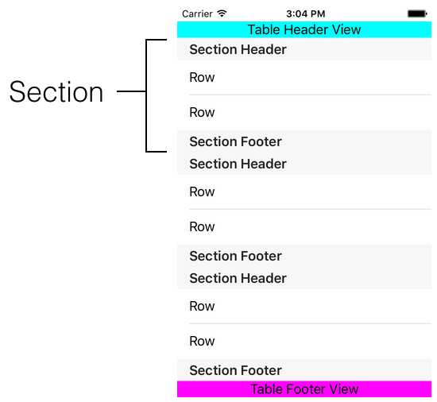
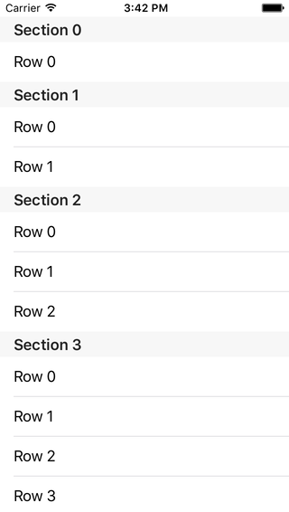

< [Overview](../00.Overview/Overview.md) | [Setup with Code](../02.SetupWithCode/SetupWithCode.md) >

# Concepts and Terminology

Table views are among the most commonly used UI widgets in iOS. From your email inbox to your Twitter feed, your contacts list to your settings, table views are used just about everywhere. If you are looking at a list - short or very very long - of even vaguely related items, chances are pretty good that you're looking at a UITableView.

Prior to iOS 6, the use of UITableView would almost be a certainty. In iOS 6, Apple introduced UICollectionView which borrows many of the same concepts, and can be made to look quite similar to a table view if you want to spend the effort. I do not currently intend to discuss UICollectionView as part of this series, but I will say that understanding how table views work will go a long way towards understanding how collection views work, so time spent here will not be wasted. If you are trying to decide which you need, then a basic guideline would be to use a table view for vertically scrolling content, and a collection view for horizontally scrolling content.

## Scroll View 

Let's start with the definition of UITableView, from the UIKit header files:

```objc
// Objective-C

@interface UITableView : UIScrollView <NSCoding>
```
```swift
// Swift

public class UITableView : UIScrollView, NSCoding
```

UITableView is defined as inheriting from UIScrollView. And this is a distinction that is worth pointing out: A table view does not _have_ a scroll view, it **is** a scroll view. It is a scroll view that has been highly customized to display and manage subviews in an orderly fashion, but at its core it is just a scroll view. If you really wanted to, you could slap a bunch of views into any plain UIScrollView and wind up with a visual that is every bit the same as what we see with UITableViews. But hopefully, long before we finish with this series, it will become clear exactly what UITableView provides and does for you, and thus why you likely won't want to try to tackle those aspects on your own.

Since it is fundamentally a scroll view, it is worth remembering that any subviews you add are going to scroll. This will be important later when we talk about UITableViewController. For now, just plant in your mind that if you have a view that you do NOT want to scroll, then you should not add it to a UITableView, or at minimum be prepared to jump through hoops to make it stationary.

## Definitions

Now let's take a look at some definitions:



This may look a little busy, so for now just pick out the key words **section** and **row**.

The **row** is sort of like the basic unit of measurement for table views. Each name in your Contact list appears in a row, or more specifically appears in a cell view that is shown for that particular row.

Rows can be grouped together into **sections**. It's a design choice to make, but doing so enables options such as the section headers, which you see in Contacts with the "A", "B", "C" banners as you scroll, and also the strip of letters that can appear on the side of a table view that lets you quickly jump around in the table.

Only a few items are shown here, but there can be many many sections, and there can be many many rows. Also shown are the standard section header and footer views (these can customized with your own views), and the table as a whole also has a header and footer view which can also be customized. As these items are all subviews of the table view, they all scroll together, with an exception as noted in a moment. Over the course of the series, we will look at how to customize everything that you see here.

If the section and row are the units of measurement, the **index path**, specifically NSIndexPath, represents the coordinate system. Just like (x,y) = (3,7) tells you where to draw a point on a graph, (section, row) = (3,2) tells you where in a table view something is located. Just like a coordinate has an x component and a y component, an index path has a section component and a row component. Everything is vertical here in table view land, so the analogy isn't perfect, but the general idea applies. If we were to apply labels that reveal the locations, it would look like this:



The first aspect to notice here is that sections and rows each begin at 0, just like array indices do. That's helpful since we'll be dealing with arrays quite frequently in the use of table views. Next, notice that the row number starts over in each section. I see "Row 0" 4 times, and this corresponds with the 4 sections that are currently shown. This will be very important when we deal with sectioned table view data later. It will not be sufficient to simply say "Row 0", as you can see here that there would be more than one answer for that. You will have to be more specific, such as "Row 0 in Section 2". The index path is what allows us to provide that extra detail. We generally will not speak in terms of "the user tapped at x,y = 280,350 pixels", we will instead speak in terms of "the user tapped the row at index path 6, 2", which will be section 6, row 2.

One last piece of terminology for now is the table style. Although table views can be highly customized to provide just about any visual flair that you might want, Apple has provided 2 built-in styles that should easily cover the vast majority of needs. These styles are called **Plain** and **Grouped**, and they look like this:


Nothing has changed about the data that is powering these tables, these are simply alternate visual representations. The difference between them is a single line of code, or one pull-down menu selection in IB. Like everything else visual, table views received a makeover for iOS 7. As you can see here, the two styles are not _that_ different. Prior to iOS 7, the distinction between them was far more dramatic, and in my opinion more useful. These days, my guess is that average users don't even realize there is a difference. The rows are almost exactly the same in each case, so the differences are in the section headers. Notice that Grouped uses more vertical space, and a smaller font while forcing all-caps. Notice that Plain still has "Section 2" shown at the top, hovering over the rows. (Remember that I said previously that all subviews of a scrollview will scroll, so imagine the work that is being done to keep that header view stationary.) You can observe the Plain table style in action by going to the Contacts app and flipping through your friends, and you can see the Grouped style in the Settings app. In general, if you have a lengthy list of records, the Plain style is probably more appropriate. If you have a short list of items, perhaps not all of the same type such as settings, then Grouped is probably the way to go. But these are style choices to make, and not hard and fast rules that you must abide.

## Customization

We have only just scratched the surface of how to customize a table view visually, and haven't talked about behaviors at all. Just comparing Contacts and Settings, we see things like a column of letters on the right side of the screen, we see switches, we see icons, we see arrows, to say nothing of what happens when we tap on rows. In Contacts we see a person's details, but in Settings we see very different screens upon tapping different rows. And I will point out that Apple is mostly using built-in table view capabilities here; your average Twitter app is probably doing all kinds of neat tricks that aren't directly supported without a fair amount of customization. So the question then becomes: How do we customize a table view? To understand why UITableView works the way it does, let us first take a look at a few of the possible choices a class designer can make.

When it comes to customizing any object, the designer of that class has a number of techniques to choose from to support that customization. Let's pretend that UILabel did not provide any means to change the text color; it only shows black text. Your only customization option would be to subclass UILabel, and override some code so that you could get another color.

```objc
// Objective-C

@interface RedLabel : UILabel
```
```swift
// Swift

public class RedLabel : UILabel
```
This class would override something, probably drawRect, and instead of using black to draw the text, it would use red.

If this is how UILabel actually worked, then let's imagine for a moment what that would mean for developers. Everywhere that you would want to have red text, you could not use a plain UILabel, whether this is in code or IB. In IB, you could still drag a plain UILabel onto your view, but then you'd have to go change the class to RedLabel. In code you'd simply create a RedLabel instead. Every time you want red text.

And this only gets us one color. Now I want a blue label, then I want a green label, etc. Each time I want a new color, I have to make a new subclass. Now I have a dozen or more files that I have to haul around into each new project. And, if want to change a color somewhere, I have to go find that label and change the class. That would not be fun.

Instead, the designer of UILabel provided direct means to customize labels via properties and methods. Specific to this example, there is a _textColor_ property. This means that we can use UILabel directly, without the need to subclass, but we still get our desired text color.

```objc
// Objective-C

UILabel *aLabel = [[UILabel alloc] init];
[aLabel setTextColor:[UIColor redColor]];
```
```swift
// Swift

let aLabel = UILabel()
aLabel.textColor = UIColor.redColor()
```
Not only is this easier, we don't have to know anything about how UILabel draws the actual text, and we aren't interfering with that process in any way, so we can't screw anything up which is certainly possible with the subclassing route. We are always using UILabel instances, and to change color we simply change one of these lines, or use the color picker in IB. And of course, labels have many options. Font size, font style, just to name a couple. If we had to make subclasses, this would get unwieldy very quickly, with my RedBoldLabel, my RedUnderlineLabel, my RedBoldUnderlineLabel, and so on. Yuck. So having configurable attributes like text color and font makes life much easier.

How does this apply to table views? Well, hopefully the previous example has provided the reason why we wouldn't want to subclass. You can imagine having a 50ItemTableView, a 100ItemTableView, a 30ItemGroupedTableView, just to start. And then, how would you know how many items need to be in that table? In your Contacts, you add people, and you delete people. So would that be the 50ItemTableView or the 500ItemTableView? What if someone has 2000 contacts? And I've assumed that we don't have any sections to deal with, but Contacts does have them grouped. So I need a 26Section10RowsTableView? Do you know that many people with names beginning with Q or X? Subclassing is often not a very good solution when you don't know the answer in advance, and so is not a good solution here for table views.

Ok, so how about customizable attributes? Perhaps, and UITableView does indeed have some. But would this be a viable customization avenue for everything we might want to do with a table view? Let's consider for a moment. In Contacts, we have a section for each letter of the alphabet. So, 26 sections in English. And that assumes we use every letter. If a section would be empty, perhaps we wouldn't want to show anything there. Maybe now we're down to 20 sections. And Settings doesn't need that many sections; I count 9 on my phone. Clearly this number needs to vary, so perhaps that would make sense as a property:

```objc
// Objective-C

UITableView *tableView = [[UITableView alloc] init];
[tableView setNumberOfSections:26];
```
```swift
// Swift

let tableView = UITableView()
tableView.numberOfSections = 26
```
>Note: This is just for illustration purposes. UITableView actually does have this property, but it is read-only, so this code would not work as shown.

So far, so good. But then we reach a challenge. I know 20 people with names beginning with A, but only 5 beginning with B, then 12 beginning with C, and so on. I have to get this information into the table view's properties, but what would that look like?

```objc
// Objective-C

UITableView *tableView = [[UITableView alloc] init];
[tableView setNumberOfSections:26];

[tableView setNumberOfRowsInSection0:20];
[tableView setNumberOfRowsInSection1:5];
[tableView setNumberOfRowsInSection2:12];
...
```
```swift
// Swift

let tableView = UITableView()
tableView.numberOfSections = 26

tableView.numberOfRowsInSection0 = 20
tableView.numberOfRowsInSection1 = 20
tableView.numberOfRowsInSection2 = 20
...

```
Oh boy. That's a lot of lines of code. And how many would there need to be? The designer of UITableView would have to create every single one of these numberOfRowsInSection# properties. How many should they make? 50? 1000? And keep in mind, the only thing we've accomplished so far is to tell the table view how many sections and rows there are. But we haven't defined any text to display.

```objc
// Objective-C

UITableView *tableView = [[UITableView alloc] init];
[tableView setNumberOfSections:26];

[tableView setNumberOfRowsInSection0:20];
[tableView setNumberOfRowsInSection1:5];
[tableView setNumberOfRowsInSection2:12];
...

[tableView setTextForRow5InSection0:@"Adam"];
[tableView setTextForRow3InSection1:@"Brian"];
...
```
```swift
// Swift

let tableView = UITableView()
tableView.numberOfSections = 26

tableView.numberOfRowsInSection0 = 20
tableView.numberOfRowsInSection1 = 5
tableView.numberOfRowsInSection2 = 12
...

tableView.textForRow5InSection0 = "Adam"
tableView.textForRow3InSection1 = "Brian"
...

```
It just gets worse and worse. Look at all of the various elements that appear in a given row in the Settings app, and then imagine what that would require in terms of these properties. And keep in mind, every time we list these out here, the designer of UITableView has no idea how many to make. Even if they put 500 of them in there, eventually someone will need 1000 and then they can't use UITableView.

So we've established that subclassing would be ugly. Adding configurable properties - at least for things like this - while it could conceivably be done more cleanly than I've shown here, would likely still be as ugly overall as subclassing. So what does that leave? Well, I can't speak to every possible scenario that has been envisioned in the history of computer science, but in the realm of object oriented programming in general and Apple's libraries in particular, a common solution for this kind of problem is to use **delegation**.

I wrote all of the previous examples to help answer the question of why UITableView is designed the way it is. I do not mean for this to be an exhaustive explanation of each of these programming concepts, nor do I mean to provide an exhaustive explanation of delegation. So let's talk about it briefly here, but if you still feel that you don't understand delegation, then that is a topic that you'll need to research further elsewhere. It is a very commonly used pattern on all of Apple's platforms, so you need to understand it, and time spent learning it will not be wasted in any way.

When I was a new programmer learning about delegation for myself, the typical form of explanation was along the lines of "one object doing something on behalf of another object". While this is unquestionably true, I was nevertheless frustrated by this explanation as I never really felt that it helped to nail the concept down in my mind. So anything you've read elsewhere about delegation is likely accurate, but allow me to place a spin on it that would have helped me when I was learning.

Consider the previous example of setting properties on a fictional table view class. This is effectively saying "Hey, you, tableView... you will have 26 sections." You are directly telling an object what to do, issuing a command. If this were a movie script, it would look like:

ME: Hey tableView, you have 26 sections</br>
TABLEVIEW: Understood

The delegation pattern flips the script around. Instead of me telling the object what to do, I design it so that the object can ask questions instead, and I will answer them. So I will be the delegate for the table view, and the script then looks like this:

TABLEVIEW: Hey delegate, how many sections should I have?</br>
DELEGATE (ME): You have 26 sections.

I could even be the delegate for multiple table views if the need arose:

TABLEVIEW1: Hey delegate, how many sections should I have?</br>
DELEGATE (ME): You have 26 sections.</br>
TABLEVIEW2: Hey delegate, how many sections should I have?</br>
DELEGATE (ME): You have 5 sections.</br>

I can answer the question differently for each table view based on certain criteria. Here is what the method signature for this particular question looks like:

```objc
// Objective-C

- (NSInteger)numberOfSectionsInTableView:(UITableView *)tableView
```
```swift
// Swift

optional func numberOfSectionsInTableView(_ tableView: UITableView) -> Int
```
We will cover the specifics of what this means later. For right now, notice that I'm given a tableView parameter (so this code could support multiple table views if necessary), and I'm expected to return an integer. My answer for the question is the value I return.

This is promising, but remember with the properties where things really went off the rails is when I needed to start telling the table view how many rows were in each section. How does delegation make that any easier? Well, instead of having 500 different properties, we can structure the question that the table view asks to take into account multiple possibilities.

TABLEVIEW: Hey delegate, how many rows are in section 0?</br>
DELEGATE (ME): There are 20 rows</br>
TABLEVIEW: Hey delegate, how many rows are in section 1?</br>
DELEGATE (ME): There are 5 rows

...and so on. What this looks like in code is:

```objc
// Objective-C

- (NSInteger)tableView:(UITableView *)tableView
 numberOfRowsInSection:(NSInteger)section
```
```swift
// Swift

func tableView(_ tableView: UITableView,
 numberOfRowsInSection section: Int) -> Int
```
Notice this time we have 2 input parameters, a table view and a section index. This is how the table view asks me this question, and the return value is how I answer it. Now I'm not going to pretend that the answer to this question will be easy. If you set your data structure up right, then it should be reasonably easy. But if you don't, you could wind up in if/else if/else if/else hell really quickly trying to answer these questions. By the time we're done with this series, you'll hopefully have the tools you need to avoid that.

The table view might not only ask questions, it can also provide statements, ex:

TABLEVIEW: Hey delegate, the user tapped row 5 in section 2.

The table view won't expect a response in this case, it is just letting me know that something happened. Once I know about that, I can write code that does something useful, such as showing my contact's details. In code, this statement looks like:

```objc
// Objective-C

- (void)tableView:(UITableView *)tableView
didSelectRowAtIndexPath:(NSIndexPath *)indexPath
```
```swift
// Swift

optional func tableView(_ tableView: UITableView,
didSelectRowAtIndexPath indexPath: NSIndexPath)
```

A couple of things to notice here. First, there is no return value, and that's usually going to be your clue that the source object, in this case the table view, isn't really expecting you to do anything. This is simply the way that the table view informs you that this action took place. If that action is something you want to know about, then you implement this method; if not, you don't. Next, notice this is our first appearance of NSIndexPath. Remember this is basically our coordinate system for table views, and this is how the table view tells us which row in which section was tapped.

All of this leads up to the way I wish someone had explained delegation to me when I was learning. A class can be designed to ask questions or make statements. The delegate is the object that will answer those questions or receive those statements. The table view wants to know how many sections it should have. Who will answer that question? That is the delegate. Who needs to know when a row has been tapped? That is the delegate. And for table views, it will mostly commonly be the view controller serving as the delegate.

So in delegation, the are 2 key players: the source object and the delegate object. The delegate object needs to have code that can answer questions or handle statements. Great, no problem, let's go write some code.... well, not so fast. What questions could the table view possibly ask? What statements could the table view possibly make? Hrm. Well, those questions and statements need to be documented. And the form that this documentation takes is called the **protocol**.

A protocol is simply a list of method names. It provides no functionality in and of itself. The author of a class that will depend on delegation will also need to define a protocol. This is where the author will declare the questions the class can ask of the delegate, and the statements the class can make to the delegate. When you create a delegate, you can refer to this protocol and implement the methods that you care about.

UITableView actually provides 2 delegate protocols: **UITableViewDelegate** and **UITableViewDataSource**. Combined they define nearly 50 questions and statements that UITableView can ask or make. Here are a few of them:

```objc
// Objective-C

@protocol UITableViewDataSource<NSObject>

@required

- (NSInteger)tableView:(UITableView *)tableView numberOfRowsInSection:(NSInteger)section;
- (UITableViewCell *)tableView:(UITableView *)tableView cellForRowAtIndexPath:(NSIndexPath *)indexPath;

@optional

- (NSInteger)numberOfSectionsInTableView:(UITableView *)tableView;
- (nullable NSString *)tableView:(UITableView *)tableView titleForHeaderInSection:(NSInteger)section;
...
@end
```
```swift
// Swift

public protocol UITableViewDataSource : NSObjectProtocol {
   public func tableView(tableView: UITableView, numberOfRowsInSection section: Int) -> Int
   public func tableView(tableView: UITableView, cellForRowAtIndexPath indexPath: NSIndexPath) -> UITableViewCell
   optional public func numberOfSectionsInTableView(tableView: UITableView) -> Int
   optional public func tableView(tableView: UITableView, titleForHeaderInSection section: Int) -> String?
   ...
}
```

And this doesn't even include the ones that are defined for UIScrollView (remember that UITableView is a UIScrollView subclass, and there is indeed a UIScrollViewDelegate protocol) That sounds like a lot, but don't panic; only 2 of them are required as seen above. The rest are optional and can be implemented as needed. There will be delegate methods that you use constantly, and there will be delegate methods that you almost never use. The more features of table view that you will want to take advantage of, the more delegate methods you will implement. We will cover many of these methods over the course of this series.

Not only are there 2 distinct protocols, there are indeed 2 different delegate properties in UITableView:

```objc
// Objective-C

// UITableView
@property (nonatomic, weak) id< UITableViewDataSource > dataSource
@property (nonatomic, weak) id< UITableViewDelegate > delegate
```
```swift
// Swift

// UITableView
weak var dataSource: UITableViewDataSource?
weak var delegate: UITableViewDelegate?
```
Don't be confused by the names; "Delegation" is the programming concept. That concept is concretely implemented here with 2 properties, each conforming to a separate protocol. Only one is _named_ delegate, but these are each delegate objects. In many cases, the same object - typically your view controller - can serve both roles. But there can be separate objects, one performing the DataSource role and the other performing the Delegate role. In my many years of programming table views, I have yet to have the need to use 2 separate objects for these duties. And I honestly could not explain why some methods are in DataSource yet other seemingly similar methods are in Delegate. In theory, certainly all of these methods could be defined under a single protocol. The fact that there are 2 protocols is simply a design choice, most likely imposed because of the sheer number of methods involved.

To summarize all of this:
* You do not need to subclass UITableView simply to customize the contents. And you should probably _really_ know what you're doing before deciding that subclassing UITableView is the proper course of action.
* UITableView does provide properties for certain aspects of customization, but these will apply to the table view as a whole, and not aspects that may be different on a per-row basis.
* UITableView depends primarily on the delegation pattern for customization.

A considerable amount of the rest of the series will be spent studying the various DataSource and Delegate methods.

< [Overview](../00.Overview/Overview.md) | [Setup with Code](../02.SetupWithCode/SetupWithCode.md) >

---
From:
[A Reasonably Complete Guide to UITableView](https://github.com/BriTerIdeas/Book-UITableViewGuide), by Brian Slick
If you found this guide to be helpful, a [tip](http://bit.ly/AW4Cc) would be appreciated.
