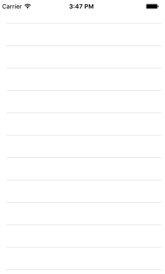
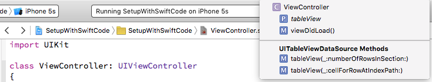
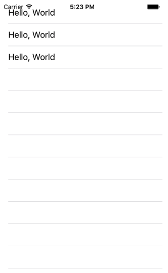

< [Concepts and Terminology](../01.Concepts/Concepts.md) | [Setup with Storyboards](../03.SetupWithStoryboards/SetupWithStoryboards.md) >

# Setup With Code

We're going to create and configure a simple table view 3 different ways: code-only, Interface Builder, and Storyboards. This chapter will focus on code-only, and the other options will be explored separately. If I write each chapter as a purely standalone unit, there will be a lot of repetition as the delegate methods are only implemented via code. Rather than copy-paste a bunch of text, I will do as much code stuff as necessary here, and then in the other setup chapters try to only refer to the aspects that are different. So even if you are brand new and are only comfortable with Storyboards, you will need to read this chapter too, and I will include a note saying likewise in that chapter.

For reference, completed projects can be found in the Sample Code folder with this chapter. I will provide ObjC and Swift versions.

Fire up Xcode and let's begin.

Even though this is the code-only chapter, with modern versions of Xcode Apple _really_ wants you to use Storyboards, so much that you can't even create a project anymore without them. So since it can't be avoided, we'll just go ahead and accept that, and for purposes of this chapter simply ignore the Storyboard.

## Setup

Create a new iOS project, using the Single View Application template. Name it anything you want, like SetupWithCode. Choose your preferred language, device doesn't really matter but let's go with iPhone, and you can turn off any of the other checkboxes like Core Data as they will not be used in this chapter.

As I said, we are ignoring the Storyboard for now. We will do everything in the ViewController class that was automatically created. For ObjC, we will be dealing exclusively with the .m file.

First things first, let's clear out any unnecessary boilerplate so that we can focus purely on creating a table view. Edit the contents of your file to look like this (you can leave out the comments, I'm just doing that here so that you know what file I'm messing with):

```objc
// Objective-C

// ViewController.m

#import "ViewController.h"

@interface ViewController ()

@end

@implementation ViewController

- (void)viewDidLoad
{
    [super viewDidLoad];
}

@end

```
```swift
// Swift

// ViewController.swift

import UIKit

class ViewController: UIViewController
{
    override func viewDidLoad()
    {
        super.viewDidLoad()
    }
}

```

## Property

Next, we pretty much will always want the table view to stay alive as long as this view controller is alive. So it will make sense to have a table view property. This will also let us reference the table view object from other methods as needed.

```objc
// Objective-C

@interface ViewController ()

@property (nonatomic, strong) UITableView *tableView;

@end
...
```
```swift
// Swift

class ViewController: UIViewController
{
    var tableView: UITableView!
...
```

>Code comments: As we'll see in the IB and Storyboard chapters, Apple likes using weak properties for IBOutlets these days. I could not disagree more with this general trend, and firmly believe in using strong properties for any object that I wish to have control over the lifespan. I personally think that Apple's preference for weak IBOutlets is dangerous, since the implied assumption that all views are children of the main view does not cover a significant number of cases, and this is not adequately explained with blanket weak property usage. So you may see lots of sample code with strong, and lots of sample code with weak, and neither is really wrong, per se. Like anything else, different choices have different consequences. I prefer, and recommend, the consequences that go along with using strong IBOutlet properties.

>Swift comments: As we'll see in the IB and Storyboard chapters, IBOutlets are typically created as a forced-unwrapped optional. I could probably get away with making it non-optional here, but then I'd either have to create the table view here or deal with an initializer method, which is well beyond the point of this chapter.

## Creation

Now we're ready to create our table view object. As with most view objects, if you aren't doing it in IB or Storyboard, then most likely the appropriate place to do so is in viewDidLoad. So that's what we'll use here.

UITableView has a designated initializer that looks like this:

```objc
// Objective-C

- (instancetype)initWithFrame:(CGRect)frame style:(UITableViewStyle)style
```
```swift
// Swift

public init(frame: CGRect, style: UITableViewStyle)
```
The table view is created with a rect and a style. Recall from the concepts chapter that our style choices are grouped or plain. Let's use plain. We will be using auto layout to position the table view, so for now we can init the table view with CGRectZero.

```objc
// Objective-C

- (void)viewDidLoad
{
   [super viewDidLoad];
    
   UITableView *table = [[UITableView alloc] initWithFrame:CGRectZero style:UITableViewStylePlain];
   [self setTableView:table];
   [[self view] addSubview:table];
}
```
```swift
// Swift

override func viewDidLoad()
{
   super.viewDidLoad()
        
   let table = UITableView(frame: CGRectZero, style: .Plain)
   tableView = table
   view.addSubview(table)     
}
```
At this point, we have created a table view object, assigned it to the property, and added it to the view controller's view. You could run the app if you wanted to, but you won't see anything size CGRectZero has a size of 0x0.

## Size and Position

In order to make the table view fill the screen on any device, we're going to use Auto Layout. I will not be covering very much about how Auto Layout works here. So if you don't understand the following code, don't sweat it. Just copy-paste and move on. But if you have been avoiding learning or using Auto Layout, I highly recommend it, and would advise you to check it out.

```objc
// Objective-C

- (void)viewDidLoad
{
   [super viewDidLoad];
    
   UITableView *table = [[UITableView alloc] initWithFrame:CGRectZero style:UITableViewStylePlain];
   [self setTableView:table];
   [[self view] addSubview:table];
   
   // Auto layout stuff. Just copy-paste if you don't understand it. Questions will not be answered.
   
   NSDictionary *views = NSDictionaryOfVariableBindings(table);
   
   [table setTranslatesAutoresizingMaskIntoConstraints:NO];
   [[self view] addConstraints:[NSLayoutConstraint constraintsWithVisualFormat:@"H:|[table]|" options:0 metrics:0 views:views]];
   [[self view] addConstraints:[NSLayoutConstraint constraintsWithVisualFormat:@"V:|[table]|" options:0 metrics:0 views:views]];
}
```
```swift
// Swift

override func viewDidLoad()
{
   super.viewDidLoad()
        
   let table = UITableView(frame: CGRectZero, style: .Plain)
   tableView = table
   view.addSubview(table)
   
   // Auto layout stuff. Just copy-paste if you don't understand it. Questions will not be answered.
        
   var views = [String: AnyObject]()
   views["table"] = table
   
   table.translatesAutoresizingMaskIntoConstraints = false
   view.addConstraints(NSLayoutConstraint.constraintsWithVisualFormat("H:|[table]|", options: NSLayoutFormatOptions(rawValue: 0), metrics: nil, views: views))
   view.addConstraints(NSLayoutConstraint.constraintsWithVisualFormat("V:|[table]|", options: NSLayoutFormatOptions(rawValue: 0), metrics: nil, views: views))
   
}
```
In short, this code constrains the table view to match the size of the parent view. And you can verify this for yourself by running the app in the Simulator:



Here we have a nice blank table view. Notice that you can scroll it, you'll see the rows bounce when you let go, etc. But also notice there is nothing in it. Let's address that with some simple content.

## Data Source

Recall from the overview discussion about customizing table views that we will be relying on the delegation pattern. And further recall that there are 2 required methods. One tells the table view how many rows there are, and the other provides a cell view for the table to display at a given index path. Let's go ahead and add those 2 methods, below viewDidLoad. We'll cover what they do in greater detail later, so for now don't worry too much about those details.

```objc
// Objective-C

#pragma mark - UITableViewDataSource Methods

- (NSInteger)tableView:(UITableView *)tableView
 numberOfRowsInSection:(NSInteger)section
{
   return 3;
}

- (UITableViewCell *)tableView:(UITableView *)tableView
         cellForRowAtIndexPath:(NSIndexPath *)indexPath
{
   UITableViewCell *cell = [[UITableViewCell alloc] initWithStyle:UITableViewCellStyleDefault reuseIdentifier:@"Default"];
    
   [[cell textLabel] setText:@"Hello, World"];
    
   return cell;
}
```
```swift
// Swift

// MARK: - UITableViewDataSource Methods
    
func tableView(tableView: UITableView, numberOfRowsInSection section: Int) -> Int
{
   return 3
}
    
func tableView(tableView: UITableView, cellForRowAtIndexPath indexPath: NSIndexPath) -> UITableViewCell
{
   let cell = UITableViewCell.init(style: .Default, reuseIdentifier: "Default")
        
   cell.textLabel?.text = "Hello, World"
        
   return cell
}
```
>Code comments: The #pragma mark and // MARK: comments are some organizational decorations you can add to your code. If you read the navigation bar across the top of your code editor, you'll see SetupWithCode > SetupWithCode > ViewController.swift/.m > and then the last item will vary depending on where you place your cursor. If you click on this last item, you will get a pop up that shows a list of all of your method names. These mark lines will be bold, and there will be a horizontal line right above them.



>You can then click on anything in this menu to quickly jump to that spot in your file. The horizontal line comes from the dash (-) in the comment. Remove the dash if you don't want the line. Adding these decorations is a helpful touch, especially where there is a lot happening in a file, which is not uncommon with view controllers.

>One additional tip when adding these kinds of comments is to use the exact text of whatever you are highlighting, in this case "UITableViewDataSource". I will occasionally see this spelled out more generally as "table data source", and although that is better than nothing, it is not as helpful as it could be. In ObjC files (sorry, Swift doesn't seem to have this for comments yet), you can hold the Command key down, and then mouseover the words in the comment. Once "UITableViewDataSource" lights up, you can click it and jump to the definition in UITableView.h. If you hold down the Option key and do a single click, you will get a pop-up help window with the documentation for UITableViewDataSource. If you hold down Option and double click on UITableViewDataSource, you will jump to the documentation window for that topic. None of this is possible with "table data source".

Ok, back to our table view. We've indicated that there should be 3 rows, and that we should see "Hello, World" in each of them. Let's run the app and see what happens.


Hrm. We've implemented the necessary methods, but nothing seems to have changed. Well, as it turns out, we missed a step. Remember from the discussion about delegation that there are 2 players involved, the source object and the delegate object. We've implemented the delegate methods in our delegate, the view controller. But the problem is that the source object, the table view, does not know who the delegate is. Just because we've created the table view here in this view controller does not automatically make this same view controller the delegate. We could elect to use a different object altogether to act as the delegate. So we need to be explicit, and tell the table view which object to use:

```objc
// Objective-C

UITableView *table = [[UITableView alloc] initWithFrame:CGRectZero style:UITableViewStylePlain];
[table setDataSource:self];
...
```
```swift
// Swift

let table = UITableView(frame: CGRectZero, style: .Plain)
table.dataSource = self    
...
```
As a reminder, UITableView offers 2 different delegate protocols, and has 2 different corresponding delegate properties. For right now we only need the data source one. So even though this particular property is not _named_ somethingDelegate, it is still a delegate property. And we have now informed the table view that we want to use the view controller - self - as the delegate.

If you are on the ObjC path right now, then you have a warning on this new line. In Swift, you have an error on the same line. We have an issue either way, but Swift is a bit meaner about making sure that we address that issue. You actually can run the ObjC version right now, and you'll see that it works properly. But I'll hold off on a screen shot until we get Swift to a build-able point as well.

What is the problem? We've implemented the required methods, so it should work (and does in ObjC). But we clearly have a warning or error. Well, the issue lies in the definition of this delegate property.

```objc
// Objective-C

// UITableView
@property (nonatomic, weak) id< UITableViewDataSource > dataSource
```
```swift
// Swift

// UITableView
weak var dataSource: UITableViewDataSource?
```
The property is defined as being any object that conforms to the UITableViewDataSource protocol. We _have_ implemented the required methods (which is why ObjC works), but we have _not_ declared that we conform to the protocol. That needs to be added to the class definition:

```objc
// Objective-C

@interface ViewController () <UITableViewDataSource>
```
```swift
// Swift

class ViewController: UIViewController, UITableViewDataSource
```
That should clear up the issue in both languages, so we can now see our populated table view:



As mentioned, we have implemented the 2 required protocol methods. Just to see what happens, let's comment one of them out:

```objc
// Objective-C

//- (NSInteger)tableView:(UITableView *)tableView
// numberOfRowsInSection:(NSInteger)section
//{
//   return 3;
//}
```
```swift
// Swift
    
//func tableView(tableView: UITableView, numberOfRowsInSection section: Int) -> Int
//{
//   return 3
//}

```
In ObjC we again have a warning, and in Swift we again have a build error. But there is a key difference this time if we go ahead and run the ObjC version: it will crash:
>Terminating app due to uncaught exception 'NSInvalidArgumentException', reason: '-[ViewController tableView:numberOfRowsInSection:]: unrecognized selector sent to instance 0x7fce99513a20'

They defined it as a required method and they aren't messing around. This error message basically confirms that the table view tried to call the required method on the view controller, but as we commented it out, the view controller no longer implements that method.

**Note**: make sure to uncomment that method before proceeding.

## Delegate

At this point, all the table view does is display a handful of cells. If you tap a row, it will turn gray. Let's make it do something slightly more interesting. The appropriate method was mentioned in the concepts chapter, and it is:

```objc
// Objective-C

- (void)tableView:(UITableView *)tableView
didSelectRowAtIndexPath:(NSIndexPath *)indexPath
{
   [tableView deselectRowAtIndexPath:indexPath animated:YES];
    
   NSLog(@"Tapped row %ld", [indexPath row]);
}

```
```swift
// Swift
    
func tableView(tableView: UITableView, didSelectRowAtIndexPath indexPath: NSIndexPath)
{
   tableView.deselectRowAtIndexPath(indexPath, animated: true)
        
   print("Tapped row \(indexPath.row)")
}

```
This will deselect the row causing it to revert to white, and will print a log message in the console. Run the app and test it out.

Unfortunately nothing seems to be different. Tapping a row still turns it gray, and it remains gray until you tap another row, which in turn remains gray. And there is no log. What happened?

Recall from the concepts chapter that UITableView defines 2 different protocols, and has 2 different delegate properties. We have conformed to one protocol and implemented the required methods, but this method is not defined in the one protocol we are currently conforming to. It's in the other one. So we need to indicate that our view controller will serve as the delegate for the other protocol also.

```objc
// Objective-C

UITableView *table = [[UITableView alloc] initWithFrame:CGRectZero style:UITableViewStylePlain];
[table setDataSource:self];
[table setDelegate:self];
...
```
```swift
// Swift

let table = UITableView(frame: CGRectZero, style: .Plain)
table.dataSource = self
table.delegate = self    
...
```
We are now in the same situation we had before; Swift has an error, ObjC has a warning, but ObjC will again build and run properly. And the solution is the same: we must indicate that we conform to the required protocol:

```objc
// Objective-C

// UITableView
@interface ViewController () <UITableViewDataSource, UITableViewDelegate>
```
```swift
// Swift

// UITableView
class ViewController: UIViewController, UITableViewDataSource, UITableViewDelegate
```
Both languages can now build the app, and tapping on the row should now deselect back to white, and you should see a message in the log telling you which row you tapped.

## Summary

We have now created a simple table view that displays a little bit of content and reacts to row taps. Let's recap what we did:
* We created a UITableView object using a frame and a style.
* We added that object to our view controller's view, and used Auto Layout to constrain it.
* We declared that our view controller conforms to both of UITableView's delegate protocols.
* We told the table view to use our view controller as the delegate for each protocol.
* We implemented the required protocol methods, and also an optional protocol method.

Clearly this table view doesn't do much at the moment, but this is pretty typical of how to work with table views. We will dive much deeper into some more interesting delegate methods, and talk about how to structure data and configure the display of that data in later chapters.

< [Concepts and Terminology](../01.Concepts/Concepts.md) | [Setup with Storyboards](../03.SetupWithStoryboards/SetupWithStoryboards.md) >

---
From:
[A Reasonably Complete Guide to UITableView](https://github.com/BriTerIdeas/Book-UITableViewGuide), by Brian Slick
If you found this guide to be helpful, a [tip](http://bit.ly/AW4Cc) would be appreciated.
