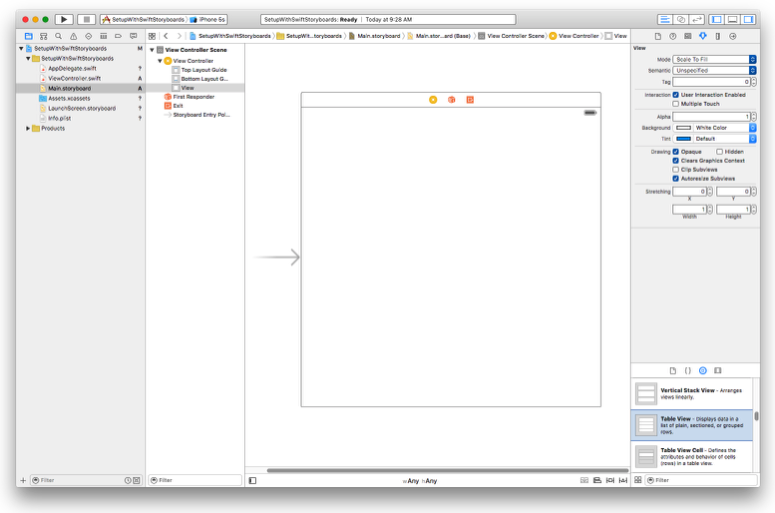
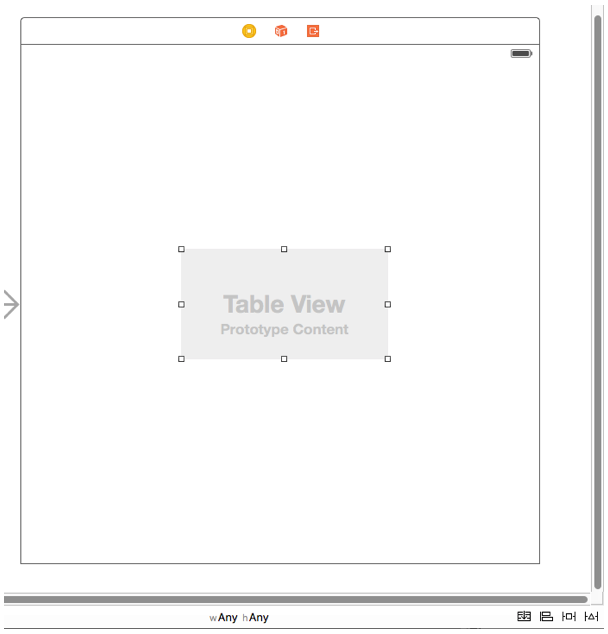
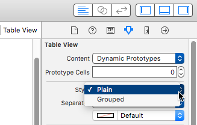
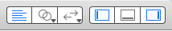
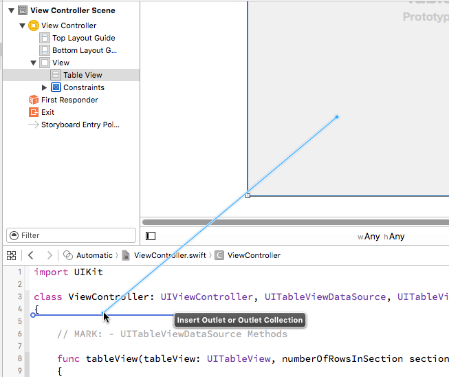
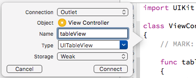
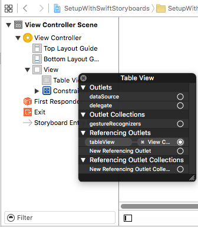
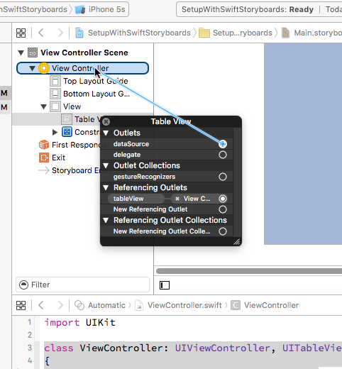
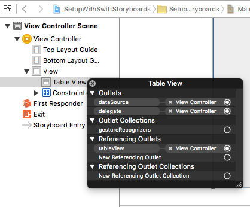

< [Setup with Code](../02.SetupWithCode/SetupWithCode.md) | [Setup with Interface Builder](../04.SetupWithInterfaceBuilder/SetupWithInterfaceBuilder.md) >

# Setup With Storyboards

If you jumped straight here hoping that meant you could avoid doing some code, I have some bad news. This chapter builds off of the [Setup With Code]
(../02.SetupWithCode/SetupWithCode.md) chapter, so you do indeed need to read it first. That chapter establishes the basic minimum that you'll need to understand, and this chapter will only focus on what is changed by using a Storyboard instead of pure code. This chapter is not intended to train you on the use of Storyboards in general, so you will need to research elsewhere if the explanations here are inadequate.

## Setup

Create a new iOS project, using the Single View Application template. Name it anything you want, like SetupWithStoryboards. Choose your preferred language, device doesn't really matter but let's stick with iPhone, and you can turn off any of the other checkboxes like Core Data as they will not be used in this chapter.

Storyboards (and IB) provide the means to do certain tasks graphically instead of in code. However, this is mostly just in the setup phase of objects. After the objects are created, the graphical capabilities don't do much for you anymore, so there will be a fair amount of table view work that will be the same - done in code - regardless of how you started. We're going to make the exact same table that we made in the code chapter, and a fair amount of that code will be exactly the same, so let's go ahead and bring that over here to get a good start. Make your ViewController file look like this:

```objc
// Objective-C

// ViewController.m

#import "ViewController.h"

@interface ViewController () <UITableViewDataSource, UITableViewDelegate>

@end

@implementation ViewController

#pragma mark - UITableViewDataSource Methods

- (NSInteger)tableView:(UITableView *)tableView
 numberOfRowsInSection:(NSInteger)section
{
    return 3;
}

- (UITableViewCell *)tableView:(UITableView *)tableView
         cellForRowAtIndexPath:(NSIndexPath *)indexPath
{
    UITableViewCell *cell = [[UITableViewCell alloc] initWithStyle:UITableViewCellStyleDefault reuseIdentifier:@"Default"];
    
    [[cell textLabel] setText:@"Hello, World"];
    
    return  cell;
}

#pragma mark - UITableViewDelegate Methods

- (void)tableView:(UITableView *)tableView
didSelectRowAtIndexPath:(NSIndexPath *)indexPath
{
    [tableView deselectRowAtIndexPath:indexPath animated:YES];
    
    NSLog(@"Tapped row %ld", [indexPath row]);
}

@end

```
```swift
// Swift

// ViewController.swift

import UIKit

class ViewController: UIViewController, UITableViewDataSource, UITableViewDelegate
{
    // MARK: - UITableViewDataSource Methods
    
    func tableView(tableView: UITableView, numberOfRowsInSection section: Int) -> Int
    {
        return 3
    }
    
    func tableView(tableView: UITableView, cellForRowAtIndexPath indexPath: NSIndexPath) -> UITableViewCell
    {
        let cell = UITableViewCell.init(style: .Default, reuseIdentifier: "Default")
        
        cell.textLabel?.text = "Hello, World"
        
        return cell
    }
    
    // MARK: - UITableViewDelegate Methods
    
    func tableView(tableView: UITableView, didSelectRowAtIndexPath indexPath: NSIndexPath)
    {
        tableView.deselectRowAtIndexPath(indexPath, animated: true)
        
        print("Tapped row \(indexPath.row)")
    }
}

```
I have removed the property, and much everything involved in creating the table view in viewDidLoad. (We still want a property, but we'll create it differently in this chapter). The implementation of the delegate methods remains the same, as does the protocol conformance declaration.

We'll return to this file in a moment, but let's take a look at the Storyboard.



## Creation

You see our blank view controller, and if you have the correct panel open on the right side, you can scroll through the list at the bottom and find the table view object. Grab one and drag it into the middle of the view controller. The size and position doesn't matter.



As long as we're here, let's take a look at one of the options that is provided graphically via the Storyboard/IB. Recall from the code chapter that we instantiate a table view object with 2 parameters, a frame and a style. Obviously the frame is being defined by our graphic object, but we can mess with the style here, too. Select the table view, then find the settings in the upper right.



There is a Style option, and using the menu we can choose between Plain and Grouped here.

## Size and Position

We will again use Auto Layout to size and position the table view, but rather than use some ugly confusing code again, we can do it here in the Storyboard. In the screen shot above, down at the lower right there are 4 icons. Make sure the table view is selected, and then hit the second button from the right. It looks like a Star Wars TIE Fighter.


Make your panel look like this one. This includes the following changes:
* Turn OFF "Constrain to margins"
* If the red lines are not a solid red as shown, click on them to turn them red.
* Make the value in each of the boxes at the top 0.
* Next to "Update Frames", select "Items of New Constraints" in the menu.

Finally, hit the "Add 4 Constraints" button. Once finished, the table view should fill the available space, and when selected you will see some blue lines around the perimeter.

## Property

Now we want to recreate the table view property that we did not carry over from the code chapter. We still want that property, but we're going to use the Storyboard to help us create it and establish a connection to our graphical table view object here.

We want to be able to see our code file and our Storyboard file at the same time. There are several ways to get there. Look to the upper right of the Xcode window, and you will see these buttons:



The group on the right is for toggling which of Xcode's panels are visible. We are interested in the group on the left. The first segment is blue, which indicates that we are in just a single view mode. Select the middle button, with the 2 circles:


This will open up a second panel, called the Assistant Editor, that shows the code file. It will either be to the side or underneath the Storyboard view depending on your settings.

If for some reason this didn't happen correctly, or if you just want to know a keyboard shortcut for accomplishing the same thing, you can hold down the Option key and select the ViewController file from the main list at the left. Option-clicking on any file will open it in the Assistant Editor.

While holding the Ctrl key down, click on the table view and drag into your code file. You will see a blue line starting at your click location that will follow your mouse around. Once you get your mouse into your code file, you should see an additional blue line to show where you are about to create some code:



In Swift, place it somewhere near the top of your class, but after the "class" line. In ObjC, place it between the @interface line and the first @end line. Once you let go, you will get a pop up window:



This is creating a property, very similar to the one that we manually typed in the code chapter. So give the property an appropriate name, and then hit the connect button. Once that is done, you should wind up with something pretty close to this:

```objc
// Objective-C

@interface ViewController () <UITableViewDataSource, UITableViewDelegate>

@property (weak, nonatomic) IBOutlet UITableView *tableView;

@end

```
```swift
// Swift

class ViewController: UIViewController, UITableViewDataSource, UITableViewDelegate
{
    @IBOutlet weak var tableView: UITableView!
...

```
By default these will be created as weak outlets, and I mentioned briefly that I disagree with this default. But for our purposes here it doesn't really make a difference.

## Data Source and Delegate

If you run the app now, you will see a table view, but it will be blank. If you refer to the list of requirements in the code chapter, all we've done so far is to create a table view object, constrain it into position, and connect it to a property. And even though we have the delegate methods already implemented, the table is blank now for the same reason it was blank in the code chapter: we haven't told the table view who the delegate is. We can establish that relationship using the Storyboard.

Find the table view item listed in the scene contents to the left of the graphical area, and Ctrl-click on it. This will open the connection panel for the table view:



The first thing to notice here is under the "Referencing Outlets" section, and there we see our tableView property, and although it is cut off here, the right side of that says "View Controller". So that is the IBOutlet connection we made previously.

But the reason we came here is the two items listed at the top under the "Outlets" section: dataSource and delegate. Those names should sound familiar by now. In the code chapter, we set these properties to 'self' in code. Here in the Storyboard, we accomplish the same thing by dragging from the circle on the right to the item that we wish to connect.



In this case, we wish to connect to the view controller. So click in the circle next to dataSource, and then drag up to the View Controller line item with the yellowish circle. Repeat these steps for the delegate. When finished, the panel should look like this:



If you run the app now, it should have 3 rows of Hello World, and deselect rows after tapping them, same as the end of the code chapter.

## Summary

Let's review what remained the same:
* All of the data source and delegate methods.
* Protocol conformance.
* We still have a table view property, though it was created differently.

Using Storyboards, here is what changed:
* We dragged a table view object directly into the view instead of creating it in code with frame and style parameters. (The style can be changed in the Storyboard, too).
* We created the table view property by dragging from the Storyboard.
* We told the table view to use the view controller for data source and delegate purposes by dragging.
* Not specifically relevant to this topic, but we did the constraints graphically, too.

If you compare the code files from the code chapter and what we have here, the primary differences are:
* We removed viewDidLoad
* The tableView property gained the IBOutlet decoration.

Overall, we removed code, and that's one of the goals of using IB/Storyboards. And we have taken an element that is visual, and switched it from creating it with text to creating it in a visual editor. I personally prefer to deal with visual things visually, when I have the choice. But, as I stated previously, IB/Storyboards is fundamentally about object creation. Once the objects are created, there isn't much else you can do in IB/Storyboards. This is proven by the fact that the various delegate methods are identical in each case. They do not care how the table view was created.

< [Setup with Code](../02.SetupWithCode/SetupWithCode.md) | [Setup with Interface Builder](../04.SetupWithInterfaceBuilder/SetupWithInterfaceBuilder.md) >

---
From:
[A Reasonably Complete Guide to UITableView](https://github.com/BriTerIdeas/Book-UITableViewGuide), by Brian Slick
If you found this guide to be helpful, a [tip](http://bit.ly/AW4Cc) would be appreciated.