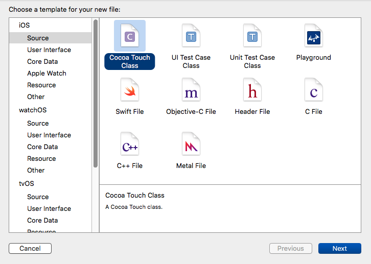
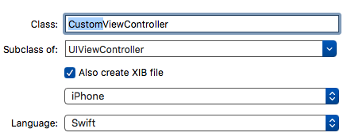
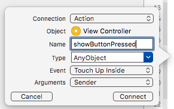
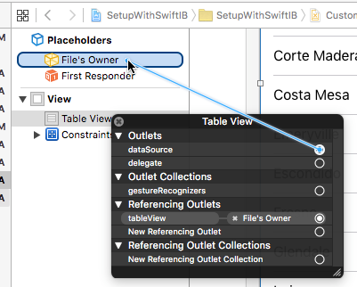

# Setup With Interface Builder

This chapter is very similar to the [Setup with Storyboards](../03.SetupWithStoryboards/SetupWithStoryboards.md) chapter, so just as in that one, if you came straight here to avoid some code, I again have bad news. You do need to read the [Setup With Code]
(../02.SetupWithCode/SetupWithCode.md) chapter first. And since the topic here is so similar to the Storyboard chapter, read that one next, because I will try to minimize the amount of repetition here in this chapter.

If you paid attention to the overview chapter, you'll recall that I stated that I'm not a fan of Storyboards, so you might be wondering why I did Storyboards before this chapter. Well, I'm mostly working around the reality of the current version of Xcode, which includes Storyboards by default. The amount of explanation that will be involved with removing the Storyboard is far beyond the scope of this series. It was easiest to discuss Storyboards first because they are already present, and so now I have to deal with that reality while trying to demonstrate something that exists outside of Storyboards. I have elected to use the Storyboard as a launch point for a new view controller that will be presented modally, without using segues. This means I will not be using the Storyboard as intended, and I'm sorry for that, but my preferred choice of not using the Storyboard at all is not practical in this scope.

Excuses aside, let's begin.

Create a new iOS project, using the Single View Application template. Name it anything you want, like SetupWithIB. Choose your preferred language, device doesn't really matter but let's stick with iPhone, and you can turn off any of the other checkboxes like Core Data as they will not be used in this chapter.

You are now looking at a project that is identical to the way we started the last chapter. In the file listing at the left, at the top will be a blue icon with your project name, and under that will be a yellow folder icon with the same name. This folder will contain the code files for the project. Ctrl-click on this folder icon, and choose "New File..." from the menu.

In the sheet that appears, select "Source" in the iOS group on the left. Then from the available file types on the right, choose the "Cocoa Touch Class".



It is important that you see the word "Touch" there. If all you see is "Cocoa Class", then you are actually in OS X land. Proceed to the next screen.

On the next panel, provide the following information:

* Class: CustomViewController
* Subclass of: UIViewController
* Turn ON checkbox for "Also create XIB file". It will not be available until you have set the subclass field to UIViewController.
* The device type should default to your project type, but it won't hurt to choose iPhone regardless.
* Choose your preferred language.



Proceed to the next screen, and save the file in the default location. You should now have the following files added to your project:
* Swift: CustomViewController.swift and .xib
* Objc: CustomViewController.h, .m, and .xib

We will deal with these files in a moment, but first we need to so some setup in the Storyboard and original view controller so that we can show this new view controller.

Select Main.storyboard, and then hit the 2 circle icon at the upper right that we saw in the Storyboard chapter. This will open up the Assistant Editor window, which should be showing us the ViewController(.swift or .m) file. Drag a button into the view in the storyboard, and change the text to "Show My View Controller". Position the button in the upper left of the view. If you want to constrain it, feel free, but all we need for now is to make sure we can see it when the app runs.

Ctrl-click on the button and drag into the code file. This will be similar to how we made the IBOutlet in the Storyboard chapter. Drag to just below the viewDidLoad method. When you let go, you will see a pop-up like this:



Make sure the connection type is "Action", and then give it a name. None of the other options make much difference for our purposes here. You now have an empty method, and you should replace its content with this:

```objc
// Objective-C
// ViewController.m

#import "ViewController.h"
#import "CustomViewController.h"

...

- (IBAction)showButtonPressed:(id)sender
{
   CustomViewController *customViewController = [[CustomViewController alloc] init];
    
   [self presentViewController:customViewController animated:YES completion:nil];
}

```
```swift
// Swift
// ViewController.swift

@IBAction func showButtonPressed(sender: AnyObject)
{
   let customViewController = CustomViewController()
   presentViewController(customViewController, animated: true, completion: nil)
}

```

Note that ObjC will need to #import the class name.

You can build and run the app now if you want to, but there won't be much to see. After hitting the button, and new white view will slide into place.

Again I apologize for needing to mess with the Storyboard in this chapter, but it's easier than the alternative. So let's turn our focus to the new files. And you can return to using the single editor view as we will not be changing the storyboard again.

Just like at the start of the Storyboard chapter, we will again bring forward the code that will be exactly the same. So make your CustomViewController(.swift or .m) file look like this:

```objc
// Objective-C
// CustomViewController.m

#import "CustomViewController.h"

@interface CustomViewController () <UITableViewDataSource, UITableViewDelegate>

@end

@implementation CustomViewController

#pragma mark - UITableViewDataSource Methods

- (NSInteger)tableView:(UITableView *)tableView
 numberOfRowsInSection:(NSInteger)section
{
    return 3;
}

- (UITableViewCell *)tableView:(UITableView *)tableView
         cellForRowAtIndexPath:(NSIndexPath *)indexPath
{
    UITableViewCell *cell = [[UITableViewCell alloc] initWithStyle:UITableViewCellStyleDefault reuseIdentifier:@"Default"];
    
    [[cell textLabel] setText:@"Hello, World"];
    
    return  cell;
}

#pragma mark - UITableViewDelegate Methods

- (void)tableView:(UITableView *)tableView
didSelectRowAtIndexPath:(NSIndexPath *)indexPath
{
    [tableView deselectRowAtIndexPath:indexPath animated:YES];
    
    NSLog(@"Tapped row %ld", [indexPath row]);
}

@end

```
```swift
// Swift
// CustomViewController.swift

import UIKit

class CustomViewController: UIViewController, UITableViewDataSource, UITableViewDelegate
{
    // MARK: - UITableViewDataSource Methods
    
    func tableView(tableView: UITableView, numberOfRowsInSection section: Int) -> Int
    {
        return 3
    }
    
    func tableView(tableView: UITableView, cellForRowAtIndexPath indexPath: NSIndexPath) -> UITableViewCell
    {
        let cell = UITableViewCell.init(style: .Default, reuseIdentifier: "Default")
        
        cell.textLabel?.text = "Hello, World"
        
        return cell
    }
    
    // MARK: - UITableViewDelegate Methods
    
    func tableView(tableView: UITableView, didSelectRowAtIndexPath indexPath: NSIndexPath)
    {
        tableView.deselectRowAtIndexPath(indexPath, animated: true)
        
        print("Tapped row \(indexPath.row)")
    }
}

```

This is now the 3rd time that we are using this exact code. So if it isn't clear by now, whether you start in code, IB, or Storyboards, a fair amount of your table view life will be the same regardless.

Select CustomViewController.xib, and let's have a look. At first glance, it looks a lot like the Storyboard view. And that's not an accident. If you are unfamiliar with the history of Apple's development tools, Interface Builder existed for many years before Storyboards were created. Storyboards build upon the concepts established by Interface Builder. Where IB pretty much focuses on one file at a time, Storyboards are intended to manage your entire project. There are differences to be aware of in each world, but the vast majority of view layout tasks will be the same.

Just as in the Storyboard chapter, find the Table View item in the list at the lower right, and drag it into your view. Constrain it to fit the entire view. Refer to the Storyboard chapter if you need help.

We again would like to create a table view property, and we need the code file visible for this. Ctrl-click on the CustomViewController(.swift or .m) file, and it should open in the assistant editor. Ctrl-click on the table view in IB and drag to the code file, creating a tableView outlet just like we did in the Storyboard chapter.

As before, we need to link up the data source and delegate. And here we have the first slight difference relative to what we did with the Storyboard. There, we opened up the connection panel, and dragged directly to the view controller. But if you compare that screenshot to what we are looking at here now in IB, you'll notice that we don't see "View Controller" or better yet "CustomViewController" here. So it's not quite as clear where to drag.

It turns out that our view controller actually is here, but it is represented by a generic item rather than specifically called out. It is the File's Owner, so drag your connection there:



Notice that the tableView property has the same connection. So connect up the dataSource and delegate by dragging to File's Owner, then build and run the app. Upon hitting the button on the first screen, our table view should slide up and look exactly the same and behave the same as our table views in previous chapters.

We have now created a table view 3 different ways. Notice that the delegate method implementations were exactly the same in each case, so these methods in an of themselves do not suggest that any particular way to start is better than the others. You have a choice between starting with code or starting graphically. I prefer graphically. One you decide to do things graphically, you have the choice between doing so on an individual basis (IB) or on a project basis (Storyboards). I prefer IB. But at the end of the day, all 3 of these paths converge on the same spot, so from here forward it doesn't really matter how you started.

---
From:
[A Reasonably Complete Guide to UITableView](https://github.com/BriTerIdeas/Book-UITableViewGuide), by Brian Slick
