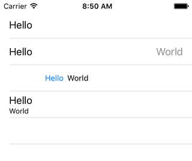
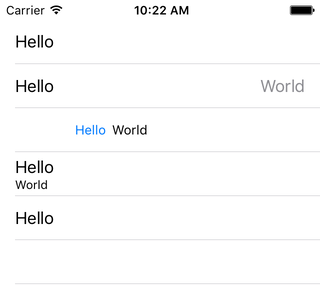
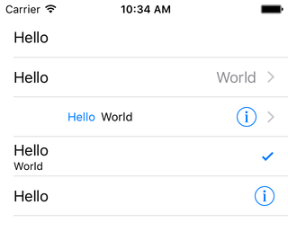
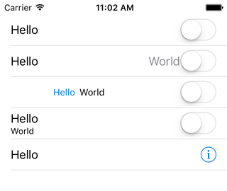
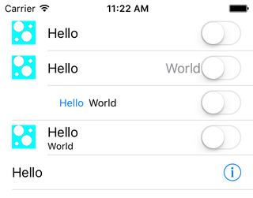

# UITableViewCell Styles & Accessories

We have seen several different ways of setting up a view controller to support a table view. But aside from showing some "Hello World" text, we haven't really done anything with a visual flair. So let's take a first step on the path towards interesting table views by looking at the various customization options that are built in to UITableViewCell.


## Cell Styles

If you refer back to any of the setup chapters, in the cellForRowAtIndexPath method we saw this line of code:

```objc
// Objective-C

UITableViewCell *cell = [[UITableViewCell alloc] initWithStyle:UITableViewCellStyleDefault reuseIdentifier:@"Default"];
```
```swift
// Swift

let cell = UITableViewCell.init(style: .Default, reuseIdentifier: "Default")
```

cellForRowAtIndexPath is one of the 2 required methods defined in UITableViewDataSource. The question it asks is "what cell should I show at this index path?" We answer the question by creating a cell instance and returning it. The table view will take the cell that we return and display it at the appropriate time in the appropriate position.

The designated initializer for UITableViewCell accepts two parameters, a style and a reuse identifier. We'll cover the reuse identifier later, so for now we're just going to focus on the style parameter. That parameter is defined as UITableViewCellStyle, which is an enum with 4 values: Default, Value1, Value2, and Subtitle. So right away Apple gives us 4 different appearances for a humble table view cell, and we haven't even needed to call our graphic designer, or make a custom subclass yet. Let's see how these styles look.

Create a new iOS project, using the Single View Application template. Name it anything you want, like CellStyles. Choose your preferred language, device doesn't really matter but let's go with iPhone, and you can turn off any of the other checkboxes like Core Data as they will not be used in this chapter.

As much as I'd rather not use the Storyboard, it's just easier here to work with it rather than jump through the hoops you saw in the IB chapter. Set up the ViewController class for table view usage, choosing your preferred technique from any of the previous chapters. I will not repeat those instructions here.

At last we will have different data source methods. They should look like this:

```objc
// Objective-C
// ViewController.m

- (NSInteger)tableView:(UITableView *)tableView
 numberOfRowsInSection:(NSInteger)section
{
    return 4;
}

- (UITableViewCell *)tableView:(UITableView *)tableView
         cellForRowAtIndexPath:(NSIndexPath *)indexPath
{
    UITableViewCell *cell = nil;
    
    switch ([indexPath row])
    {
        case 1:
            cell = [[UITableViewCell alloc] initWithStyle:UITableViewCellStyleValue1 reuseIdentifier:@"Value1"];
            break;
        case 2:
            cell = [[UITableViewCell alloc] initWithStyle:UITableViewCellStyleValue2 reuseIdentifier:@"Value2"];
            break;
        case 3:
            cell = [[UITableViewCell alloc] initWithStyle:UITableViewCellStyleSubtitle reuseIdentifier:@"Subtitle"];
            break;
        default:
            cell = [[UITableViewCell alloc] initWithStyle:UITableViewCellStyleDefault reuseIdentifier:@"Default"];
            break;
    }
    
    [[cell textLabel] setText:@"Hello"];
    [[cell detailTextLabel] setText:@"World"];
    
    return cell;
}

```
```swift
// Swift
// ViewController.swift

func tableView(tableView: UITableView, numberOfRowsInSection section: Int) -> Int
{
    return 4
}

func tableView(tableView: UITableView, cellForRowAtIndexPath indexPath: NSIndexPath) -> UITableViewCell
{
    var cell: UITableViewCell
    
    switch(indexPath.row)
    {
    case 1:
        cell = UITableViewCell(style: .Value1, reuseIdentifier: "Value1")
    case 2:
        cell = UITableViewCell(style: .Value2, reuseIdentifier: "Value2")
    case 3:
        cell = UITableViewCell(style: .Subtitle, reuseIdentifier: "Subtitle")
    default:
        cell = UITableViewCell(style: .Default, reuseIdentifier: "Default")
    }
    
    cell.textLabel?.text = "Hello"
    cell.detailTextLabel?.text = "World"
    
    return cell
}

```

First thing, we are increasing our row count to 4. Woo! This is so that we can see all four cell styles. Next, we are using the indexPath parameter, specifically its row component, to decide what kind of cell to show at each row. Recall that row indices start at 0, so the very first row we see will actually fall to the "default" cause since I did not specifically call out row 0.

We've been putting our "Hello World" text into the cell's textLabel property this whole time. The cell also has a detailTextLabel property that we haven't needed until now, so I'm splitting the text across each property to that we can see what happens. Run the app, and observe:



We see 4 rows, each populated and arranged differently. Keep in mind that the only significant difference involved in making these 4 cells was the style parameter. That's a nice amount of variety from a single parameter. Let's talk about what we're seeing:

First row, **UITableViewCellStyleDefault** style

The default style is all that we've seen so far. Basic text, nothing fancy. The key thing to be aware of is what we are _not_ seeing: the word "World". We put that text into the detailTextLabel property, but the Default cell style does not show a detailTextLabel. Thus the Default style is geared towards a single piece of information. So any cell that you see in any table that has a single piece of information with a single appearance (font, color, etc.) is most likely going to be a Default style cell. The rest of the styles are for dealing with 2 pieces of information.

Second row, **UITableViewCellStyleValue1** style

The first thing to notice here is that we see both pieces of text. The text in the textLabel property, which can be considered the primary label, is aligned to the left using the same font as the Default cell. The text in the detailTextLabel property, which can be considered the secondary label, is aligned to the right, using a font that appears to be the same size but is a gray color.

To see this style in action, launch the Settings app. In the first section, the Wi-Fi, Bluetooth, and Personal Hotspot rows, just to name a few, are using this style. If you tap on Bluetooth, you will see even more examples (depending on how many devices you talk to) this time in a table view with a Grouped style. Notice that the style of the table view (Plain vs Grouped) doesn't affect the style of the cell.

And notice the usage pattern. On the left is something that is settable. The Wi-Fi network, Bluetooth, and so on. On the right is the current value for that setting. _Which_ Wi-Fi network you're currently connected to. Is Bluetooth on? Is Personal Hotspot on? The important text is on the left, so that you know where to go to mess with the Wi-Fi settings. The value on the right is a convenience, and could be considered optional, as the user still has to tap the row in order to make changes to the setting. These are conventions that are understood across iOS, and you would be wise to follow them.

Third row, **UITableViewCellStyleValue2** style

Again we have two pieces of information, and again the primary text is on the left with the secondary on the right. There are differences in colors, alignment, and sizes. The text on the left is aligned to the right; the text on the right is aligned to the left. Blue text on the left, each font is slightly smaller than the Default text.

I cannot find an active example in Apple's apps of this style. I believe it died in iOS 7. It was previously used primarily in the Contacts app, and you'll see it if you Google for older images of that app. Here, the text on the left is supposed to be more important, so it has a stronger font. In Contacts for example, the blue text might be "Home" and the black text "888-555-1212". So at a quick glance, you can quickly identify the number, and then if you need more specifics you can look to the left. If you can imagine this data as being in 2 columns on a spreadsheet, the border between columns would be right between the blue and black text. I personally feel that the left column became far too wide in iOS 7; it was not so dramatic before.

Fourth row, **UITableViewCellStyleSubtitle** style

Two pieces of information again, this time arranged vertically. The primary text is on top with a stronger font, the secondary font is on the bottom with a smaller font.

This style was most commonly used by the Music app, back when the Music app was actually not a jumbled mess. You might have an album title in the first line, with the artist in the second line. Or song title and artist. Or any of several combinations. To see it these days, go to Settings > Cellular, then scroll down to the "Use Cellular Data For:" section.

The Subtitle style picked up a neat trick several versions ago. To see it in action, change the number of rows from 4 to 5, and then add this to the switch statement:

```objc
// Objective-C
// ViewController.m

case 4:
    cell = [[UITableViewCell alloc] initWithStyle:UITableViewCellStyleSubtitle reuseIdentifier:@"Subtitle2"];
    [[cell textLabel] setText:@"Hello"];
    return cell;
    break;

```
```swift
// Swift
// ViewController.swift

case 4:
    cell = UITableViewCell(style: .Subtitle, reuseIdentifier: "Subtitle2")
    cell.textLabel?.text = "Hello"
    return cell

```
I only want to use the primary textLabel, so I'm immediately returning this cell before we set the detailTextLabel later in the method. Run the app.



Compare the first row, and the last row. Look the same, right? Indeed, but they are 2 different styles; the first is Default the last is Subtitle. Then compare the last 2 rows, as they are each Subtitle. Notice how the "Hello" text is shifted vertically when there is a detailTextLabel, but is centered vertically when there isn't. The original versions of the iOS didn't work this way. The final cell would have had the "Hello" line in the exact same spot as the previous cell, with a larger empty space underneath. I consider this to be a nice change, but it is something to keep in mind. If you want to have a Subtitle appearance, you need to be aware that cells without detailText will display a little differently.

## Accessory Types

As we've looked at these various app examples, you may have noticed some additional symbols on the right side of the cells. Perhaps an arrow >, or a checkmark, or a variety of other widgets. Several of these (though not everything that you've seen so far) are provided via the accessoryType property. This is defined as a UITableViewCellAccessoryType property, which is an enum with 5 values: None, Disclosure Indicator, Detail Disclosure Button, Checkmark, and Detail Button. Since we now have 5 rows in our table, let's just put one type in each row and see what happens:

```objc
// Objective-C
// ViewController.m

switch ([indexPath row])
{
    case 1:
        cell = [[UITableViewCell alloc] initWithStyle:UITableViewCellStyleValue1 reuseIdentifier:@"Value1"];
        [cell setAccessoryType:UITableViewCellAccessoryDisclosureIndicator];
        break;
    case 2:
        cell = [[UITableViewCell alloc] initWithStyle:UITableViewCellStyleValue2 reuseIdentifier:@"Value2"];
        [cell setAccessoryType:UITableViewCellAccessoryDetailDisclosureButton];
        break;
    case 3:
        cell = [[UITableViewCell alloc] initWithStyle:UITableViewCellStyleSubtitle reuseIdentifier:@"Subtitle"];
        [cell setAccessoryType:UITableViewCellAccessoryCheckmark];
        break;
    case 4:
        cell = [[UITableViewCell alloc] initWithStyle:UITableViewCellStyleSubtitle reuseIdentifier:@"Subtitle2"];
        [[cell textLabel] setText:@"Hello"];
        [cell setAccessoryType:UITableViewCellAccessoryDetailButton];
        return cell;
        break;
    default:
        cell = [[UITableViewCell alloc] initWithStyle:UITableViewCellStyleDefault reuseIdentifier:@"Default"];
        [cell setAccessoryType:UITableViewCellAccessoryNone];
        break;
}

```
```swift
// Swift
// ViewController.swift

switch(indexPath.row)
{
case 1:
    cell = UITableViewCell(style: .Value1, reuseIdentifier: "Value1")
    cell.accessoryType = .DisclosureIndicator
case 2:
    cell = UITableViewCell(style: .Value2, reuseIdentifier: "Value2")
    cell.accessoryType = .DetailDisclosureButton
case 3:
    cell = UITableViewCell(style: .Subtitle, reuseIdentifier: "Subtitle")
    cell.accessoryType = .Checkmark
case 4:
    cell = UITableViewCell(style: .Subtitle, reuseIdentifier: "Subtitle2")
    cell.textLabel?.text = "Hello"
    cell.accessoryType = .DetailButton
    return cell
default:
    cell = UITableViewCell(style: .Default, reuseIdentifier: "Default")
    cell.accessoryType = .None
}

```
Run the app, and let's take a look:



The first thing to notice is that these accessories still work with the various cell styles. You can use any accessory with any cell style.

Next, notice that the first row looks exactly the same, and that's where we're using None. Thus we confirm that None is indeed the default, which is why we haven't seen any of these accessories yet.

The second row is the familiar > arrow. This is called the DisclosureIndicator, and as the name suggests, it it merely an indication of something. The standard meaning for this arrow is that if the user taps on the row, something will happen, most likely sliding to the next screen.

The third row has the arrow again, but also this "i" inside a circle button. Before iOS 7, this same icon was a heavy blue circle with an arrow. This is called DetailDisclosureButton, and as the name suggests it is actually a button. This means that by using this accessory, we have enable a second touch zone. The primary touch zone remains as the bulk of the row. But if the user taps on this "i" icon, it is treated differently. This is useful if you want to have a different action depending on where the user taps.

The forth row has a checkmark, which is quite commonly used. Any apps that involve selecting one or more items are simply toggling the accessory between Checkmark and None. Like the DisclosureIndicator, the checkmark is simply an indicator, and does not present a secondary tap target.

The fifth row has the "i" button alone. It was introduced with iOS 7, and is called DetailButton. So like the other "i" button, it also introduces a second tap target to the row. You can see these in the Wi-Fi panel. Tapping on the row selects that Wi-Fi network. Tapping on the "i" button slides in information about that network. I personally don't know what difference Apple intends with is button vs the DetailDisclosureButton, and the documentation doesn't really give me a clear-cut understanding either. So as far as I'm concerned, they are interchangeable, and it's mostly a style or space choice regarding which to use.

We will discuss the handling of the button taps in a later chapter.

## Accessory Views

Between the cell styles and accessory types, we've seen a good number of options for styling your table view in a "standard" way. We haven't subclassed UITableViewCell yet; we are strictly dealing with its properties. But as you may have observed while browsing around the Settings app, there are elements appearing on the right side of the cell that did not appear in the accessory list. Right off the bat in Settings, the first thing you see is Airplane Mode, and the widget to the right is a switch, something we haven't seen yet. How do they do that?

UITableViewCell is a UIView subclass, so therefore it is a UIView. Views can have subviews. So you could add a subview of anything you want to a UITableViewCell. There are ways to do this with and without subclassing, but we'll address those at a later time. For now, we don't even need to bother, because UITableViewCell provides us an easy means to accomplish it: the accessoryView property. The accessoryView is a simple UIView property, meaning you can shove any UIView or subclass in there. Let's mimic the Airplane Mode row and add a switch:

```objc
// Objective-C
// ViewController.m

[[cell textLabel] setText:@"Hello"];
[[cell detailTextLabel] setText:@"World"];
[cell setAccessoryView:[[UISwitch alloc] init]];

```
```swift
// Swift
// ViewController.swift

cell.textLabel?.text = "Hello"
cell.detailTextLabel?.text = "World"
cell.accessoryView = UISwitch()

```

Run the app and take a look:



(recall that we are bailing early for the final row, so that's why it looks different)

Again notice that this accessory view works with all cell styles. And also notice that we are no longer seeing our accessory types, even though they were set first in the code. If an accessory view is provided, the accessory type will be ignored.

As I said, this accessory view could be anything. A switch as we've done here, a button, another plain view, and image view, whatever you want. But do notice how it shoved the word "World" over in the second row, so you'll want to keep spacing considerations in mind. We will discuss how to handle taps on the switch, or a button, in a later chapter.

## Image View

So we've seen all of this easily configurable neat stuff about cells, but there's one thing immediately apparent upon viewing Settings that we haven't talked about: icons on the left.

The story here is much the same as it was for the accessory views. We could certainly add subviews of anything we want, with or without subclassing. But here again, UITableViewCell adds a useful property that largely avoids the need to do so: an imageView property. A difference is that the accessoryView was a plain UIView, but this imageView is a UIImageView property, so that limits our options somewhat.

If you refer to the Sample Code folder for this chapter, in each project there are 3 images: image.png, image@2x.png, and image@3x.png. Add these images to your project. Or if you have another image you'd rather use, size it down to 30x30, 60x60, and 90x90 following the same file naming convention. Now let's use our imageView:

```objc
// Objective-C
// ViewController.m

[[cell textLabel] setText:@"Hello"];
[[cell detailTextLabel] setText:@"World"];
[cell setAccessoryView:[[UISwitch alloc] init]];
[[cell imageView] setImage:[UIImage imageNamed:@"image"]];

```
```swift
// Swift
// ViewController.swift

cell.textLabel?.text = "Hello"
cell.detailTextLabel?.text = "World"
cell.accessoryView = UISwitch()
cell.imageView?.image = UIImage(named: "image")

```
Run the app and take a look:



(recall that we are bailing early for the final row, so that's why it looks different)

At last we have an icon on the left, and we now have all of the pieces we need to recreate the look of the Settings app.

A curiosity: The icon does not appear when used with the Value2 cell style. To be completely honest, I did not realize that until writing this chapter and running the sample app. I had assumed it would appear. I'm not certain if this was an iOS 7 change or if it has always been this way. So, be advised, if you want the icon on the left, you apparently cannot use the Value2 cell style.

For the rest of the rows, notice how all of the text has been shoved to the right to make room for the image.

## Summary

This is a lengthy chapter, but I feel it is important to draw attention to everything that Apple provides you for free, or at least cheaply, when it comes to customizing your table views. To recap what we saw:

* 4 different cell styles, with text arranged in different ways
* 5 different cell accessories, 2 of which add tap actions to your cell
* A customizable view on the right
* A customizable image view on the left

Notice what we did not do:
* Subclass UITableViewCell
* addSubview

All of the variety we have seen was provided by UITableViewCell itself, via customizable properties. We will get into more advanced forms of configuration later, but for now it is worth understanding and appreciating just how far you can go with a humble UITableViewCell. These layouts are established by Apple as standards, and when you adhere to standards, you make life easier on your users as they can instantly understand how your app works.

---
From:
[A Reasonably Complete Guide to UITableView](https://github.com/BriTerIdeas/Book-UITableViewGuide), by Brian Slick