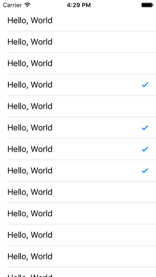

# Table Cell Reuse

As we saw in the [Styles & Accessories](../06.UITableViewCell/UITableViewCell.md) chapter, UITableViewCells are initialized with 2 parameters:

```objc
// Objective-C

UITableViewCell *cell = [[UITableViewCell alloc] initWithStyle:UITableViewCellStyleDefault reuseIdentifier:@"Default"];
```
```swift
// Swift

let cell = UITableViewCell.init(style: .Default, reuseIdentifier: "Default")
```
We explored the style parameter in that chapter. Now let's talk about the reuseIdentifier.

This topic is fundamentally about performance, specifically scrolling performance. Now I don't really have a great example of something that we can quickly wire up that will bring your average device to its knees when we try to scroll. So I will have to ask you take some of this on faith. What I show in this chapter will improve your scrolling performance - if you are not already following the techniques - even if you don't think you notice any issues.

So let's begin with a project that will demonstrate the reason for concern, if not being able to display the performance issue itself.

Create a new iOS project, using the Single View Application template. Name it anything you want, like CellReuse. Choose your preferred language, device doesn't really matter but let's go with iPhone, and you can turn off any of the other checkboxes like Core Data as they will not be used in this chapter.

Once again we will stick with the Storyboard, so rig up the ViewController class to support a table view as we have done several times now. We will start roughly where we have started previously, with some simple text being displayed. But what I want to do is demonstrate how many cells we are creating, so I will add a counter property and then log its value. Make your file look something like this:

```objc
// Objective-C
// ViewController.m

#import "ViewController.h"

@interface ViewController () <UITableViewDataSource, UITableViewDelegate>

@property (weak, nonatomic) IBOutlet UITableView *tableView;
@property (nonatomic, assign) NSInteger numberOfCellsCreated;

@end

@implementation ViewController

#pragma mark - UITableViewDataSource Methods

- (NSInteger)tableView:(UITableView *)tableView
 numberOfRowsInSection:(NSInteger)section
{
    return 50;
}

- (UITableViewCell *)tableView:(UITableView *)tableView
         cellForRowAtIndexPath:(NSIndexPath *)indexPath
{
    UITableViewCell *cell = [[UITableViewCell alloc] initWithStyle:UITableViewCellStyleDefault reuseIdentifier:@"Default"];
    self.numberOfCellsCreated++;
    NSLog(@"Number of cells created: %ld", (long)self.numberOfCellsCreated);
    
    [[cell textLabel] setText:@"Hello, World"];
    
    return cell;
}

@end
```
```swift
// Swift
// ViewController.swift

import UIKit

class ViewController: UIViewController, UITableViewDataSource, UITableViewDelegate
{
    @IBOutlet weak var tableView: UITableView!
    var numberOfCellsCreated = 0
    
    // MARK: - UITableViewDataSource Methods
    
    func tableView(tableView: UITableView, numberOfRowsInSection section: Int) -> Int
    {
        return 50
    }
    
    func tableView(tableView: UITableView, cellForRowAtIndexPath indexPath: NSIndexPath) -> UITableViewCell
    {
        let cell = UITableViewCell.init(style: .Default, reuseIdentifier: "Default")
        numberOfCellsCreated++
        print("Number of cells created: \(numberOfCellsCreated)")
        
        cell.textLabel?.text = "Hello, World"
        
        return cell
    }
}
```
This is pretty much what we've seen so far, just with 50 rows. I increment the counter after creating a cell, and then log the value. Run the app.

The first thing to observe is that upon first launch, we do not create 50 cells. This is what I see when running in the iPhone 5S simulator:

>Number of cells created: 13

Only 13. Notice that this is much less than 50. If I count on the screen, I can see the entirety of 12 cells, and I can partially see 1 more, for a total of 13 visible cells. If you scroll up very slowly, and watch the logs, notice that this only happens:

>Number of cells created: 14

...when that new cell first becomes visible. Even the tiniest piece of that cell shows up, and a new one will be created.

Now scroll the table back and forth a lot. Scroll all the way to the bottom, back up to the top, jiggle around in the middle, whatever. And keep an eye on the log output while you do.

>Number of cells created: 315
Number of cells created: 316
Number of cells created: 317

I'm already in the hundreds without much trying. Spend enough time and you'll be in the thousands. The specific number doesn't really matter, all that you need to notice right now is that it is greater than 50, our number of rows.

Why does this matter? Well, if you hang around developer circles long enough, you'll eventually hear some form of the phrase "allocation is expensive". Allocation meaning creating a new object, and expensive usually meaning CPU cycles, though could also refer to memory usage. If you have a choice between creating a new object and NOT creating a new object, chances are pretty good that NOT creating it will be faster. Creating 100 objects would be faster than creating 300 equivalent objects. So the more of these that we make, the more resources we are throwing at something that could be better used elsewhere.

Now I don't mean to suggest that we are leaking memory here. The table view takes our cell that we returned in cellForRowAtIndexPath, shows it on screen when appropriate, and then once it is off screen, discards it. (This isn't technically true, but we'll get to that in a moment.) The discarded cells are indeed free to die, so we aren't camping on any needless memory.

At this point, the key concepts to take away are:
* The table view will only request enough cells to service the immediate need. It does NOT request every possible cell that it _might_ need right away.
* In the absence of the technique I'm about to show, you will just keep on creating brand new table view objects as needed, which could easily be hundreds of cells, quite conceivably thousands. That's a lot of object creation, and we'd like to avoid or at least reduce that.

In order to reduce the need to create all of these cells, the designers of UITableView provided a caching mechanism. Instead of having to instantly create a brand new cell, you can first ask the table view if it has any cells already available. That question takes the form of this method in UITableView:

```objc
// Objective-C
- (nullable UITableViewCell *)dequeueReusableCellWithIdentifier:(NSString *)identifier;
```
```swift
// Swift
public func dequeueReusableCellWithIdentifier(identifier: String) -> UITableViewCell?
```
The first thing to notice here is the return value. In ObjC, this is nullable; in Swift it is an optional. And the reason is simple: the cache could be empty. If this cache is empty, the table view cannot give you back a table cell, and you will get back nil. Why would it be empty? Well, most commonly this will occur at first launch (or first display of this screen). You don't start off with a pre-populated cache. You have to have some objects available to put into the cache, and those won't be ready right away.

The other thing to notice is the input parameter, a string called "identifier". Basically, the table view can have several caches. Each cache will be identified by name, and that name is this "identifier" parameter. This is the same name that we will use to create the cell with, in the reuseIdentifier parameter.

Generally speaking, the first thing we want to do is ask the table view if there are any cells available in the cache for a given identifier. That looks like this:

```objc
// Objective-C
- (UITableViewCell *)tableView:(UITableView *)tableView
         cellForRowAtIndexPath:(NSIndexPath *)indexPath
{
    UITableViewCell *cell = [tableView dequeueReusableCellWithIdentifier:@"Default"];
    
    return cell;
}
```
```swift
// Swift
func tableView(tableView: UITableView, cellForRowAtIndexPath indexPath: NSIndexPath) -> UITableViewCell
{
    let cell = tableView.dequeueReusableCellWithIdentifier("Default")
    
    return cell!
}
```
Because the return from this method is optional, Swift will complain until you unwrap it, so that's why the ! is there in the return value. Run the app, see what happens.

It's bad.

Swift gets caught up on finding nil when it unwraps the optional, so we'll have to refer to ObjC for a better error message. I've cleaned this up a bit, but the essence is:

>*** Terminating app due to uncaught exception 'NSInternalInconsistencyException', reason: 'UITableView failed to obtain a cell from its dataSource 

And sure enough, in the documentation for cellForRowAtIndexPath, we find:
>An assertion is raised if you return nil.

What this is saying, and what we have just proven for ourselves, is that we MUST return a valid UITableViewCell object in this method.

In other words, we need to protect ourselves when the cache is empty. We do this by checking for nil, and if we find it, we create a brand new cell at that moment. That check looks like this:

```objc
// Objective-C
- (UITableViewCell *)tableView:(UITableView *)tableView
         cellForRowAtIndexPath:(NSIndexPath *)indexPath
{
    UITableViewCell *cell = [tableView dequeueReusableCellWithIdentifier:@"Default"];
    if (cell == nil)
    {
        cell = [[UITableViewCell alloc] initWithStyle:UITableViewCellStyleDefault reuseIdentifier:@"Default"];
        self.numberOfCellsCreated++;
        NSLog(@"Number of cells created: %ld", (long)self.numberOfCellsCreated);
    }
    
    [[cell textLabel] setText:@"Hello, World"];
    
    return cell;
}
```
```swift
// Swift
{
    var optionalCell = tableView.dequeueReusableCellWithIdentifier("Default")
    if (optionalCell == nil)
    {
        optionalCell = UITableViewCell.init(style: .Default, reuseIdentifier: "Default")
        numberOfCellsCreated++
        print("Number of cells created: \(numberOfCellsCreated)")
    }
    
    // At this point, we are certain we have a cell.
    // Let's map to a new variable so that we don't have
    // to deal with the optional past this point.
    
    let cell = optionalCell!
    
    cell.textLabel?.text = "Hello, World"
    
    return cell
}
```
>Swift comment: Since the dequeue... method returns an optional, the variable is defined as an optional, even though once we get past the if (cell == nil) part, we know for certain that we have a value; it is no longer nil. But, due to Swift rules, we still have to deal with it as an optional, which potentially means a bunch of ?'s and !'s along the way, and then the final return value cannot be an optional so we must force unwrap it. This is not a concern that ObjC has ever had, and at the time of this writing I'm not aware of Apple providing any update guidelines for how to handle this situation here in cellForRow in Swift. In the absence of guidance, I have made a decision that the cleanest way to handle this is to force-unwrap the optional into a new non-optional variable. I will continue to use this convention from here out, but I will be happy to consider alternative approaches.

If cell is nil, we enter the clause and create one. If not, that means we got one from the cache, and we bypass the clause. Note that we use the same identifier in both places. In fact it is not a bad idea to use a separate variable to reduce errors:

```objc
// Objective-C
- (UITableViewCell *)tableView:(UITableView *)tableView
         cellForRowAtIndexPath:(NSIndexPath *)indexPath
{
    static NSString *identifier = @"Default";
    
    UITableViewCell *cell = [tableView dequeueReusableCellWithIdentifier:identifier];
    if (cell == nil)
    {
        cell = [[UITableViewCell alloc] initWithStyle:UITableViewCellStyleDefault reuseIdentifier:identifier];
        self.numberOfCellsCreated++;
        NSLog(@"Number of cells created: %ld", (long)self.numberOfCellsCreated);
    }
    
    [[cell textLabel] setText:@"Hello, World"];
    
    return cell;
}
```
```swift
// Swift
{
   let identifier = "Default"
   
   var optionalCell = tableView.dequeueReusableCellWithIdentifier(identifier)
   if (optionalCell == nil)
   {
      optionalCell = UITableViewCell.init(style: .Default, reuseIdentifier: identifier)
      numberOfCellsCreated++
      print("Number of cells created: \(numberOfCellsCreated)")
   }
   
   let cell = optionalCell!
   
   cell.textLabel?.text = "Hello, World"
   
   return cell
}
```
Now run the app and scroll around again. This is the highest I see on the iPhone 5S:

>Number of cells created: 14

No matter how much I scroll, back and forth all day long, I've gone from creating hundreds of cells - without limit mind you, to a mere 14.

What is happening behind the scenes is that when a cell is no longer needed on screen, the UITableView will place it into an appropriate cache. Then when a new row needs to be displayed, that cell can be pulled right back out of the cache and shown on screen again, without needing to create a new one. And it turns out that you don't need to create too many more than are ever visible at one time, plus a small buffer. I said before I could see 13 rows, so a buffer of 1 is apparently sufficient. I would not be surprised to see 15 or 16 cells created total, but the designers felt that the buffer size we are witnessing was sufficient.

So, hopefully I don't require too much justification to claim that creating only 14 objects will be higher performance than creating hundreds of objects. That seems inherently obvious.

But we have introduced a new consideration. Let's say that we want the 4th row to show a checkmark. Easy enough, simply add this code before returning the cell:

```objc
// Objective-C

[[cell textLabel] setText:@"Hello, World"];

if ([indexPath row] == 3)
{
    [cell setAccessoryType:UITableViewCellAccessoryCheckmark];
}

return cell;
```
```swift
// Swift

cell!.textLabel?.text = "Hello, World"

if indexPath.row == 3
{
    cell.accessoryType = .Checkmark
}

return cell
```
Run the app, and sure enough there is our checkmark on the 4th row. So far so good.

Now scroll.

Scroll all the way to the bottom. Notice anything? Scroll all the way back to the top. How about now? Repeat this several times. Eventually you should wind up with something like this:



Uh oh. Worse, theoretically if you keep scrolling long enough, you could conceivably wind up with a checkmark in every single row. What in the world happened here?

Well, I titled the chapter "Cell Reuse", but it could just as easily have been called "Cell Recycling" because it means the same thing. After a certain point, we are no longer dealing with brand new cells. We are reusing cells that were created long ago, and were potentially shown on screen numerous times. So how does that explain the extra checkmarks? Well, let's think this through.

1. From a fresh launch, the table asks for a cell at row 0. Cache is empty, so we create a new cell. It is not row 4, so we don't add a checkmark.
2. Next the table asks for cells in rows 1 and 2. Cache is still empty, so we create new cells. Still not row 4, no checkmarks added.
3. Now we get to row 4. Cache is empty, create new cell. It _is_ row 4 now, so add the checkmark.
4. We are now past row 4, so any additional cells are created as needed, without adding checkmarks.
5. Now we scroll. The first row slides off screen, and is placed into the cache. We need to show row 14. The cache is not empty, so we grab the cell that used to be at row 1, and use it for row 14.
6. We keep scrolling. Row 2 slides off, we reuse it for row 15. Row 3 slides off, we reuse it for row 16.
7. Now row 4 slides off. Recall that this cell has a checkmark. It goes into the cache with the checkmark. We pull it out for row 17... and it still has the checkmark. So we see what appears to be a second checkmark in our list that we didn't ask for.
8. Scroll all the way down. Rows keep sliding off, going into the cache, coming back out of the cache, and sliding back on.
9. Scroll all the way back up. Eventually we reach row 4 again, and pull a cell out of the cache. What are the chances that the cell we get out of the cache this time will be the exact same cell that we used the first time for row 4? It could happen, but it's pretty unlikely. So we pull out a cell that probably does not already have a checkmark, we add a checkmark, and display it. Now we have a total of 2 cells in circulation with checkmarks.
 
So that's the general idea. Each time we recycle a cell for row 4, we're going to add a checkmark. That's fine as long as we're dealing with the exact same cell at row 4 each time, but it is highly unlikely that will be the case. If we keep scrolling long enough, eventually we'll add a checkmark to each cell in the cache, and will no longer have blank rows. That's a bummer.

This example has exposed a flaw in our assumptions. We assumed that we were getting a fresh and clean cell each time through, and this is a very common mistake for beginners to make (even veterans once in a while). And when we were creating hundreds of cells, that was indeed the case. But now we are only creating 14 cells, and they aren't fresh and clean anymore. The more we use them, the dirtier they get. So the solution to our problem is to take steps to clean them. In this case, that means turning the checkmark OFF when we aren't showing row 4. That looks like this:

```objc
// Objective-C

if ([indexPath row] == 3)
{
    [cell setAccessoryType:UITableViewCellAccessoryCheckmark];
}
else
{
    [cell setAccessoryType:UITableViewCellAccessoryNone];
}
```
```swift
// Swift

if indexPath.row == 3
{
    cell.accessoryType = .Checkmark
}
else
{
    cell.accessoryType = .None
}
```
When we get to the row we want, we add the checkmark. For **all other rows**, we turn the checkmark off.

Run the app again, and scroll as much as you want. You should only ever see a single checkmark on the 4th row.

There are at least a couple of ways of writing cellForRowAtIndexPath code that can reveal a similar problem. So let me offer you a guideline on the way to do it correctly:

```objc
// Objective-C

UITableViewCell *cell = [tableView dequeue....];
if (cell == nil)
{
   cell = [[UITableViewCell alloc] init....];
   
   // A. If it needs to be the same on EACH cell, do it here
   
   [[cell textLabel] setText:@"Hello, World"];
}

// B. If it COULD be different on ANY cell, do it here.
// This should be an if/else. If you stop at 'if', you're doing it wrong.

if ([indexPath row] == 3)
{
    [cell setAccessoryType:UITableViewCellAccessoryCheckmark];
}
else
{
    [cell setAccessoryType:UITableViewCellAccessoryNone];
}

return cell
```
```swift
// Swift

var optionalCell = tableView.dequeue....
if (optionalCell == nil)
{
   optionalCell = UITableViewCell.init....
   
   // A. If it needs to be the same on EACH cell, do it here
   optionalCell!.textLabel?.text = "Hello, World"
}

let cell = optionalCell!

// B. If it COULD be different on ANY cell, do it here.
// This should be an if/else. If you stop at 'if', you're doing it wrong.

if indexPath.row == 3
{
    cell.accessoryType = .Checkmark
}
else
{
    cell.accessoryType = .None
}

return cell
```
I've placed two comments in there, **A** and **B**.

**A** is where you should do anything that should be and/or appear exactly the same on every single cell, without changing. If your font should be bold, do it there. If your font should be green, do it there. If all of your row accessories will be the same, apply them there. If what you want to do will be different on any row, under any circumstances, don't do it at **A**.

**B** is where you should do anything that COULD be different on any cell. It could be every other cell, it could be most cells, it could be only 1 out of 1000 cells. If it needs to be different under any circumstances, it needs to be outside of the if (cell == nil){} clause. And you almost certainly will need to set it up as an if/else structure. If you want even rows to have red text, and odd rows to have black text, you'll 'if' one and 'else' the other. Maybe one section has > indicators, another section has "i" accessories. Set up a conditional statement for that. Whatever you DO in the if case, you have to UNDO in the else case. In this example, we applied the checkmark in the if case. We removed the checkmark in the else case.

When using cell recycling, and in most (but not all) cases you will want to, this is the structure you have to follow in order to get proper display of your cells. At any point in the future, if your problem can be described as "it looks great at first, but then goes screwy when I scroll", the root cause is most likely somewhere here. It may sound complicated, in exchange you get a real performance gain when scrolling. The more complex your cell is, the more gain you will have by using cell recycling.

---
From:
[A Reasonably Complete Guide to UITableView](https://github.com/BriTerIdeas/Book-UITableViewGuide), by Brian Slick