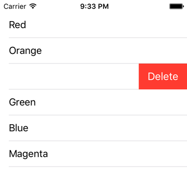

< [Handling Row Taps](../09.HandlingRowTaps/HandlingRowTaps.md) | [Editing Mode](../11.EditingMode/EditingMode.md) >

# Deleting Rows

Thus far in our series, we've dealt with static data. We pre-populate some data, show that data in our table view, and call it a day. In this chapter, we take the first step in allowing the user to modify that data. We'll separate different kinds of modifications into separate chapters. This one will focus on deleting rows, and thus deleting data.

## Setup

Create a new iOS project, using the Single View Application template. Name it anything you want, like DeletingRows. Choose your preferred language, device doesn't really matter but let's go with iPhone, and you can turn off any of the other checkboxes like Core Data as they will not be used in this chapter. Using your preferred technique, configure the provided view controller for table view use.

We will again use the list of colors that we saw in the [Basic Data Structure](../08.BasicDataStructure/BasicDataStructure.md) chapter, with one slight exception. Since we intend to modify the data, the non-mutable NSArray we used in ObjC will not work. We'll need to use NSMutableArray instead. The Swift code was already mutable (via the 'var' declaration) due to the way I elected to set it up. Make your view controller look like this:

```objc
// Objective-C

#import "ViewController.h"

@interface ViewController () <UITableViewDataSource, UITableViewDelegate>

@property (weak, nonatomic) IBOutlet UITableView *tableView;
@property (nonatomic, strong) NSMutableArray *contents;

@end

@implementation ViewController

- (void)viewDidLoad
{
    [super viewDidLoad];
    
    [self setContents:[@[ @"Red", @"Orange", @"Yellow", @"Green", @"Blue", @"Magenta"] mutableCopy]];
}

#pragma mark - UITableViewDataSource Methods

- (NSInteger)tableView:(UITableView *)tableView
 numberOfRowsInSection:(NSInteger)section
{
    return [[self contents] count];
}

- (UITableViewCell *)tableView:(UITableView *)tableView
         cellForRowAtIndexPath:(NSIndexPath *)indexPath
{
    static NSString *identifier = @"PlainCell";
    
    UITableViewCell *cell = [tableView dequeueReusableCellWithIdentifier:identifier];
    if (cell == nil)
    {
        cell = [[UITableViewCell alloc] initWithStyle:UITableViewCellStyleDefault reuseIdentifier:identifier];
    }
    
    NSString *rowValue = [[self contents] objectAtIndex:[indexPath row]];
    
    [[cell textLabel] setText:rowValue];
    
    return cell;
}

@end
```
```swift
// Swift

import UIKit

class ViewController: UIViewController, UITableViewDataSource, UITableViewDelegate
{
    @IBOutlet weak var tableView: UITableView!
    var contents = [String]()
    
    override func viewDidLoad()
    {
        super.viewDidLoad()
        
        contents = [ "Red", "Orange", "Yellow", "Green", "Blue", "Magenta" ]
    }
    
    // MARK: - UITableViewDataSource Methods
    
    func tableView(tableView: UITableView, numberOfRowsInSection section: Int) -> Int
    {
        return contents.count
    }
    
    func tableView(tableView: UITableView, cellForRowAtIndexPath indexPath: NSIndexPath) -> UITableViewCell
    {
        let identifier = "PlainCell"
        
        var optionalCell = tableView.dequeueReusableCellWithIdentifier(identifier)
        if (optionalCell == nil)
        {
            optionalCell = UITableViewCell.init(style: .Default, reuseIdentifier: identifier)
        }
        
        let cell = optionalCell!
        
        let rowValue = contents[indexPath.row];
        
        cell.textLabel?.text = rowValue
        
        return cell
    }    
}
```
Run the app, and try to swipe-to-delete. This actually can be done in the Simulator, but you may find it easier to test on a device. Note that at this point, nothing happens. You either select the row, or nothing happens at all.

## Implementation

Row deletion in general, and swipe-to-delete in particular, is something that needs to be enabled. As we'll see over the next few chapters, some common table view behaviors are enabled simply by providing an implementation of one or two key delegate methods. In order to enable swipe-to-delete, we need to implement the following method, so add it to your view controller:

```objc
// Objective-C

#pragma mark - UITableViewDataSource Methods

- (void)tableView:(UITableView *)tableView
commitEditingStyle:(UITableViewCellEditingStyle)editingStyle
forRowAtIndexPath:(NSIndexPath *)indexPath
{
    
}
```
```swift
// Swift

// MARK: - UITableViewDataSource Methods

func tableView(tableView: UITableView, commitEditingStyle editingStyle: UITableViewCellEditingStyle, forRowAtIndexPath indexPath: NSIndexPath)
{
    
}
```
There's a lot going on just in the method signature, though note that I have an empty method at the moment. That's fine for now, run the app and try to swipe.



There is the familiar button. But notice that tapping that button doesn't cause anything to happen. You can tap anywhere you want to make the button go away, but tapping on the button itself doesn't do anything. We need the mere presence of this delegate method to see the button, but then we need to write some code to make something happen.

Let's pay attention to the name of the method here. Commit editing style. Note that we don't see the word "delete" anywhere here. Or "Remove" or anything similar. Just edit. That editingStyle parameter is probably important. And sure enough the documentation reveals that it can have 3 possible values: None, Delete, and Insert. There is that "delete" word we were looking for. This means that this method will be called under different editing circumstances, and we need to be careful to only act in the event of a deletion. We do that by adding a check:

```objc
// Objective-C

#pragma mark - UITableViewDataSource Methods

- (void)tableView:(UITableView *)tableView
commitEditingStyle:(UITableViewCellEditingStyle)editingStyle
forRowAtIndexPath:(NSIndexPath *)indexPath
{
   if (editingStyle == UITableViewCellEditingStyleDelete)
   {
    
   }
}
```
```swift
// Swift

// MARK: - UITableViewDataSource Methods

func tableView(tableView: UITableView, commitEditingStyle editingStyle: UITableViewCellEditingStyle, forRowAtIndexPath indexPath: NSIndexPath)
{
   if editingStyle == .Delete
   {
            
   }
}
```
> Comment: I have never had a reason to use the "None" case. I honestly don't even know when or why that condition would happen. The "Insert" case is equally rare. So 99.99% of the time, you're only going to care about the "Delete" case.

## Wrong Way #1

Alright, we're ready to delete some data. We have our array of strings, and we have an index path. So that means we have an index for our array, and we can remove a corresponding item:

```objc
// Objective-C

- (void)tableView:(UITableView *)tableView
commitEditingStyle:(UITableViewCellEditingStyle)editingStyle
forRowAtIndexPath:(NSIndexPath *)indexPath
{
   if (editingStyle == UITableViewCellEditingStyleDelete)
   {
      [[self contents] removeObjectAtIndex:[indexPath row]];
   }
}
```
```swift
// Swift

func tableView(tableView: UITableView, commitEditingStyle editingStyle: UITableViewCellEditingStyle, forRowAtIndexPath indexPath: NSIndexPath)
{
   if editingStyle == .Delete
   {
      contents.removeAtIndex(indexPath.row)
   }
}
```
If you run this now, swipe-to-delete, and tap on the delete button, either nothing will happen, or you will crash, depending on which row you swipe. If you keep on tapping the delete button, you will eventually crash with something like this:
> fatal error: Array index out of range

What's happening? Let's add a log and find out:

```objc
// Objective-C

- (void)tableView:(UITableView *)tableView
commitEditingStyle:(UITableViewCellEditingStyle)editingStyle
forRowAtIndexPath:(NSIndexPath *)indexPath
{
   if (editingStyle == UITableViewCellEditingStyleDelete)
   {
      [[self contents] removeObjectAtIndex:[indexPath row]];
      NSLog(@"%@", [self contents]);
   }
}
```
```swift
// Swift

func tableView(tableView: UITableView, commitEditingStyle editingStyle: UITableViewCellEditingStyle, forRowAtIndexPath indexPath: NSIndexPath)
{
   if editingStyle == .Delete
   {
      contents.removeAtIndex(indexPath.row)
      print(contents)
   }
}
```
You should see something like this:
>["Red", "Orange", "Green", "Blue", "Magenta"]
["Red", "Orange", "Blue", "Magenta"]
["Red", "Orange", "Magenta"]
["Red", "Orange"]
fatal error: Array index out of range

So the array is indeed getting smaller. Eventually it gets small enough that whatever index you're tapping on is out of bounds, and then you crash.

## The Right Way

This seems a little weird, but we actually need to tell the table view to delete the row. It's weird because the table view is currently telling _us_ to commit that editing change. The way we tell the table view to delete a row is with this method:

```objc
// Objective-C

- (void)tableView:(UITableView *)tableView
commitEditingStyle:(UITableViewCellEditingStyle)editingStyle
forRowAtIndexPath:(NSIndexPath *)indexPath
{
   if (editingStyle == UITableViewCellEditingStyleDelete)
   {
      [[self contents] removeObjectAtIndex:[indexPath row]];
      [tableView deleteRowsAtIndexPaths:@[ indexPath ] withRowAnimation:UITableViewRowAnimationAutomatic];
   }
}
```
```swift
// Swift

func tableView(tableView: UITableView, commitEditingStyle editingStyle: UITableViewCellEditingStyle, forRowAtIndexPath indexPath: NSIndexPath)
{
   if editingStyle == .Delete
   {
      contents.removeAtIndex(indexPath.row)
      tableView.deleteRowsAtIndexPaths([indexPath], withRowAnimation: .Automatic)
   }
}
```
Easy enough, we tell the table view to delete some rows, and give it an array of index paths. In this case we only need one, but file that away for later that you can delete multiple rows at once.

The row animation option is a way to provide some flair to the deletion animation. It can slide up or down, left or right, or you can do a fade. In iOS 5, Apple added the "Automatic" option, which uses the context of whatever you're doing to make a good decision regarding how to animate the row out. It works really well, so I'm not going to bother covering the other options. Feel free to explore them on your own.

Run the app now, and observe swipe-to-delete in action. Hitting the delete button actually works this time, the rows slides out, and our list gets shorter. Success!

## Wrong Way #2

In your travels, you may encounter a slight variation on how this works, and it looks like this:

```objc
// Objective-C

- (void)tableView:(UITableView *)tableView
commitEditingStyle:(UITableViewCellEditingStyle)editingStyle
forRowAtIndexPath:(NSIndexPath *)indexPath
{
   if (editingStyle == UITableViewCellEditingStyleDelete)
   {
      [[self contents] removeObjectAtIndex:[indexPath row]];
      [tableView reloadData];  // Don't do this here
   }
}
```
```swift
// Swift

func tableView(tableView: UITableView, commitEditingStyle editingStyle: UITableViewCellEditingStyle, forRowAtIndexPath indexPath: NSIndexPath)
{
   if editingStyle == .Delete
   {
      contents.removeAtIndex(indexPath.row)
      tableView.reloadData()  // Don't do this here
   }
}
```
reloadData is sort of the "nuclear option" when it comes to table views. In situations like this, it is usually a band-aid applied when a better solution would be to increase one's understanding of how table views work. Go ahead and run the app, and see what is different. It's subtle but it is there. Notice that when the row is deleted, it just instantly vanishes. We've lost our nice animation of the row sliding out. When you reload a table view, it's like hitting the reset button. It's going to disregard any nice animations - even if we were asking for them, which we aren't in this case - and simply start over. So yes, the end result is the same; we have a shorter list. But we've made our user experience just a little more jarring.

## Wrong Way #3

What is the reason that you might encounter reloadData in a situation like this? Well, we saw what happened when we deleted array data without deleting a row. Let's try it the other way around, deleting a row without deleting array data:

```objc
// Objective-C

- (void)tableView:(UITableView *)tableView
commitEditingStyle:(UITableViewCellEditingStyle)editingStyle
forRowAtIndexPath:(NSIndexPath *)indexPath
{
   if (editingStyle == UITableViewCellEditingStyleDelete)
   {
//      [[self contents] removeObjectAtIndex:[indexPath row]];
      [tableView deleteRowsAtIndexPaths:@[ indexPath ] withRowAnimation:UITableViewRowAnimationAutomatic];
   }
}
```
```swift
// Swift

func tableView(tableView: UITableView, commitEditingStyle editingStyle: UITableViewCellEditingStyle, forRowAtIndexPath indexPath: NSIndexPath)
{
   if editingStyle == .Delete
   {
//      contents.removeAtIndex(indexPath.row)
      tableView.deleteRowsAtIndexPaths([indexPath], withRowAnimation: .Automatic)
   }
}
```
Run the app, swipe-to-delete, and... crash.
>Invalid update: invalid number of rows in section 0.  The number of rows contained in an existing section after the update (6) must be equal to the number of rows contained in that section before the update (6), plus or minus the number of rows inserted or deleted from that section (0 inserted, 1 deleted) and plus or minus the number of rows moved into or out of that section (0 moved in, 0 moved out).

This is wordy, but UITableView really does have some of the best error messages in all of UIKit. In short, what this is saying is that we told the table view there were 6 rows originally, then we told it to delete 1, but then we're still telling it there are 6 rows. Recall that the way we tell the table view how many rows it has is with the numberOfRowsInSection method. That method is returning the count of the array, which is 6. During this row deletion process, the table view will bounce off of that method again to find out what the new total is. The table view believes, correctly, that the answer should be 5, but we are still providing a value of 6. The table view doesn't like this discrepancy, so it crashes.

Situations like this are why some people choose to reloadData at the wrong time. It's a fundamental misunderstanding of how to work with table views.

Let's recap what we've seen so far:
* Delete data only. This did not work and eventually crashed.
* Delete row only. This crashed quickly.
* Delete data and row. This worked.

We only successfully performed a swipe-to-delete when we did 2 actions: 1) remove a piece of data, _and_ 2) delete a row. This will be a repeating theme in future chapters. This transaction has two components, one data and one visual. You have to do both, and in most cases you will need to mess with the data first. Forgetting one or the other step leads to problems.

## Prevention

Before proceeding, make sure to uncomment the remove from array line, so that we are again performing both steps in the transaction. Run the app and verify that you can still swipe-to-delete.

As we saw in the [Handling Row Taps](../09.HandlingRowTaps/HandlingRowTaps.md) chapter, in addition to receiving notice about the row tap itself, we can also take steps to prevent rows from being tapped. The situation is the same here. Not only can we delete rows, we can take steps to prevent rows from being deleted. And just as in that chapter, the solution here is again yet another delegate method. It looks like this:

```objc
// Objective-C

- (BOOL)tableView:(UITableView *)tableView
canEditRowAtIndexPath:(NSIndexPath *)indexPath
{
    return NO;
}
```
```swift
// Swift

func tableView(tableView: UITableView, canEditRowAtIndexPath indexPath: NSIndexPath) -> Bool
{
    return false
}
```
We return a simple boolean to indicate whether or not a row can be edited. If you implement this method exactly as I have it here, you won't be able to delete rows anymore. That's not very useful, so let's pretend that our first row is some kind of a status view, so we don't want that to be deleted, but anything else is fair game.

```objc
// Objective-C

- (BOOL)tableView:(UITableView *)tableView
canEditRowAtIndexPath:(NSIndexPath *)indexPath
{
    return [indexPath row] != 0;
}
```
```swift
// Swift

func tableView(tableView: UITableView, canEditRowAtIndexPath indexPath: NSIndexPath) -> Bool
{
    return indexPath.row != 0
}
```
Run the app and verify that indeed we can delete any row except for the first one.

## Customization

When we swipe the row to delete it, we are presented with a red button with the word "Delete" in it. This is the confirmation button. This text can be configured with yet another delegate method:

```objc
// Objective-C

#pragma mark - UITableViewDelegate Methods

- (NSString *)tableView:(UITableView *)tableView
titleForDeleteConfirmationButtonForRowAtIndexPath:(NSIndexPath *)indexPath
{
    return @"BOOM!";
}
```
```swift
// Swift

// MARK: - UITableViewDelegate Methods

func tableView(tableView: UITableView, titleForDeleteConfirmationButtonForRowAtIndexPath indexPath: NSIndexPath) -> String?
{
    return "BOOM!"
}
```
We return a string from this method. Run the app now and you'll see this word on each row when you swipe-to-delete. Like all of the methods we've seen so far, you can customize the logic as you see fit, so each row could potentially have a different word if you so choose. You can even return nil from this method, and you just get a very small red button.

## Summary

This is our first introduction to a couple of themes that will be repeated in the coming chapters:
* You need to implement one delegate method enable something. You can implement an additional delegate method to selectively disable it.
* Whatever you do to the table view (ex: delete a row) must also be done to your underlying data (ex: remove an object).

This is a big reason why there are so many delegate methods between UITableViewDelegate and UITableViewDataSource. One method to enable, another to disable, possibly still more to provide additional customizations. Table views do a lot, so it takes a lot of methods to support them.

< [Handling Row Taps](../09.HandlingRowTaps/HandlingRowTaps.md) | [Editing Mode](../11.EditingMode/EditingMode.md) >

---
From:
[A Reasonably Complete Guide to UITableView](https://github.com/BriTerIdeas/Book-UITableViewGuide), by Brian Slick
If you found this guide to be helpful, a [tip](http://bit.ly/AW4Cc) would be appreciated.