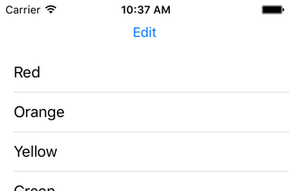
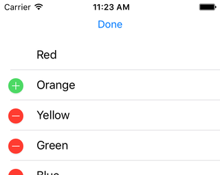
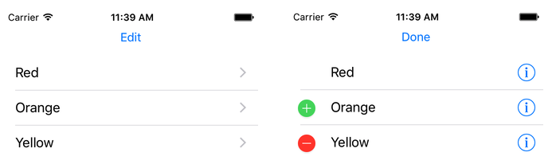
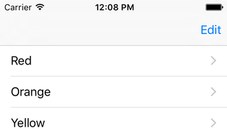

< [Deleting Rows (Swipe-To-Delete)](../10.DeletingRows/DeletingRows.md) | [Adding Rows](../12.AddingRows/AddingRows.md) >

# Editing Mode

In the last chapter, we took our first step along the way towards allowing the user to modify the underlying data that powers our table view. We started with swipe-to-delete, since that's usually a pretty common thing to want to do, and it helps us establish some concepts and delegate methods. But there is an even more fundamental concept that must be understood before we proceed much further, and that is the editing mode of a table view.

You are almost certainly already very familiar with editing mode, you just perhaps overlooked it. Apple has "Edit" buttons all over their apps. Mail, Notes, Messages, just to name a few. You are looking at a list, then you hit that Edit button, and then your list changes. All kinds of controls might either appear or disappear, depending on the situation. The Edit button usually changes to a "Done" button, and hitting that returns you to your original state. This editing capability is not merely a UI convention, UITableView has an editing mode that can be turned on or off. In this chapter we'll take a look at how to toggle that mode, and explore some options available to us in different modes.

## Setup

Create a new iOS project, using the Single View Application template. Name it anything you want, like EditingMode. Choose your preferred language, device doesn't really matter but let's go with iPhone, and you can turn off any of the other checkboxes like Core Data as they will not be used in this chapter. Using your preferred technique, configure the provided view controller for table view use. But leave some room above the table view for a button. Name that button "Edit", and Ctrl-drag into your view controller to create an IBAction method.
>Note: When you drag to create the action, note that you can change the "type" from "any object" to "UIButton", which I have done below.

We will start this chapter the same way we started the [Deleting Rows](../10.DeletingRows/DeletingRows.md) chapter, plus our new button. So make your code look like this:

```objc
// Objective-C

#import "ViewController.h"

@interface ViewController () <UITableViewDataSource, UITableViewDelegate>

@property (weak, nonatomic) IBOutlet UITableView *tableView;
@property (nonatomic, strong) NSMutableArray *contents;

@end

@implementation ViewController

- (void)viewDidLoad
{
    [super viewDidLoad];
    
    [self setContents:[@[ @"Red", @"Orange", @"Yellow", @"Green", @"Blue", @"Magenta"] mutableCopy]];
}

- (IBAction)editButtonTapped:(UIButton *)sender
{
}

#pragma mark - UITableViewDataSource Methods

- (NSInteger)tableView:(UITableView *)tableView
 numberOfRowsInSection:(NSInteger)section
{
    return [[self contents] count];
}

- (UITableViewCell *)tableView:(UITableView *)tableView
         cellForRowAtIndexPath:(NSIndexPath *)indexPath
{
    static NSString *identifier = @"PlainCell";
    
    UITableViewCell *cell = [tableView dequeueReusableCellWithIdentifier:identifier];
    if (cell == nil)
    {
        cell = [[UITableViewCell alloc] initWithStyle:UITableViewCellStyleDefault reuseIdentifier:identifier];
    }
    
    NSString *rowValue = [[self contents] objectAtIndex:[indexPath row]];
    
    [[cell textLabel] setText:rowValue];
    
    return cell;
}

@end
```
```swift
// Swift

import UIKit

class ViewController: UIViewController, UITableViewDataSource, UITableViewDelegate
{
    @IBOutlet weak var tableView: UITableView!
    var contents = [String]()
    
    override func viewDidLoad()
    {
        super.viewDidLoad()
        
        contents = [ "Red", "Orange", "Yellow", "Green", "Blue", "Magenta" ]
    }
    
    @IBAction func editButtonTapped(sender: UIButton)
    {
    }
    
    // MARK: - UITableViewDataSource Methods
    
    func tableView(tableView: UITableView, numberOfRowsInSection section: Int) -> Int
    {
        return contents.count
    }
    
    func tableView(tableView: UITableView, cellForRowAtIndexPath indexPath: NSIndexPath) -> UITableViewCell
    {
        let identifier = "PlainCell"
        
        var optionalCell = tableView.dequeueReusableCellWithIdentifier(identifier)
        if (optionalCell == nil)
        {
            optionalCell = UITableViewCell.init(style: .Default, reuseIdentifier: identifier)
        }
        
        let cell = optionalCell!
        
        let rowValue = contents[indexPath.row];
        
        cell.textLabel?.text = rowValue
        
        return cell
    }    
}
```

...and when you run the app it should look something like this:



## Toggling Edit Mode

First we need to understand how to access editing mode. It is a property of UITableView and comes along with a custom setter method:

```objc
// Objective-C

// UITableView
@property (nonatomic, getter=isEditing) BOOL editing;   // default is NO. setting is not animated.
- (void)setEditing:(BOOL)editing animated:(BOOL)animated;
```
```swift
// Swift

// UITableView
public var editing: Bool // default is NO. setting is not animated.
public func setEditing(editing: Bool, animated: Bool)

```
Here we have a boolean property. Thus, to toggle between modes, we simply change the boolean value. Notice the comment though, that doing so directly is not animated. To get a nicer transition between modes, you can use the setEditing:animated: method. Let's see this in action:

Add this code to the action method. We'll try the property directly first.

```objc
// Objective-C

- (IBAction)editButtonTapped:(UIButton *)sender
{
    UITableView *tableView = [self tableView];
    
    [tableView setEditing:![tableView isEditing]];
    
    [sender setTitle:([tableView isEditing]) ? @"Done" : @"Edit" forState:UIControlStateNormal];
}
```
```swift
// Swift

@IBAction func editButtonTapped(sender: UIButton)
{
    tableView.editing = !tableView.editing
    
    sender.setTitle(tableView.editing ? "Done" : "Edit", forState: .Normal)
}
```
The first thing I do here is simply reverse the boolean value. Whatever the value is currently set for, give me the opposite, make that the new value. The final line then uses the now-current state of the table view to decide what text to show in the button.

Run the app, and upon hitting the Edit button, you should see this:


We'll talk about the red buttons in a moment, but for now just hit the Edit/Done button a few times and observe the transition between modes. Again, this is not animated.

And that's boring, so let's use the animated method instead:

```objc
// Objective-C

- (IBAction)editButtonTapped:(UIButton *)sender
{
    UITableView *tableView = [self tableView];
    
    [tableView setEditing:![tableView isEditing] animated:YES];
    
    [sender setTitle:([tableView isEditing]) ? @"Done" : @"Edit" forState:UIControlStateNormal];
}
```
```swift
// Swift

@IBAction func editButtonTapped(sender: UIButton)
{
    tableView.setEditing(!tableView.editing, animated: true)
    
    sender.setTitle(tableView.editing ? "Done" : "Edit", forState: .Normal)
}
```
Run the app again, and this time notice how nicely the red buttons slide in/out from the left side of the screen.

## Deleting Rows

If you tried swipe-to-delete, you'll notice that it didn't work. As we learned in the previous chapter, we need to implement a method to do that, so let's bring it forward here. Add this to your class:

```objc
// Objective-C

- (void)tableView:(UITableView *)tableView
commitEditingStyle:(UITableViewCellEditingStyle)editingStyle
forRowAtIndexPath:(NSIndexPath *)indexPath
{
   if (editingStyle == UITableViewCellEditingStyleDelete)
   {
      [[self contents] removeObjectAtIndex:[indexPath row]];
      [tableView deleteRowsAtIndexPaths:@[ indexPath ] withRowAnimation:UITableViewRowAnimationAutomatic];
   }
}
```
```swift
// Swift

func tableView(tableView: UITableView, commitEditingStyle editingStyle: UITableViewCellEditingStyle, forRowAtIndexPath indexPath: NSIndexPath)
{
   if editingStyle == .Delete
   {
      contents.removeAtIndex(indexPath.row)
      tableView.deleteRowsAtIndexPaths([indexPath], withRowAnimation: .Automatic)
   }
}
```
Run the app again, and swipe-to-delete is restored. But this time, put the app into editing mode, and notice that you don't _have_ to swipe-to-delete. You can tap on any of the red buttons on the left, and doing so will reveal the Delete button on the right.

## Editing Styles

In the previous delegate method, note that we are only paying attention to the "Delete" editing style. And in the Deleting chapter, we mentioned that there are a couple of extra styles: Insert and None. Notice that we haven't done anything special, and automatically got Delete, so that is the default for table views. But how to we configure that if we want to? That is handled by yet another delegate method:

```objc
// Objective-C

#pragma mark - UITableViewDelegate Methods

- (UITableViewCellEditingStyle)tableView:(UITableView *)tableView
           editingStyleForRowAtIndexPath:(NSIndexPath *)indexPath
{
    return UITableViewCellEditingStyleDelete;
}
```
```swift
// Swift

// MARK: - UITableViewDelegate Methods

func tableView(tableView: UITableView, editingStyleForRowAtIndexPath indexPath: NSIndexPath) -> UITableViewCellEditingStyle
{
    return .Delete
}
```
Recall that up to this point, we have seen 2 different "editing" related delegate methods, and each of those came from UITableViewDataSource. Curiously, here is a 3rd one, but it comes from UITableViewDelegate. I cannot explain why they are split up.

The implementation above doesn't look any different when we run the app, so let's make it more interesting:

```objc
// Objective-C

- (UITableViewCellEditingStyle)tableView:(UITableView *)tableView
           editingStyleForRowAtIndexPath:(NSIndexPath *)indexPath
{
    if ([indexPath row] == 0)
    {
        return UITableViewCellEditingStyleNone;
    }
    else if ([indexPath row] == 1)
    {
        return UITableViewCellEditingStyleInsert;
    }
    
    return UITableViewCellEditingStyleDelete;
}
```
```swift
// Swift

func tableView(tableView: UITableView, editingStyleForRowAtIndexPath indexPath: NSIndexPath) -> UITableViewCellEditingStyle
{
    if indexPath.row == 0
    {
        return .None
    }
    else if indexPath.row == 1
    {
        return .Insert
    }
    
    return .Delete
}
```
Run the app, hit the Edit button, and you should see this:



Our first row is now blank, and our second row has a green + button instead. Notice that we can no longer swipe-to-delete the first two rows. So we haven't simply changed the appearance, we've changed the behavior. You can add, you can remove, or you can do nothing. Let's add a quick log for the insert case:

```objc
// Objective-C

- (void)tableView:(UITableView *)tableView
commitEditingStyle:(UITableViewCellEditingStyle)editingStyle
forRowAtIndexPath:(NSIndexPath *)indexPath
{
    if (editingStyle == UITableViewCellEditingStyleDelete)
    {
        [[self contents] removeObjectAtIndex:[indexPath row]];
        [tableView deleteRowsAtIndexPaths:@[ indexPath ] withRowAnimation:UITableViewRowAnimationAutomatic];
    }
    else if (editingStyle == UITableViewCellEditingStyleInsert)
    {
        NSString *rowValue = [[self contents] objectAtIndex:[indexPath row]];
        NSLog(@"Tapped add button on %@ row", rowValue);
    }
}
```
```swift
// Swift

func tableView(tableView: UITableView, commitEditingStyle editingStyle: UITableViewCellEditingStyle, forRowAtIndexPath indexPath: NSIndexPath)
{
    if editingStyle == .Delete
    {
        contents.removeAtIndex(indexPath.row)
        tableView.deleteRowsAtIndexPaths([indexPath], withRowAnimation: .Automatic)
    }
    else if editingStyle == .Insert
    {
        let rowValue = contents[indexPath.row];
        print("Tapped add button on \(rowValue) row")
    }
}
```
Run the app, hit the edit button, and you should see this log when hitting the add button. You can see this add button in action in the Contacts app. Go to a contact's details, then hit the Edit button. You will see the red buttons to remove existing phone numbers, or the green button to add a new one.

## Editing Accessory Type

In the [UITableViewCell Styles & Accessories](../06.UITableViewCell/UITableViewCell.md) chapter, we talked about the various indicators and buttons that can be shown on the right side of a cell. An additional feature of editing mode in a table view is that you can show a different accessory in each mode. Add this to our cell creation code:

```objc
// Objective-C

if (cell == nil)
{
    cell = [[UITableViewCell alloc] initWithStyle:UITableViewCellStyleDefault reuseIdentifier:identifier];
    [cell setAccessoryType:UITableViewCellAccessoryDisclosureIndicator];
    [cell setEditingAccessoryType:UITableViewCellAccessoryDetailButton];
}
```
```swift
// Swift

if (optionalCell == nil)
{
    optionalCell = UITableViewCell.init(style: .Default, reuseIdentifier: identifier)
    optionalCell!.accessoryType = .DisclosureIndicator
    optionalCell!.editingAccessoryType = .DetailButton
}
```


Recall that the "i" button is an additional tap target on the row. So this means that in normal mode, we can have a single tap target on the whole row. In editing mode, we can have 2. So editing mode isn't purely for deletion, you can radically alter the behavior of your table view.

## Editing Accessory View

In the [UITableViewCell Styles & Accessories](../06.UITableViewCell/UITableViewCell.md) chapter, we also talked about putting custom views on the right side of a cell. We used a switch in that example. Just as there is an editing accessory type, there is also an editing accessory view. We can see an example of this in the Clock app. The app shows switches for enabling alarms, but after hitting the Edit button we see indicators instead. Let's do a variation on that behavior. We'll show the switches in editing mode:

```objc
// Objective-C

if (cell == nil)
{
    cell = [[UITableViewCell alloc] initWithStyle:UITableViewCellStyleDefault reuseIdentifier:identifier];
    [cell setAccessoryType:UITableViewCellAccessoryDisclosureIndicator];
    [cell setEditingAccessoryView:[[UISwitch alloc] init]];
}
```
```swift
// Swift

if (optionalCell == nil)
{
    optionalCell = UITableViewCell.init(style: .Default, reuseIdentifier: identifier)
    optionalCell!.accessoryType = .DisclosureIndicator
    optionalCell!.editingAccessoryView = UISwitch()
}
```
Run the app, and you should see indicators in normal mode, and switches in editing mode.

## View Controller Edit Mode

In all of the Apple examples I have cited, the Edit button is found in either the upper or lower bar on the screen. This is still a button, a UIBarButtonItem to be exact, but it is a button that only lives within the context of either UINavigationBar or UIToolbar. Let's explore how this works, and how it relates to table views, but we need to do some setup work in our project first.

* Delete the Edit button.
* Re-constrain the table view to fill the screen.
* Delete the editButtonTapped method.
* In the Storyboard, select the view controller. You can grab either of the yellow circles, either the one immediately above your view, or the one in the upper left of the scene listing. Select the Editor menu item -> Embed In -> Navigation Controller.

UIViewController offers this method:

```objc
// Objective-C

// UIViewController
- (UIBarButtonItem *)editButtonItem;
// Return an Edit|Done button that can be used as a navigation item's custom view. Default action toggles the editing state with animation.
```
```swift
// Swift

// UIViewController
public func editButtonItem() -> UIBarButtonItem
// Return an Edit|Done button that can be used as a navigation item's custom view. Default action toggles the editing state with animation.
```
This means we don't have to create our own button, we can use the one that is built-in with UIViewController. What isn't entirely clear, even from the comment, is that this button will automatically handle the "Done" or "Edit" text swapping that we were doing manually. And this text is localized, so that's one less thing for us to have to worry about. It's a nice feature.

When we embedded our view controller into a navigation controller, we gained access to that navigation controller's navigation bar. Thus now we have a place to add our button. Do this in viewDidLoad:

```objc
// Objective-C

- (void)viewDidLoad
{
    [super viewDidLoad];
    
    [self setContents:[@[ @"Red", @"Orange", @"Yellow", @"Green", @"Blue", @"Magenta"] mutableCopy]];
    
    [[self navigationItem] setRightBarButtonItem:[self editButtonItem]];
}
```
```swift
// Swift

override func viewDidLoad()
{
    super.viewDidLoad()
    
    contents = [ "Red", "Orange", "Yellow", "Green", "Blue", "Magenta" ]
    
    navigationItem.rightBarButtonItem = editButtonItem()
}
```
Run the app now, and you should see this:



The light gray area is our navigation bar, and we see an Edit button in the upper right. If you hit that button, you'll notice that it toggles back and forth between "Edit" and "Done" automatically, even with a font change. That's nice since we didn't have to implement that. But notice that the table view is no longer changing. This button is not controlling our table view's edit mode.

It turns out that UITableView is not the only class to provide an "editing" state; UIViewController has one, too. And it looks pretty much the same:

```objc
// Objective-C

// UIViewController
@property(nonatomic,getter=isEditing) BOOL editing;
- (void)setEditing:(BOOL)editing animated:(BOOL)animated;
// Updates the appearance of the Edit|Done button item as necessary. Clients who override it must call super first.
```
```swift
// Swift

// UIViewController
public var editing: Bool
public func setEditing(editing: Bool, animated: Bool)
// Updates the appearance of the Edit|Done button item as necessary. Clients who override it must call super first.
```
When we press this Edit/Done button, it toggles this editing value on the _view controller_. We need to know when that happens so that we can toggle the corresponding value on our table view. And the comment in the header provides the clue: we can override this method.

```objc
// Objective-C

- (void)setEditing:(BOOL)editing
          animated:(BOOL)animated
{
    [super setEditing:editing animated:animated];
    
    [[self tableView] setEditing:editing animated:animated];
}
```
```swift
// Swift

override func setEditing(editing: Bool, animated: Bool)
{
    super.setEditing(editing, animated: animated)
    
    tableView.setEditing(editing, animated: animated)
}
```
As instructed by the comment, we first call the superclass's implementation of this method. Then, we call our table view, passing along the same values.

Run the app now, and you'll find that pressing the button does indeed toggle edit mode on the table view.

## Summary

We have now learned of the existence of an editing mode in table views (and view controllers) and we've learned how to toggle it on and off. We've seen that editing mode can have accessory types and views independent of the normal mode. And we've seen how to implement a widely-used UI for toggling editing mode. Given that most table views show data that the user is intended to change, this is an important skill to have in your bag of tricks.

< [Deleting Rows (Swipe-To-Delete)](../10.DeletingRows/DeletingRows.md) | [Adding Rows](../12.AddingRows/AddingRows.md) >

---
From:
[A Reasonably Complete Guide to UITableView](https://github.com/BriTerIdeas/Book-UITableViewGuide), by Brian Slick
If you found this guide to be helpful, a [tip](http://bit.ly/AW4Cc) would be appreciated.