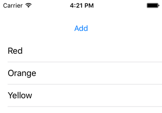

< [Editing Mode](../11.EditingMode/EditingMode.md) | >

# Adding Rows

In the [Deleting Rows](../10.DeletingRows/DeletingRows.md) chapter, we of course discussed how to remove rows from a table view. An important concept in that chapter is that whatever we do to the table view, we must also do to our underlying data. Remove a row; remove an object from the array. Now we will take a look at adding rows, and we'll see how that pattern holds up.

## Setup

Create a new iOS project, using the Single View Application template. Name it anything you want, like AddingRows. Choose your preferred language, device doesn't really matter but let's go with iPhone, and you can turn off any of the other checkboxes like Core Data as they will not be used in this chapter. Using your preferred technique, configure the provided view controller for table view use. But leave some room above the table view for a button. Name that button "Add", and Ctrl-drag into your view controller to create an IBAction method.
>Note: When you drag to create the action, note that you can change the "type" from "any object" to "UIButton", which I have done below.

We will start this chapter the same way we started the [Deleting Rows](../10.DeletingRows/DeletingRows.md) chapter, plus our new button. So make your code look like this:

```objc
// Objective-C

#import "ViewController.h"

@interface ViewController () <UITableViewDataSource, UITableViewDelegate>

@property (weak, nonatomic) IBOutlet UITableView *tableView;
@property (nonatomic, strong) NSMutableArray *contents;

@end

@implementation ViewController

- (void)viewDidLoad
{
    [super viewDidLoad];
    
    [self setContents:[@[ @"Red", @"Orange", @"Yellow", @"Green", @"Blue", @"Magenta"] mutableCopy]];
}

- (IBAction)addButtonTapped:(UIButton *)sender
{
}

#pragma mark - UITableViewDataSource Methods

- (NSInteger)tableView:(UITableView *)tableView
 numberOfRowsInSection:(NSInteger)section
{
    return [[self contents] count];
}

- (UITableViewCell *)tableView:(UITableView *)tableView
         cellForRowAtIndexPath:(NSIndexPath *)indexPath
{
    static NSString *identifier = @"PlainCell";
    
    UITableViewCell *cell = [tableView dequeueReusableCellWithIdentifier:identifier];
    if (cell == nil)
    {
        cell = [[UITableViewCell alloc] initWithStyle:UITableViewCellStyleDefault reuseIdentifier:identifier];
    }
    
    NSString *rowValue = [[self contents] objectAtIndex:[indexPath row]];
    
    [[cell textLabel] setText:rowValue];
    
    return cell;
}

@end
```
```swift
// Swift

import UIKit

class ViewController: UIViewController, UITableViewDataSource, UITableViewDelegate
{
    @IBOutlet weak var tableView: UITableView!
    var contents = [String]()
    
    override func viewDidLoad()
    {
        super.viewDidLoad()
        
        contents = [ "Red", "Orange", "Yellow", "Green", "Blue", "Magenta" ]
    }
    
    @IBAction func addButtonTapped(sender: UIButton)
    {
    }
    
    // MARK: - UITableViewDataSource Methods
    
    func tableView(tableView: UITableView, numberOfRowsInSection section: Int) -> Int
    {
        return contents.count
    }
    
    func tableView(tableView: UITableView, cellForRowAtIndexPath indexPath: NSIndexPath) -> UITableViewCell
    {
        let identifier = "PlainCell"
        
        var optionalCell = tableView.dequeueReusableCellWithIdentifier(identifier)
        if (optionalCell == nil)
        {
            optionalCell = UITableViewCell.init(style: .Default, reuseIdentifier: identifier)
        }
        
        let cell = optionalCell!
        
        let rowValue = contents[indexPath.row];
        
        cell.textLabel?.text = rowValue
        
        return cell
    }    
}
```

...and when you run the app it should look something like this:



## Adding Data

We want to add some data when the user taps the add button, so let's start there:

```objc
// Objective-C

- (IBAction)addButtonTapped:(UIButton *)sender
{
    [[self contents] insertObject:@"Black" atIndex:0];
}
```
```swift
// Swift

@IBAction func addButtonTapped(sender: UIButton)
{
    contents.insert("Black", atIndex: 0)
}
```
We insert a new color at the beginning of the array. If you run the app, you can hit the button as much as you want, but you aren't going to see any difference. Recall from the deleting chapter that we need to do 2 things: 1) mess with our data, and 2) mess with our table view. We've done the first (feel free to use a log to verify that the array is growing), now we need to do the second.

## The Harsh Way

Again recall from the deleting chapter that I showed what I called the nuclear option: reloadData. I didn't mean to suggest that reloadData was always the wrong thing to do; there are a number of cases where it is the appropriate thing to do. In that chapter, in that method, it produced less-than-ideal results.

And the situation is exactly the same here. But let's see it anyway:

```objc
// Objective-C

- (IBAction)addButtonTapped:(UIButton *)sender
{
   [[self contents] insertObject:@"Black" atIndex:0];
    
   [[self tableView] reloadData];
}
```
```swift
// Swift

@IBAction func addButtonTapped(sender: UIButton)
{
    contents.insert("Black", atIndex: 0)
    
    tableView.reloadData()
}
```
Run the app, and observe that every time you hit a button, a new row appears at the beginning of the table view. So let's be absolutely clear: reloadData absolutely works in this case. And it is quite speedy. But notice how harsh it is. Just like when we used it in the delete case, there is no animation here in the add case either. The new row simply pops into existence and the other rows are instantly moved down. We like pretty things, so let's try it with an animation.

## The Nice Way

Just as there was a deleteRows method in that chapter, we'll use an insertRows method in this chapter. But we have a key difference in this case. Recall that we delete a row based on an index path, an index path that was provided to us in the delegate method. Well, adding works the same way, we need to add a row with a particular index path. But we don't have one in this case. When deleting, we were deleting a particular row based on a user action, so the index path was known. In this case, we could add the row wherever we want. So that means we need to build our own index path to represent that location. Here is what that looks like:

```objc
// Objective-C

- (IBAction)addButtonTapped:(UIButton *)sender
{
    [[self contents] insertObject:@"Black" atIndex:0];
    
    NSIndexPath *indexPath = [NSIndexPath indexPathForRow:0 inSection:0];
    
    [[self tableView] insertRowsAtIndexPaths:@[ indexPath ] withRowAnimation:UITableViewRowAnimationAutomatic];
}
```
```swift
// Swift

@IBAction func addButtonTapped(sender: UIButton)
{
    contents.insert("Black", atIndex: 0)
    
    let indexPath = NSIndexPath.init(forRow: 0, inSection: 0)
    
    tableView.insertRowsAtIndexPaths([ indexPath ], withRowAnimation: .Automatic)
}
```
NSIndexPath has an initializer that allows us to build our own custom object using whatever section and row that we want. Recall that row and section numbers start at 0, so here I have defined an index path for the very first row in the very first section.

After that is done, we use the insertRows method, provide that index path, and we again use our familiar "Automatic" row animation. Run the app, and observe how nicely the new row animates in.

## The Broken Way

Let's pretend we forgot to change our array:

```objc
// Objective-C

- (IBAction)addButtonTapped:(UIButton *)sender
{
//    [[self contents] insertObject:@"Black" atIndex:0];
    
    NSIndexPath *indexPath = [NSIndexPath indexPathForRow:0 inSection:0];
    
    [[self tableView] insertRowsAtIndexPaths:@[ indexPath ] withRowAnimation:UITableViewRowAnimationAutomatic];
}
```
```swift
// Swift

@IBAction func addButtonTapped(sender: UIButton)
{
//    contents.insert("Black", atIndex: 0)
    
    let indexPath = NSIndexPath.init(forRow: 0, inSection: 0)
    
    tableView.insertRowsAtIndexPaths([ indexPath ], withRowAnimation: .Automatic)
}
```
Run the app, and upon tapping the button, it will crash. You will get an error that is nearly identical to what we saw in the delete case:

>Invalid update: invalid number of rows in section 0.  The number of rows contained in an existing section after the update (6) must be equal to the number of rows contained in that section before the update (6), plus or minus the number of rows inserted or deleted from that section (1 inserted, 0 deleted) and plus or minus the number of rows moved into or out of that section (0 moved in, 0 moved out).'

The table view is telling us that we told it to show 6 rows, then we told it to show 1 more, but that we are still telling it to show 6 rows in numberOfRows. This further reinforces that we must modify our data when inserting rows.

## Editing Accessory

In the [Editing Mode](../11.EditingMode/EditingMode.md) chapter, we saw a way to enable a green add button, and saw that it corresponded to an "Insert" editing style:

```objc
// Objective-C

else if (editingStyle == UITableViewCellEditingStyleInsert)
{
   NSString *rowValue = [[self contents] objectAtIndex:[indexPath row]];
   NSLog(@"Tapped add button on %@ row", rowValue);
}
```
```swift
// Swift

else if editingStyle == .Insert
{
   let rowValue = contents[indexPath.row];
   print("Tapped add button on \(rowValue) row")
}
```
I mention it here for sake of completeness, but this characteristic really doesn't fit with the rest of this chapter. In this case, you are tapping on a button that is in a row that is already visible. So you don't need to insert another row, because that row is already there.

I suppose it is conceivable that you could tap this button and then insert a _different_ row at a completely separate index path, in which case the steps taken elsewhere in this chapter would apply. That's sort of what Apple does in the Contacts app, when you tap the button to add a new phone number. There it looks like they might actually be inserting with the same index path, with the intention that the row that was just tapped - the add phone number row - moves down, with the user now editing their number in the same location.

## Summary

Adding rows works about the same way as deleting rows does, just in reverse. In each case, we need to modify our data prior to performing the row change transaction. We added a piece of data, then we inserted a row. The only new element here was the need to manually construct a NSIndexPath object.


< [Editing Mode](../11.EditingMode/EditingMode.md) | >

---
From:
[A Reasonably Complete Guide to UITableView](https://github.com/BriTerIdeas/Book-UITableViewGuide), by Brian Slick
If you found this guide to be helpful, a [tip](http://bit.ly/AW4Cc) would be appreciated.