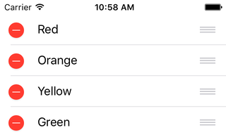
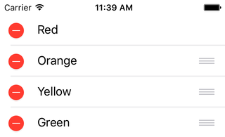
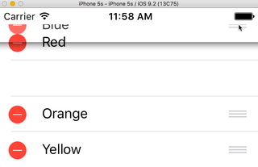

< [Adding Rows](../12.AddingRows/AddingRows.md) | [Multiple Row Selection](../14.MultipleRowSelection/MultipleRowSelection.md) >

# Reordering Rows

We have added rows, and we have removed rows. But sometimes you just want to rearrange your rows. In this chapter, we'll take a look at how to implement the common UI pattern of adding drag handles to your table view.

## Setup

Create a new iOS project, using the Single View Application template. Name it anything you want, like ReorderingRows. Choose your preferred language, device doesn't really matter but let's go with iPhone, and you can turn off any of the other checkboxes like Core Data as they will not be used in this chapter. Using your preferred technique, configure the provided view controller for table view use.

We will continue on with our mutable list of colors, so make your view controller look like this:

```objc
// Objective-C

#import "ViewController.h"

@interface ViewController () <UITableViewDataSource, UITableViewDelegate>

@property (weak, nonatomic) IBOutlet UITableView *tableView;
@property (nonatomic, strong) NSMutableArray *contents;

@end

@implementation ViewController

- (void)viewDidLoad
{
    [super viewDidLoad];
    
    [self setContents:[@[ @"Red", @"Orange", @"Yellow", @"Green", @"Blue", @"Magenta"] mutableCopy]];
}

#pragma mark - UITableViewDataSource Methods

- (NSInteger)tableView:(UITableView *)tableView
 numberOfRowsInSection:(NSInteger)section
{
    return [[self contents] count];
}

- (UITableViewCell *)tableView:(UITableView *)tableView
         cellForRowAtIndexPath:(NSIndexPath *)indexPath
{
    static NSString *identifier = @"PlainCell";
    
    UITableViewCell *cell = [tableView dequeueReusableCellWithIdentifier:identifier];
    if (cell == nil)
    {
        cell = [[UITableViewCell alloc] initWithStyle:UITableViewCellStyleDefault reuseIdentifier:identifier];
    }
    
    NSString *rowValue = [[self contents] objectAtIndex:[indexPath row]];
    
    [[cell textLabel] setText:rowValue];
    
    return cell;
}

#pragma mark - UITableViewDelegate Methods

- (void)tableView:(UITableView *)tableView
didSelectRowAtIndexPath:(NSIndexPath *)indexPath
{
    NSString *rowValue = [[self contents] objectAtIndex:[indexPath row]];
    
    NSLog(@"Tapped on %@ row", rowValue);
}

@end
```
```swift
// Swift

import UIKit

class ViewController: UIViewController, UITableViewDataSource, UITableViewDelegate
{
    @IBOutlet weak var tableView: UITableView!
    var contents = [String]()
    
    override func viewDidLoad()
    {
        super.viewDidLoad()
        
        contents = [ "Red", "Orange", "Yellow", "Green", "Blue", "Magenta" ]
    }
    
    // MARK: - UITableViewDataSource Methods
    
    func tableView(tableView: UITableView, numberOfRowsInSection section: Int) -> Int
    {
        return contents.count
    }
    
    func tableView(tableView: UITableView, cellForRowAtIndexPath indexPath: NSIndexPath) -> UITableViewCell
    {
        let identifier = "PlainCell"
        
        var optionalCell = tableView.dequeueReusableCellWithIdentifier(identifier)
        if (optionalCell == nil)
        {
            optionalCell = UITableViewCell.init(style: .Default, reuseIdentifier: identifier)
        }
        
        let cell = optionalCell!
        
        let rowValue = contents[indexPath.row];
        
        cell.textLabel?.text = rowValue
        
        return cell
    }
    
    // MARK: - UITableViewDelegate Methods
    
    func tableView(tableView: UITableView, didSelectRowAtIndexPath indexPath: NSIndexPath)
    {
        let rowValue = contents[indexPath.row];
        
        print("Tapped on \(rowValue) row")
    }
}
```
## Edit Mode

This chapter is located after the [Editing Mode](../11.EditingMode/EditingMode.md) chapter for the simple reason that cell reordering only works in editing mode. We need for the table view to be in editing mode, but rather than deal with an Edit button, I'm just going to force the table view into edit mode:

```objc
// Objective-C

- (void)viewDidLoad
{
    [super viewDidLoad];
    
    [self setContents:[@[ @"Red", @"Orange", @"Yellow", @"Green", @"Blue", @"Magenta"] mutableCopy]];
    
    [[self tableView] setEditing:YES animated:NO];
    [[self tableView] setAllowsSelectionDuringEditing:YES];
}
```
```swift
// Swift

override func viewDidLoad()
{
    super.viewDidLoad()
    
    contents = [ "Red", "Orange", "Yellow", "Green", "Blue", "Magenta" ]
    
    tableView.setEditing(true, animated: false)
    tableView.allowsSelectionDuringEditing = true
}
```
By default, row selection is disabled in edit mode. I want to be able to tap on rows to see logs, so I have enabled row selection in edit mode.

Run the app and you'll see the delete buttons. We're going to ignore them in this chapter, but it is useful to note that you can put the table view into edit mode whenever you want. If you want the user to always see editing widgets, you can certainly do so.

## Implementation

Like most of the other content manipulation techniques we've seen so far, cell reordering is enabled with the mere presence of a delegate method, from UITableViewDataSource:

```objc
// Objective-C

- (void)tableView:(UITableView *)tableView
moveRowAtIndexPath:(NSIndexPath *)sourceIndexPath
      toIndexPath:(NSIndexPath *)destinationIndexPath
{
    
}
```
```swift
// Swift

func tableView(tableView: UITableView, moveRowAtIndexPath sourceIndexPath: NSIndexPath, toIndexPath destinationIndexPath: NSIndexPath)
{
    
}
```
Run the app, and you will see the familiar grabby handles on the right side of the screen.



If you recall from the [Deleting Rows](../10.DeletingRows/DeletingRows.md) chapter, as soon as we implemented the required method, we saw the button but were not actually able to delete the row. The difference here is that if you try to drag rows around, it will actually work.

Or it will seem to work. You can reorder these rows as much as you want. That's great, this is easy! Well, not so fast. After you have them mixed up, start tapping on some rows. Notice anything? The logs don't match the labels. And to further demonstrate the issue, pull up on the whole table view so that a row or two goes off screen, then let go. Depending on what order the rows were in, it's possible you see multiple "Red" rows now, maybe even an extra "Orange" row.

What's happening here? Well, recall the pattern with deleting and inserting rows: whatever we do to the table view, we must also do to our data. Sure, we've moved a row that says "Red" to row 5. But our array still has "Red" at the first index. We need to modify our array, too.

So let's notice how this delegate method works. We are given 2 index path parameters, a **source** and a **destination**. And this is a big part of the reason why the visuals of dragging a row are allowed to finish: the table view has to be able to tell us where the drag target is. We can use these index paths to modify our array.

## The Wrong Way (in Objective-C)

I have encountered this misunderstanding in production code, so I'd like to highlight it here. Swift isn't old enough to reveal a mistake like this, and I can't find an equivalent method in Swift, so we're just going to focus on Obj-C here.

```objc
// Objective-C

- (void)tableView:(UITableView *)tableView
moveRowAtIndexPath:(NSIndexPath *)sourceIndexPath
      toIndexPath:(NSIndexPath *)destinationIndexPath
{
    [[self contents] exchangeObjectAtIndex:[sourceIndexPath row]
                         withObjectAtIndex:[destinationIndexPath row]];
}
```
There is a handy method on NSMutableArray that allows you to swap the positions of any two objects, given appropriate indices. So we take the item at our source position and swap it with the item at our destination position. Easy!

Run the app. Take the very last row (Magenta), and drag it to the very top. Now tap on the Magenta row and look at the log. Should say Magenta, so far, so good. Now tap on the Red row. Uh oh, log says Orange. Keep tapping on rows. You have to get all the way to the bottom (Blue) before you finally see a log that says Red.

Let's think about what we _told_ the array to do vs. what we actually wanted. We told the array to swap the position of the very first and very last objects. So if we started with [1, 2, 3, 4, 5], we would now have [5, 2, 3, 4, 1]. Notice that the middle 3 positions are exactly the same. But that does not accurately represent what we did on screen. We took the very last row and moved it to the beginning. That's not an _exchange_ of position, it's a move. What we should wind up with is [5, 1, 2, 3, 4]. Every single item has been repositioned. exchangeObject is not what we want to use, so let's take a look at the right way.

## The Right Way

Unfortunately there is no 1-liner code for this in either language, though it is easy enough to make one via Category/Extension. Instead we need to remove the object from the source index and reinsert it at the destination. It looks like this:

```objc
// Objective-C

- (void)tableView:(UITableView *)tableView
moveRowAtIndexPath:(NSIndexPath *)sourceIndexPath
      toIndexPath:(NSIndexPath *)destinationIndexPath
{
    NSString *movingItem = [[self contents] objectAtIndex:[sourceIndexPath row]];
    
    [[self contents] removeObjectAtIndex:[sourceIndexPath row]];
    [[self contents] insertObject:movingItem atIndex:[destinationIndexPath row]];
}
```
```swift
// Swift

func tableView(tableView: UITableView, moveRowAtIndexPath sourceIndexPath: NSIndexPath, toIndexPath destinationIndexPath: NSIndexPath)
{
    let movingItem = contents[sourceIndexPath.row]
    
    contents.removeAtIndex(sourceIndexPath.row)
    contents.insert(movingItem, atIndex: destinationIndexPath.row)
}
```
We grab a reference to the item in the array. Then we remove it from the source row, and reinsert it at the destination row. Run the app, reorder some rows, tap some rows, and confirm that the logs do indeed correspond. Slide some rows off the screen again, and verify that when they come back they still have the correct contents.

## Prevent Drag (Source)

We have enabled dragging by implementing a method, so let's take a look at how to further configure that. Repeating the pattern that we've seen before, there is again another delegate method to provide additional control, and it again comes from UITableViewDataSource:

```objc
// Objective-C

- (BOOL)tableView:(UITableView *)tableView
canMoveRowAtIndexPath:(NSIndexPath *)indexPath
{
    return YES;
}
```
```swift
// Swift

func tableView(tableView: UITableView, canMoveRowAtIndexPath indexPath: NSIndexPath) -> Bool {
    return true
}
```
We saw a canEdit method in the deleting chapter, and here we have a canMove method. Return a boolean according to whatever logic you see fit. Let's pretend we don't want the first row (Red) to move.

```objc
// Objective-C

- (BOOL)tableView:(UITableView *)tableView
canMoveRowAtIndexPath:(NSIndexPath *)indexPath
{
    return [indexPath row] != 0;
}
```
```swift
// Swift

func tableView(tableView: UITableView, canMoveRowAtIndexPath indexPath: NSIndexPath) -> Bool {
    return indexPath.row != 0
}
```
Run the app and you should see this:



Notice that the first row no longer has the grabby handle. You can drag the other rows around as much as you want. So if the first row was some kind of a status view or something, and you want it to stay put, this is how you accomplish that.

Almost. If you are crafty with your testing, you may have noticed that you can drag any row you want to the top. Grab the Blue row and drag it to the top. Notice that you can. So our Red row is no longer first.
>Note: I consider this to be a bug, but in my testing for this chapter, after completing this operation, the Blue row still has the drag handle, and the Red row does not. This is not correct, as we've indicated that only the first row should not be draggable. If you stretch the table upward so that these rows are off screen, when you let go the handles will be restored to their correct positions. The cells just needed a refresh. I am almost positive that older versions of iOS dealt with this situation correctly.

## Prevent Drag (Destination)

As we've seen before, we start with a couple of UITableViewDataSource methods to enable and configure a particular behavior. Then we introduce a third method to further control things that for some reason comes from UITableViewDelegate instead. The pattern continues here, and again I have absolutely no idea why they are split up.

In the previous example, we were able to prevent the Red row from being dragged, but as we saw we could still drag other rows to its position. Let's get mean, and make sure that the Red row stays put no matter what. 

```objc
// Objective-C

- (NSIndexPath *)tableView:(UITableView *)tableView
targetIndexPathForMoveFromRowAtIndexPath:(NSIndexPath *)sourceIndexPath
       toProposedIndexPath:(NSIndexPath *)proposedDestinationIndexPath
{
    return proposedDestinationIndexPath;
}
```
```swift
// Swift

func tableView(tableView: UITableView, targetIndexPathForMoveFromRowAtIndexPath sourceIndexPath: NSIndexPath, toProposedIndexPath proposedDestinationIndexPath: NSIndexPath) -> NSIndexPath
{
    return proposedDestinationIndexPath
}
```
This method is a mouthful. Basically this method is saying "Hey, I'm dragging this row from here, is it ok if I drag it to there?" If you are fine with the destination, then you can simply return that proposed value, as I'm doing here. But there is an opportunity for custom logic here, so let's utilize that.

First we need to decide what we want. We don't want someone to drag **to** the first row. Alright, so if they try, what should happen? Hrm. Well, how about if we let them drag up to the second row, and then they can't go any further? That's probably not bad, let's check it out:

```objc
// Objective-C

- (NSIndexPath *)tableView:(UITableView *)tableView
targetIndexPathForMoveFromRowAtIndexPath:(NSIndexPath *)sourceIndexPath
       toProposedIndexPath:(NSIndexPath *)proposedDestinationIndexPath
{
    if ([proposedDestinationIndexPath row] == 0)
    {
        return [NSIndexPath indexPathForRow:1 inSection:0];
    }
    
    return proposedDestinationIndexPath;
}
```
```swift
// Swift

func tableView(tableView: UITableView, targetIndexPathForMoveFromRowAtIndexPath sourceIndexPath: NSIndexPath, toProposedIndexPath proposedDestinationIndexPath: NSIndexPath) -> NSIndexPath
{
    if proposedDestinationIndexPath.row == 0
    {
        return NSIndexPath.init(forRow: 1, inSection: 0)
    }
    
    return proposedDestinationIndexPath
}
```
If the proposed index path has a row of 0, we build a new index path for row index 1, and return that instead. Otherwise, we return the proposed index path as-is. Run the app again, and try to drag rows to the top. You should see something like this:



I'm dragging the Blue row as high as I possibly can, but the Red row won't budge. After I let go, the Blue row will settle into the blank space for the second row. We have now fixed the Red row at the top of the list; we can't drag it elsewhere (as far as reordering goes, we can still scroll the table), and we can't drag anything else into its place.

## Summary

This pretty much completes our data modification topics. We've added, removed, and now reordered rows. In each case we implemented a delegate method to enable the feature, a second delegate method to refine the behavior, and occasionally a third method to even further control those behaviors. And in each case, whatever we do to the table view, we must also do to our data.


< [Adding Rows](../12.AddingRows/AddingRows.md) | [Multiple Row Selection](../14.MultipleRowSelection/MultipleRowSelection.md) >

---
From:
[A Reasonably Complete Guide to UITableView](https://github.com/BriTerIdeas/Book-UITableViewGuide), by Brian Slick
If you found this guide to be helpful, a [tip](http://bit.ly/AW4Cc) would be appreciated.