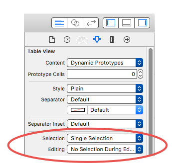
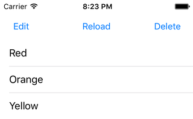
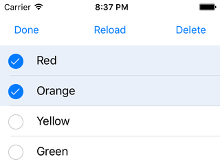
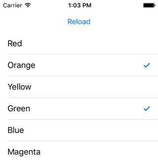

< [Reordering Rows](../13.ReorderingRows/ReorderingRows.md) | >

# Multiple Row Selection

We have done a fair amount of row tapping up to this point, but only one row at a time. Now that we know how to delete rows, we can explore a fairly common UI pattern: selecting one or many rows to then delete them. We'll take a look at what UITableView offers built-in, and then look at a manual alternative. The techniques are different enough that this will indeed be our first multi-project chapter.

## Built-in Properties

We have observed single row selection many times so far. And in the editing chapter, I had to enable row selection while in editing mode. It turns out there are a total of 4 properties provided by UITableView to configure selection behaviors:

```objc
// Objective-C

// UITableView
@property (nonatomic) BOOL allowsSelection;  // default is YES.
@property (nonatomic) BOOL allowsSelectionDuringEditing;  // default is NO.
@property (nonatomic) BOOL allowsMultipleSelection;  // default is NO.
@property (nonatomic) BOOL allowsMultipleSelectionDuringEditing;  // default is NO.
```
```swift
// Swift

// UITableView
public var allowsSelection: Bool // default is YES.
public var allowsSelectionDuringEditing: Bool // default is NO.
public var allowsMultipleSelection: Bool // default is NO.
public var allowsMultipleSelectionDuringEditing: Bool // default is NO.
```
You can read the full comments in the header file or documentation if you wish, I only left the default values shown. Those comments reveal that the multiple selection capability was added in iOS 5.

Between these 4 properties, you can have selection behaviors of "None", "Single", and "Multiple", and then editing mode has its own options. So you could, for example, have multiple selection in edit mode with single selection in regular mode.

These values can be toggled when you select a table view in Storyboard/IB here:



## First Project Setup

In our first project, we are going to implement a common pattern: single selection normal mode, multiple selection edit mode, with a delete button.

Create a new iOS project, using the Single View Application template. Name it anything you want, like MultipleDelete. Choose your preferred language, device doesn't really matter but let's go with iPhone, and you can turn off any of the other checkboxes like Core Data as they will not be used in this chapter. Using your preferred technique, configure the provided view controller for table view use. But leave some room above the table view for 3 buttons. Name those buttons "Edit", "Reload", and "Delete". Ctrl-drag into your view controller to create  IBAction methods for each one. Also make an IBOutlet for the Delete button.

We'll continue on with our trusty color list, so make your code look like this:

```objc
// Objective-C

#import "ViewController.h"

@interface ViewController () <UITableViewDataSource, UITableViewDelegate>

@property (weak, nonatomic) IBOutlet UITableView *tableView;
@property (weak, nonatomic) IBOutlet UIButton *deleteButton;
@property (nonatomic, strong) NSMutableArray *contents;

@end

@implementation ViewController

- (void)viewDidLoad
{
    [super viewDidLoad];
    
    [self setContents:[@[ @"Red", @"Orange", @"Yellow", @"Green", @"Blue", @"Magenta"] mutableCopy]];
    
    [[self tableView] setAllowsMultipleSelectionDuringEditing:YES];
}

- (IBAction)editButtonTapped:(UIButton *)sender
{
    UITableView *tableView = [self tableView];
    
    [tableView setEditing:![tableView isEditing] animated:YES];
    
    [sender setTitle:([tableView isEditing]) ? @"Done" : @"Edit" forState:UIControlStateNormal];
}

- (IBAction)reloadButtonTapped:(UIButton *)sender
{
}

- (IBAction)deleteButtonTapped:(UIButton *)sender
{
}

#pragma mark - UITableViewDataSource Methods

- (NSInteger)tableView:(UITableView *)tableView
 numberOfRowsInSection:(NSInteger)section
{
    return [[self contents] count];
}

- (UITableViewCell *)tableView:(UITableView *)tableView
         cellForRowAtIndexPath:(NSIndexPath *)indexPath
{
    static NSString *identifier = @"PlainCell";
    
    UITableViewCell *cell = [tableView dequeueReusableCellWithIdentifier:identifier];
    if (cell == nil)
    {
        cell = [[UITableViewCell alloc] initWithStyle:UITableViewCellStyleDefault reuseIdentifier:identifier];
    }
    
    NSString *rowValue = [[self contents] objectAtIndex:[indexPath row]];
    
    [[cell textLabel] setText:rowValue];
    
    return cell;
}

@end
```
```swift
// Swift

import UIKit

class ViewController: UIViewController, UITableViewDataSource, UITableViewDelegate
{
    @IBOutlet weak var tableView: UITableView!
    @IBOutlet weak var deleteButton: UIButton!
    var contents = [String]()
    
    override func viewDidLoad()
    {
        super.viewDidLoad()
        
        contents = [ "Red", "Orange", "Yellow", "Green", "Blue", "Magenta" ]
        
        tableView.allowsMultipleSelectionDuringEditing = true
    }
    
    @IBAction func editButtonTapped(sender: UIButton)
    {
        tableView.setEditing(!tableView.editing, animated: true)
        
        sender.setTitle(tableView.editing ? "Done" : "Edit", forState: .Normal)
    }
    
    @IBAction func reloadButtonTapped(sender: UIButton)
    {
    }
    
    @IBAction func deleteButtonTapped(sender: UIButton)
    {
    }
    
    // MARK: - UITableViewDataSource Methods
    
    func tableView(tableView: UITableView, numberOfRowsInSection section: Int) -> Int
    {
        return contents.count
    }
    
    func tableView(tableView: UITableView, cellForRowAtIndexPath indexPath: NSIndexPath) -> UITableViewCell
    {
        let identifier = "PlainCell"
        
        var optionalCell = tableView.dequeueReusableCellWithIdentifier(identifier)
        if (optionalCell == nil)
        {
            optionalCell = UITableViewCell.init(style: .Default, reuseIdentifier: identifier)
        }
        
        let cell = optionalCell!
        
        let rowValue = contents[indexPath.row];
        
        cell.textLabel?.text = rowValue
        
        return cell
    }    
}
```

Run the app and you should see something like this:



You should recognize the editButtonTapped method from the [Editing Mode](../11.EditingMode/EditingMode.md) chapter. And note that we are enabling multiple selection in edit mode. (If you did that in the Storyboard, you don't need the line of code here.)

Our reload button action is new, so let's give it some code:

```objc
// Objective-C

- (IBAction)reloadButtonTapped:(UIButton *)sender
{
    [[self tableView] reloadData];
}
```
```swift
// Swift

@IBAction func reloadButtonTapped(sender: UIButton)
{
    tableView.reloadData()
}
```
Easy enough, it reloads the table view. I added that button for a reason, so let's run the app and explore a bit.

First of all, in normal mode, notice how single selection works. You select a row and it stays selected. (We've seen this before, and here we did not include the code to deselect the row). You select another row, and the old one is unselected, leaving you with only one row selected. Tap a selected row and nothing happens.

Now hit the Edit button, and notice how the table view changes:



Circles slide in from the left, and each time you tap a row, you see a checkmark in the corresponding circle. Keep tapping rows and you'll see more checkmarks, confirming that we are indeed able to select multiple rows. But the key thing to notice here is that if you tap a row that has a checkmark, that row is deselected.

One more thing to observe before we move on is what happens when we hit Reload. Select a few rows, then hit the button. Notice that we lose the selection. It is for this reason that I will show another technique with the second project in this chapter. For now, simply be aware that reloadData causes the table view to lose its selection. And further notice that the same thing happens when hitting the Edit/Done button. The selection state is not maintained.

## Deleting Multiple Rows

Enough with the setup, let's delete some rows. Now I could simply add appropriate code to the delete action method, but let's be a little more user-friendly. In some apps, the Delete button always says "Delete". In fact, several of Apple's apps do exactly that, so clearly that is fine. But other apps will be a little bit fancier, and show "Delete (#)", with a value showing how many items you will delete. Let's do that. Additional nice details would be to disable the Delete button when not in editing mode, and only enable it when there actually is something selected. Let's put all of this code in a method so that we can call it whenever we need.

But first we need to know how many items are selected. When we use the table view's built-in selection capabilities, we have access to a couple of UITableView properties that allow us to determine the selection: 

```objc
// Objective-C

// UITableView
@property (nonatomic, readonly) NSIndexPath *indexPathForSelectedRow;
@property (nonatomic, readonly) NSArray *indexPathsForSelectedRows;
```
```swift
// Swift

// UITableView
public var indexPathForSelectedRow: NSIndexPath? { get }
public var indexPathsForSelectedRows: [NSIndexPath]? { get }
```
The singular version is for single selection, the plural version will cover any case. Use whichever is appropriate for your situation.

This property will allow us to find out if anything is selected, and how many if so. This will help us to determine when to enable the Delete button, and what (#) to use. Our method looks like this:

```objc
// Objective-C

- (void)updateDeleteButtonStatus
{
    __weak ViewController *weakSelf = self;
    
    void (^setButtonTitle)(NSString *title, BOOL isEnabled) = ^(NSString *title, BOOL isEnabled)
    {
        [[weakSelf deleteButton] setTitle:title forState:UIControlStateNormal];
        [[weakSelf deleteButton] setEnabled:isEnabled];
    };
    
    NSString *rootButtonTitle = @"Delete";
    
    if (![[self tableView] isEditing])
    {
        setButtonTitle(rootButtonTitle, NO);
    }
    else
    {
        NSArray *selection = [[self tableView] indexPathsForSelectedRows];
        
        if ([selection count] == 0)
        {
            setButtonTitle(rootButtonTitle, NO);
        }
        else
        {
            NSString *buttonTitle = [rootButtonTitle stringByAppendingFormat:@" (%ld)", (long)[selection count]];
            setButtonTitle(buttonTitle, YES);
        }
    }
}
```
```swift
// Swift

func updateDeleteButtonStatus()
{
    func setButtonTitle(title: String, enabled: Bool)
    {
        deleteButton.setTitle(title, forState: .Normal)
        deleteButton.enabled = enabled
    }
    
    let rootButtonTitle = "Delete"
    
    if tableView.editing != true
    {
        setButtonTitle(rootButtonTitle, enabled: false)
    }
    else
    {
        if let selection = tableView.indexPathsForSelectedRows
        {
            if selection.count == 0
            {
                setButtonTitle(rootButtonTitle, enabled: false)
            }
            else
            {
                setButtonTitle(rootButtonTitle + " (\(selection.count))", enabled: true)
            }
        }
        else
        {
            setButtonTitle(rootButtonTitle, enabled: false)
        }
    }
}
```
In the interest of reducing repetitive code, I declared an inline function/block that accepts a parameter for the button title, and a boolean for the enabled state of the button.

Next I look at whether the table is in editing mode. If not, I disable the button and reset the title.

If it is in editing mode, then I grab the indexPathsForSelectedRows and inspect it. Swift has an extra check for nil, Obj-C doesn't care. If it is nil, or if there are no contents, I again disable the button and reset the title. If we have contents, I append the total onto the button title, and enable the button.

We need to call this method from several places. Since the table view does not start in editing mode, we'd like the button to be disabled at the start. That means calling it from viewDidLoad. Since we don't want to allow deletion when editing mode is off, we need to call it again whenever that status changes. And since we established that reloading clears the selection, we need to call it from there too. So we need to call the method from 3 places at moment:

```objc
// Objective-C

- (void)viewDidLoad
{
    [super viewDidLoad];
...
    [self updateDeleteButtonStatus];
}

- (IBAction)editButtonTapped:(UIButton *)sender
{
    UITableView *tableView = [self tableView];
    
    [tableView setEditing:![tableView isEditing] animated:YES];
    
    [sender setTitle:([tableView isEditing]) ? @"Done" : @"Edit" forState:UIControlStateNormal];
    
    [self updateDeleteButtonStatus];
}

- (IBAction)reloadButtonTapped:(UIButton *)sender
{
    [[self tableView] reloadData];
    
    [self updateDeleteButtonStatus];
}
```
```swift
// Swift

override func viewDidLoad()
{
    super.viewDidLoad()
...
    updateDeleteButtonStatus()
}

@IBAction func editButtonTapped(sender: UIButton)
{
    tableView.setEditing(!tableView.editing, animated: true)
    
    sender.setTitle(tableView.editing ? "Done" : "Edit", forState: .Normal)
    
    updateDeleteButtonStatus()
}

@IBAction func reloadButtonTapped(sender: UIButton)
{
    tableView.reloadData()
    
    updateDeleteButtonStatus()
}
```
Of course, we need the title to update every time I tap a row too, so let's add our delegate method and call the refresh method:

```objc
// Objective-C

- (void)tableView:(UITableView *)tableView
didSelectRowAtIndexPath:(NSIndexPath *)indexPath
{
    [self updateDeleteButtonStatus];
}
```
```swift
// Swift

func tableView(tableView: UITableView, didSelectRowAtIndexPath indexPath: NSIndexPath)
{
    updateDeleteButtonStatus()
}
```
Let's run the app and see how we are doing. The Delete button should be:
* Disabled when editing mode is off
* Disabled when editing mode is on but there is no selection
* Enabled when editing mode is on and there is a selection

Verify that this works. And it mostly does, but there is a problem when you deselect rows. You should see "Delete (1)", "Delete (2)", "Delete (3)", etc. But when you deselect rows, the numbers don't go back down. It will get corrected when you select another row, but at the moment we forgot something:

```objc
// Objective-C

- (void)tableView:(UITableView *)tableView
didDeselectRowAtIndexPath:(NSIndexPath *)indexPath
{
    [self updateDeleteButtonStatus];
}
```
```swift
// Swift

func tableView(tableView: UITableView, didDeselectRowAtIndexPath indexPath: NSIndexPath)
{
    updateDeleteButtonStatus()
}
```
We need to refresh the button when we DEselect, too. Run the app now, and the button title should keep up with your selections and deselections.

All we need to do now is actually delete the rows:

```objc
// Objective-C

- (IBAction)deleteButtonTapped:(UIButton *)sender
{
    NSArray *selection = [[self tableView] indexPathsForSelectedRows];
    
    NSMutableIndexSet *indexSet = [[NSMutableIndexSet alloc] init];
    
    for (NSIndexPath *indexPath in selection)
    {
        [indexSet addIndex:[indexPath row]];
    }
    
    if ([selection count] > 0)
    {
        [[self contents] removeObjectsAtIndexes:indexSet];
        
        [[self tableView] deleteRowsAtIndexPaths:selection withRowAnimation:UITableViewRowAnimationAutomatic];
        
        [self updateDeleteButtonStatus];
    }
}
```
```swift
// Swift

@IBAction func deleteButtonTapped(sender: UIButton)
{
    if var selection = tableView.indexPathsForSelectedRows
    {
        if selection.count > 0
        {
            selection.sortInPlace{ $1.compare($0) == .OrderedAscending }
            
            for indexPath in selection
            {
                contents.removeAtIndex(indexPath.row)
            }
            
            tableView.deleteRowsAtIndexPaths(selection, withRowAnimation: .Automatic)
            
            updateDeleteButtonStatus()
        }
    }
}
```

There are some differences between the languages just due to difference in available methods. In essence, I grab the selected index paths, and if there are some, I remove the corresponding items from our content array, then delete the rows. Lastly I update the button status.

## First Project Summary

Yes, this was a long way to go simply to illustrate multiple selection. But I felt it was important to highlight a few points:
* reloadData causes the table to lose its selection
* Toggling edit mode causes the table to lose its selection
* The use of didSelectRow AND didDeselectRow
* Putting frequently-needed code into a separate method and calling as needed

## Second Project Setup

As mentioned, UITableView gained the multi-selection capability in iOS 5, which means we had 4 OS versions to handle things manually before then. If you'll recall from the [UITableViewCell Styles & Accessories](../06.UITableViewCell/UITableViewCell.md) chapter, we saw that one of the provided accessories is a checkmark. This is how we did checklists in the old days, and it remains a viable option today.

Create a new iOS project, using the Single View Application template. Name it anything you want, like MultipleCheckmarks. Choose your preferred language, device doesn't really matter but let's go with iPhone, and you can turn off any of the other checkboxes like Core Data as they will not be used in this chapter. Using your preferred technique, configure the provided view controller for table view use. But leave some room above the table view for a button. We will again use a Reload button for this one, but we're not going to bother with the Edit and Delete buttons. I will leave the incorporation of those functions as an exercise for the reader.

We'll start this one pretty similar to the last one, so make your view controller look like this:

```objc
// Objective-C

#import "ViewController.h"

@interface ViewController () <UITableViewDataSource, UITableViewDelegate>

@property (weak, nonatomic) IBOutlet UITableView *tableView;
@property (nonatomic, strong) NSMutableArray *contents;

@end

@implementation ViewController

- (void)viewDidLoad
{
    [super viewDidLoad];
    
    [self setContents:[@[ @"Red", @"Orange", @"Yellow", @"Green", @"Blue", @"Magenta"] mutableCopy]];
}

- (IBAction)reloadButtonTapped:(UIButton *)sender
{
    [[self tableView] reloadData];
}

#pragma mark - UITableViewDataSource Methods

- (NSInteger)tableView:(UITableView *)tableView
 numberOfRowsInSection:(NSInteger)section
{
    return [[self contents] count];
}

- (UITableViewCell *)tableView:(UITableView *)tableView
         cellForRowAtIndexPath:(NSIndexPath *)indexPath
{
    static NSString *identifier = @"PlainCell";
    
    UITableViewCell *cell = [tableView dequeueReusableCellWithIdentifier:identifier];
    if (cell == nil)
    {
        cell = [[UITableViewCell alloc] initWithStyle:UITableViewCellStyleDefault reuseIdentifier:identifier];
    }
    
    NSString *rowValue = [[self contents] objectAtIndex:[indexPath row]];
    
    [[cell textLabel] setText:rowValue];
    
    return cell;
}

@end
```
```swift
// Swift

import UIKit

class ViewController: UIViewController, UITableViewDataSource, UITableViewDelegate
{
    @IBOutlet weak var tableView: UITableView!
    var contents = [String]()
    
    override func viewDidLoad()
    {
        super.viewDidLoad()
        
        contents = [ "Red", "Orange", "Yellow", "Green", "Blue", "Magenta" ]
    }
    
    @IBAction func reloadButtonTapped(sender: UIButton)
    {
        tableView.reloadData()
    }
    
    // MARK: - UITableViewDataSource Methods
    
    func tableView(tableView: UITableView, numberOfRowsInSection section: Int) -> Int
    {
        return contents.count
    }
    
    func tableView(tableView: UITableView, cellForRowAtIndexPath indexPath: NSIndexPath) -> UITableViewCell
    {
        let identifier = "PlainCell"
        
        var optionalCell = tableView.dequeueReusableCellWithIdentifier(identifier)
        if (optionalCell == nil)
        {
            optionalCell = UITableViewCell.init(style: .Default, reuseIdentifier: identifier)
        }
        
        let cell = optionalCell!
        
        let rowValue = contents[indexPath.row];
        
        cell.textLabel?.text = rowValue
        
        return cell
    }    
}
```
Note that we are NOT using the table view's multiple selection capabilities. We'll handle that manually. But, that also means we lost something: the ability to ask the table view for the selected index paths. We will need to keep track of that external to the table view, and we can accomplish that by adding a property:

```objc
// Objective-C

@interface ViewController () <UITableViewDataSource, UITableViewDelegate>

@property (weak, nonatomic) IBOutlet UITableView *tableView;
@property (nonatomic, strong) NSMutableArray *contents;
@property (nonatomic, strong) NSMutableArray *selectedIndexPaths;

@end

@implementation ViewController

- (void)viewDidLoad
{
    [super viewDidLoad];
    
    [self setContents:[@[ @"Red", @"Orange", @"Yellow", @"Green", @"Blue", @"Magenta"] mutableCopy]];
    [self setSelectedIndexPaths:[NSMutableArray array]];
}
```
```swift
// Swift

class ViewController: UIViewController, UITableViewDataSource, UITableViewDelegate
{
    @IBOutlet weak var tableView: UITableView!
    var contents = [String]()
    var selectedIndexPaths = [NSIndexPath]()
   
...
```
Recall that in single selection mode, when tapping on a selected row, it does NOT deselect that row. So we will need to manually deselect rows, and that means we'll need some logic to determine what "selected" means. What we will do in our tap handler is add or remove our index path to that array, and then update the checkmark accordingly.

Before we add more code, let's consider what we will need to do with our cells. We'll need to add or remove checkmarks in cellForRow, but will also need to do that in response to tapping on a row. That's 2 places that will need similar code, so let's pull that common code out into a separate method, and update cellForRow accordingly:

```objc
// Objective-C

- (void)populateCell:(UITableViewCell *)cell
         atIndexPath:(NSIndexPath *)indexPath
{
    NSString *rowValue = [[self contents] objectAtIndex:[indexPath row]];
    
    [[cell textLabel] setText:rowValue];
    
    if ([[self selectedIndexPaths] containsObject:indexPath])
    {
        [cell setAccessoryType:UITableViewCellAccessoryCheckmark];
    }
    else
    {
        [cell setAccessoryType:UITableViewCellAccessoryNone];
    }
}

- (UITableViewCell *)tableView:(UITableView *)tableView
         cellForRowAtIndexPath:(NSIndexPath *)indexPath
{
    static NSString *identifier = @"PlainCell";
    
    UITableViewCell *cell = [tableView dequeueReusableCellWithIdentifier:identifier];
    if (cell == nil)
    {
        cell = [[UITableViewCell alloc] initWithStyle:UITableViewCellStyleDefault reuseIdentifier:identifier];
    }
    
    [self populateCell:cell atIndexPath:indexPath];
    
    return cell;
}
```
```swift
// Swift

func populateCell(cell: UITableViewCell, indexPath: NSIndexPath)
{
    let rowValue = contents[indexPath.row];
    
    cell.textLabel?.text = rowValue
    
    if (selectedIndexPaths.contains(indexPath))
    {
        cell.accessoryType = .Checkmark
    }
    else
    {
        cell.accessoryType = .None
    }
}

func tableView(tableView: UITableView, cellForRowAtIndexPath indexPath: NSIndexPath) -> UITableViewCell
{
    let identifier = "PlainCell"
    
    var optionalCell = tableView.dequeueReusableCellWithIdentifier(identifier)
    if (optionalCell == nil)
    {
        optionalCell = UITableViewCell.init(style: .Default, reuseIdentifier: identifier)
    }
    
    let cell = optionalCell!
    
    populateCell(cell, indexPath: indexPath)
    
    return cell
}
```
Essentially what we've done here is split up the cell creation and population duties. cellForRow is responsible solely for creating the cell, and our new method is responsible for populating it.

Next let's add some row tap handling, but first we need to add some helper code to Swift. Add this to the swift file at the top, above the class definition:
```swift
// Swift

// http://stackoverflow.com/a/30724543
extension Array where Element : Equatable {
    mutating func removeObject(object : Generator.Element) {
        if let index = self.indexOf(object) {
            self.removeAtIndex(index)
        }
    }
}
```
Thank you to user "Martin R" for providing this solution at that SO link. This provides a "removeObject" method that is already present in Objective-C. On to our delegate method:

```objc
// Objective-C

- (void)tableView:(UITableView *)tableView
didSelectRowAtIndexPath:(NSIndexPath *)indexPath
{
    [tableView deselectRowAtIndexPath:indexPath animated:YES];
    
    if ([[self selectedIndexPaths] containsObject:indexPath])
    {
        [[self selectedIndexPaths] removeObject:indexPath];
    }
    else
    {
        [[self selectedIndexPaths] addObject:indexPath];
    }
    
    UITableViewCell *cell = [tableView cellForRowAtIndexPath:indexPath];
    [self populateCell:cell atIndexPath:indexPath];
}
```
```swift
// Swift

func tableView(tableView: UITableView, didSelectRowAtIndexPath indexPath: NSIndexPath)
{
    tableView.deselectRowAtIndexPath(indexPath, animated: true)
    
    if (selectedIndexPaths.contains(indexPath))
    {
        selectedIndexPaths.removeObject(indexPath)
    }
    else
    {
        selectedIndexPaths.append(indexPath)
    }
    
    let cell = tableView.cellForRowAtIndexPath(indexPath)!
    populateCell(cell, indexPath: indexPath)
}
```
The first thing we do is deselect the row. Remember that we are not depending on the table view to keep track of our selection state, and that we cannot automatically deselect a row by tapping again. Thus, we must manually deselect the row in all cases.

Next, we determine if our index path is already in the list of selected index paths. What we want to do is toggle the state. So if the index path is already there, we remove it. If not, we add it. Finally, we ask the table view for the cell being displayed at this row, and pass that along to our populate method which will take care of adding or removing the checkmark.

Run the app and you should see something like this:



You can check and uncheck as many rows as you want. While you're playing, hit the Reload button every once in a while. Notice that you don't lose your checkmarks.

## Second Project Summary

This is a much older technique than what was shown in the first project, but it remains a perfectly viable means of accomplishing the goal. A couple of differences relative to the first project to note:

* We are not relying on the table view to keep track of selection state at all
* This means we really don't care about "selected" or "deselected" from the table's point of view. We simple treat each row as a button press, and go handle our own logic internally
* With the built-in capability, we are largely limited to Apple's UI. Here we have much more flexibility. The simple checkmark used here could instead be a much more radical visual indicator.

## Overall Summary

The first project uses the table view to keep track of the selection. The second project uses the view controller to keep track of the selection. It is entirely possible - I'd go so far as to say "likely" - that neither of these will be a viable option in the real world. If you need to store the fact that 3 of these items are selected, it might be more appropriate to have an "isSelected" property on a model object, and that value can be persisted anywhere. That is mostly beyond the scope of this series, but we may wind up touching on some of the basic concepts along the way.

Fundamentally, it is not uncommon for a user to need the ability to manipulate multiple items at once. Either of the techniques shown here provide a user-friendly way to enable that, and both are common enough that very few users will be confused by either option.


< [Reordering Rows](../13.ReorderingRows/ReorderingRows.md) | >

---
From:
[A Reasonably Complete Guide to UITableView](https://github.com/BriTerIdeas/Book-UITableViewGuide), by Brian Slick
If you found this guide to be helpful, a [tip](http://bit.ly/AW4Cc) would be appreciated.