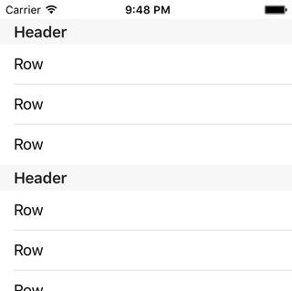
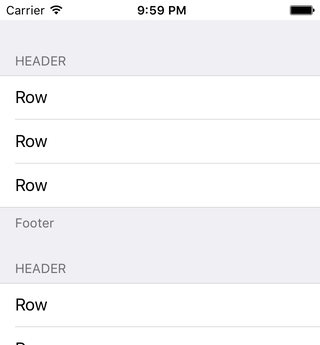

< [Multiple Row Selection](../14.MultipleRowSelection/MultipleRowSelection.md) | >

# Standard Section Headers and Footers

Thus far in our series we have dealt with a single continuous set of data. Only a few strings were used for sake of simplicity, but the code up to this point would not have changed whether there were 5 or 500 strings. We fed the table view a single group of strings, and that's exactly what it showed. A great many table views need to work exactly in this way, but plenty of other cases exist.

Consider the case of the Contacts app that has been mentioned on several occasions so far. It is true that you have 250 contacts, but it is equally true that you probably don't want a single unbroken list of all 250 contacts. It is helpful to break that data up into groups, and a common grouping is by first letter of the name, either first or last. And hopefully this list allows you to jump around to various parts of the list with ease. Or consider a Calendar app that gives you a list of appointments. A continuous list might have some use, but by grouping the appointments by date, the list becomes easier to read, and you can more easily understand which days are busier than others.

The concept of sections in table views was mentioned in the [Concepts and Terminology](../01.Concepts/Concepts.md) chapter, but this chapter will be our first real step along the path towards understanding how that concept is applied. We will explore some data structures in future chapters, so for now we will simply focus on some visual elements.

## Setup

Create a new iOS project, using the Single View Application template. Name it anything you want, like SectionHeaders. Choose your preferred language, device doesn't really matter but let's go with iPhone, and you can turn off any of the other checkboxes like Core Data as they will not be used in this chapter. Using your preferred technique, configure the provided view controller for table view use.

Since we will be covering data structures later, we will go very simplified for this project. Make your view controller look like this:

```objc
// Objective-C

#import "ViewController.h"

@interface ViewController () <UITableViewDataSource, UITableViewDelegate>

@property (nonatomic, weak) IBOutlet UITableView *tableView;

@end

@implementation ViewController

#pragma mark - UITableViewDataSource Methods

- (NSInteger)tableView:(UITableView *)tableView
 numberOfRowsInSection:(NSInteger)section
{
    return 3;
}

- (UITableViewCell *)tableView:(UITableView *)tableView
         cellForRowAtIndexPath:(NSIndexPath *)indexPath
{
    UITableViewCell *cell = [[UITableViewCell alloc] initWithStyle:UITableViewCellStyleDefault reuseIdentifier:@"Plain"];
    
    [[cell textLabel] setText:@"Row"];
    
    return cell;
}

@end
```
```swift
// Swift

import UIKit

class ViewController: UIViewController, UITableViewDataSource, UITableViewDelegate
{
    @IBOutlet weak var tableView: UITableView!
    
    // MARK: - UITableViewDataSource Methods
    
    func tableView(tableView: UITableView, numberOfRowsInSection section: Int) -> Int
    {
        return 3
    }
    
    func tableView(tableView: UITableView, cellForRowAtIndexPath indexPath: NSIndexPath) -> UITableViewCell
    {
        let cell = UITableViewCell.init(style: .Default, reuseIdentifier: "Plain")
        
        cell.textLabel?.text = "Row"
        
        return cell
    }
}
```
3 rows, each one says "Row", nothing fancy.

## Sections

Let's consider the first method for a moment. numberOfRows... inSection. We haven't really focused on that part of the method name. Let's log it:

```objc
// Objective-C

- (NSInteger)tableView:(UITableView *)tableView
 numberOfRowsInSection:(NSInteger)section
{
    NSLog(@"Section %ld", section);
    return 3;
}
```
```swift
// Swift

func tableView(tableView: UITableView, numberOfRowsInSection section: Int) -> Int
{
    print("Section \(section)")
    return 3
}
```
>Section 0
Section 0

(you might see that several times)
Section 0, and as we recall, section (and row) index numbers start at zero, thus we are dealing with the first section. And we haven't done anything special to get there, so this reveals that - in the absence of other directives - a table view will have a single section. We actually have been working with sectioned table views all along, without realizing.

Now we want sections, so in order to get them, we need to implement a delegate method from UITableViewDataSource:

```objc
// Objective-C

- (NSInteger)numberOfSectionsInTableView:(UITableView *)tableView
{
    return 4;
}
```
```swift
// Swift

func numberOfSectionsInTableView(tableView: UITableView) -> Int
{
    return 4;
}
```
If you run the app and count, you should find that you have a total of 12 rows now. The log is interesting, too:

>Section 3
Section 0
Section 1
Section 2
...

(you might see these several times, too)
The logic that UITableView uses to ping these delegate methods is rather odd. I personally would expect it to start at the beginning (0) and work its way up. But here we see it actually starts at the end, then starts over at the beginning and goes up. And if you continue experimenting with different numbers of sections, you'll find that it isn't strictly the last section each time. It might be the last couple of sections, for example. I cannot explain why, so simply be aware that it may not query from 0 to the max in order. If your logic is counting on it to do so, well you shouldn't do that, and as you see here that is not a behavior that you can expect.

Back to the main point, we have 12 rows. And this table looks exactly the same as if we were returning "12" from numberOfRowsInSection without bothering with the numberOfSections method. So A) be aware that you can group data without showing the data in groups, and B) why did we do this?

## Headers

The UITableView designers felt, correctly, that having grouped data in a single list like this won't always be ideal. They felt that some kind of visual indication between the groups would be helpful. One of the means of providing that visual division is via the **section header**. That is enabled with another delegate method from UITableViewDataSource:

```objc
// Objective-C

- (NSString *)tableView:(UITableView *)tableView
titleForHeaderInSection:(NSInteger)section
{
    return @"Header";
}
```
```swift
// Swift

func tableView(tableView: UITableView, titleForHeaderInSection section: Int) -> String?
{
    return "Header"
}
```
Run the app and you should see 4 of them, one for each section:



Notice that all we provided was a string. UITableView has taken care of the rest, from the font to the background color. And this is just for a "Plain" style table view. If you want, you can change your table view to "Grouped" and see another style applied. These banners serve as a nice visual divider between our groups of data. But they are not our only option.

## Footers

Headers place text above the section. Sometimes it make sense to put text below the section. That's where footers come in, and they have their own very similarly-named delegate method:

```objc
// Objective-C

- (NSString *)tableView:(UITableView *)tableView
titleForFooterInSection:(NSInteger)section
{
    return @"Footer";
}
```
```swift
// Swift

func tableView(tableView: UITableView, titleForFooterInSection section: Int) -> String?
{
    return "Footer"
}
```
Having both at the same time is a little busy with a Plain table view, since they are both styled the same. Run it and you'll see what I mean. So here it is with a Grouped table view instead:



Note the header is forced to be all-caps, while the footer is case-sensitive and a little smaller.

Headers are meant to be visually stronger, signifying something of importance. Footers, like a footnote, are more for additional information while trying to be out of the way. To see an example, go to Settings > Wi-Fi, then scroll to the bottom. The note about joining networks automatically is a footer. While you're there, notice that there are 3 sections in this table view, yet we only see 1 header and 1 footer. How do they do that?

Swift provides us a clue in the method definition, noting that the return value is optional. For Obj-C, you'll need to read the documentation to find out that returning nil will remove the header or footer. So let's tweak our code so that only the first two sections have headers, and only the last has a footer:

```objc
// Objective-C

- (NSString *)tableView:(UITableView *)tableView
titleForHeaderInSection:(NSInteger)section
{
    if (section < 2)
    {
        return @"Header";
    }
    return nil;
}

- (NSString *)tableView:(UITableView *)tableView
titleForFooterInSection:(NSInteger)section
{
    if (section == 3)
    {
        return @"Footer";
    }
    return nil;
}
```
```swift
// Swift

func tableView(tableView: UITableView, titleForHeaderInSection section: Int) -> String?
{
    if section < 2
    {
        return "Header"
    }
    return nil
}

func tableView(tableView: UITableView, titleForFooterInSection section: Int) -> String?
{
    if section == 3
    {
        return "Footer"
    }
    return nil
}
```
Run the app and verify that we succeeded. Also try it with Plain and Grouped table styles. Notice the 3rd section in particular, as it has neither header nor footer. In Plain it blends right in; in Grouped there is still some visual division from the other sections.

## Customization

Before writing this chapter, I believed that you were stuck with Apple's default styles for these built-in header and footer views. I assumed that if you wanted a different look, you needed to provide a custom view, which is a topic that we will cover in a later chapter. So it was with a great deal of joy that I read, literally a couple days before writing this chapter, [this tweet](https://twitter.com/merowing_/status/687183453679431680) by [Krzysztof Zabłocki](https://twitter.com/merowing_) (I found it via [Cocoanetics](https://twitter.com/Cocoanetics)) claiming that these built-in views can be customized. After a couple of exchanged messages to understand the concept, I am now in a position to share the knowledge here. Thanks, Krzysztof!

First we need to introduce a delegate method, this one from UITableViewDelegate:

```objc
// Objective-C

- (void)tableView:(UITableView *)tableView
willDisplayHeaderView:(UIView *)view
       forSection:(NSInteger)section
{
    NSLog(@"view: %@", view);
}

```
```swift
// Swift

func tableView(tableView: UITableView, willDisplayHeaderView view: UIView, forSection section: Int)
{
    print("view: \(view)")
}
```
This method is typically used with customized header views, which as I said will be covered in a later chapter. But what Krzysztof is bringing attention to is that it works with the built-in headers too. What this method does is inform us when it is about to display a view for the header in a given section. Run the app and let's take a look at the log:

>view: UITableViewHeaderFooterView: 0x7fc1549083f0...

So this view that is about to be shown is a UITableViewHeaderFooterView. This is interesting. A lot of Apple's widgets feature a view hierarchy, and there are a variety of ways that you can interrogate that hierarchy. It is not uncommon to find out that Apple is using custom subclasses for their views, and more importantly they are private subclasses. What they do is officially a mystery, and to be a good iOS citizen you shouldn't use private stuff. But here we have a plain UITableViewHeaderFooterView, which is actually a public class. That means we can pull up documentation on it, and see if there is anything interesting to play with. And there is. Let's pick out a couple of fun ones:

```objc
// Objective-C

// UITableViewHeaderFooterView
@property (nonatomic, readonly, strong) UILabel *textLabel;
@property (nonatomic, strong, nullable) UIView *backgroundView;
```
```swift
// Swift

// UITableViewHeaderFooterView
public var textLabel: UILabel? { get }
public var backgroundView: UIView?
```
We have a text label that sure seems a lot like our familiar textLabel in UITableViewCell, and there's also a backgroundView we can mess with.

But first, we must practice safe coding. Apple doesn't really come out and document that we're going to be dealing with UITableViewHeaderFooterView here. That might even be considered a private implementation detail, and thus subject to change. So just in case Apple would yank the rug out from under us and start using a private class here, we should make sure that we only modify the view when we know what the class is. Here is our safety check:

```objc
// Objective-C

- (void)tableView:(UITableView *)tableView
willDisplayHeaderView:(UIView *)view
       forSection:(NSInteger)section
{
    if ([view isKindOfClass:[UITableViewHeaderFooterView class]])
    {
        UITableViewHeaderFooterView *headerView = (UITableViewHeaderFooterView *)view;
    }
}
```
```swift
// Swift

func tableView(tableView: UITableView, willDisplayHeaderView view: UIView, forSection section: Int)
{
    if let headerView = view as? UITableViewHeaderFooterView
    {
    }
}
```


< [Multiple Row Selection](../14.MultipleRowSelection/MultipleRowSelection.md) | >

---
From:
[A Reasonably Complete Guide to UITableView](https://github.com/BriTerIdeas/Book-UITableViewGuide), by Brian Slick
If you found this guide to be helpful, a [tip](http://bit.ly/AW4Cc) would be appreciated.