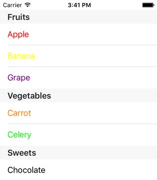
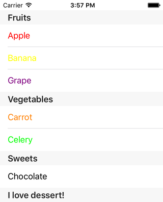

< [Another Basic Data Structure](../17.SectionsAnotherBasicDataStructure/SectionsAnotherBasicDataStructure.md) | >

# Multiple Sections: Custom Model Objects

We've seen a couple different approaches to setting up a data structure. What we have done so far has been perfectly fine if all we ever need to do is list out a bunch of strings. Most table views are not so simple, and so we need to step up our game.

Let's assume we want to show the text for each line in a different color, maybe a color that is appropriate for the food item. So now we need not just a list of strings, but a list of UIColor objects as well. I stated in a previous chapter that you do not want to split data up, generally speaking. What I mean by that is we wouldn't want to have 1 array for tracking the names, and 1 array for tracking the colors. Imagine that I decide that the names need to be alphabetically sorted. How would I keep the color list in sync? Sorting the strings is a simple 1-liner, but sorting the colors? Hrm.

This is a situation that we want to avoid. Pieces of information that belong together, in this case a string and color pair, should remain together. All that we need is a structure of some kind to keep this data together. And there are many ways to accomplish that goal. In the previous chapter, we saw the use of a dictionary to keep a name and an array paired together. Perhaps we could do that here to keep a name and a color paired. Swift offers a creature called a tuple that is quite handy for grouping pieces of information together. Either of those approaches have downsides that are beyond the scope of this series. If you would like to read more about the downsides, I wrote a [blog post](http://briterideas.blogspot.com/2012/09/a-model-object-is-beautiful-thing.html) on this subject several years ago. For our purposes here, we'll skip all of that and go straight to one of the better solutions: custom model objects.

## Setup

Create a new iOS project, using the Single View Application template. Name it anything you want, like SectionsCustomModel. Choose your preferred language, device doesn't really matter but let's go with iPhone, and you can turn off any of the other checkboxes like Core Data as they will not be used in this chapter. Using your preferred technique, configure the provided view controller for table view use.

We will continue to use the list of foods, but this requires enough changes that we'll build it from scratch. Go ahead and setup a tableView property and the delegate conformance. You can add a couple of stubs to silence any errors, but we'll get those implemented before we need to test run.

## Custom Food Model

We want to pair up a color and a string. As mentioned, there are a variety of ways we can do this, even beyond what I've already mentioned. We will focus on a custom class here. We'll define a class that contains a string property and a color property.

We should first make a decision regarding whether or not a color is required. It doesn't have to be. We could decide that if a color is present, use it; if not, use black. We either need to define a color for every food item, or we need an if/else case when populating the cell to check for a color. For our purposes here, we'll leave color as optional, and we'll use black if a color is not provided.

Let's define our class. Add a new file to your project. Choose according to your language:
* Obj-C: Cocoa Touch Class -> class name "Models", subclass of "NSObject"
* Swift: Swift File -> Save as "Models"

Make the Objective-C files look like this:

```objc
// Objective-C
// Models.h

@import UIKit;

@interface FoodItem : NSObject

@property (nonatomic, copy) NSString *name;
@property (nonatomic, copy) UIColor *color;

- (id)initWithName:(NSString *)name color:(UIColor *)color;

@end
```
```objc
// Objective-C
// Models.m

#import "Models.h"

@implementation FoodItem

- (id)initWithName:(NSString *)name
             color:(UIColor *)color
{
    self = [super init];
    if (self)
    {
        _name = name;
        _color = color;
    }
    return self;
}

@end
```
Or make the Swift file look like this:

```swift
// Swift

import UIKit

class FoodItem
{
    var name = ""
    var color: UIColor?
    
    init(name: String, color: UIColor?)
    {
        self.name = name
        self.color = color
    }
}
```
We've defined a FoodItem class, that contains a string property and a color property (in Swift, an optional). It also has a custom initializer accepting both parameters. We could stop here and write our corresponding changes, but maybe we could use this concept again to solve a problem that's been nagging for a couple of chapters now.

## Custom Section Model

We can make models for anything. We just saw how to bring 2 properties together into a single class. It just so happens we've had the need to do exactly that a couple of times before. The 2 pieces of data we'd like to bring together are the section contents and the section header. Let's make a model that does that.

Add this to your Models file, below the FoodItem definition:

```objc
// Objective-C
// Models.h

// FoodItem
//...
@end

@interface SectionItem : NSObject

@property (nonatomic, copy) NSString *sectionName;
@property (nonatomic, strong) NSMutableArray *sectionContents;

@end
```
```objc
// Objective-C
// Models.m

// FoodItem
//...
@end

@implementation SectionItem

- (id)init
{
    self = [super init];
    if (self)
    {
        _sectionContents = [NSMutableArray array];
    }
    return self;
}

@end
```
Or the Swift version:
```swift
// Swift

import UIKit

class FoodItem
...

class SectionItem
{
    var sectionName: String?
    var sectionContents = [FoodItem]()
}
```
We have a sectionName, which is declared to be optional in Swift just in case we want to omit titles. And we've added an array for the contents, which will be FoodItem objects.

## Data Structure

Let's build our data.

First, we need to import our model file in Objective-C:

```objc
// Objective-C

#import "ViewController.h"
#import "Models.h"
```
Next we'll add our familiar contents property. The only difference with Swift relative to what we've done so far is the type declaration since we're not dealing with strings:

```objc
// Objective-C

@interface ViewController () <UITableViewDataSource, UITableViewDelegate>

@property (nonatomic, strong) IBOutlet UITableView *tableView;
@property (nonatomic, strong) NSMutableArray *contents;

@end
```
```swift
// Swift

@IBOutlet var tableView: UITableView!
var contents = [SectionItem]()
```
This is going to look more complicated than what we've done before in viewDidLoad. So let's make a new method, populateData, and call it from viewDidLoad:

```objc
// Objective-C

- (void)viewDidLoad
{
    [super viewDidLoad];
    
    [self populateData];
}

- (void)populateData
{
    SectionItem *fruitSection = [[SectionItem alloc] init];
    [fruitSection setSectionName:@"Fruits"];
    
    [[fruitSection sectionContents] addObject:[[FoodItem alloc] initWithName:@"Apple" color:[UIColor redColor]]];
    [[fruitSection sectionContents] addObject:[[FoodItem alloc] initWithName:@"Banana" color:[UIColor yellowColor]]];
    [[fruitSection sectionContents] addObject:[[FoodItem alloc] initWithName:@"Grape" color:[UIColor purpleColor]]];
    
    SectionItem *veggieSection = [[SectionItem alloc] init];
    [veggieSection setSectionName:@"Vegetables"];
    
    [[veggieSection sectionContents] addObject:[[FoodItem alloc] initWithName:@"Carrot" color:[UIColor orangeColor]]];
    [[veggieSection sectionContents] addObject:[[FoodItem alloc] initWithName:@"Celery" color:[UIColor greenColor]]];
    
    SectionItem *sweetSection = [[SectionItem alloc] init];
    [sweetSection setSectionName:@"Sweets"];
    
    [[sweetSection sectionContents] addObject:[[FoodItem alloc] initWithName:@"Chocolate" color:nil]];
    
    [self setContents:[@[ fruitSection, veggieSection, sweetSection ] mutableCopy]];
}
```
```swift
// Swift

override func viewDidLoad()
{
    super.viewDidLoad()
    
    populateData()
}

func populateData()
{
    let fruitSection = SectionItem()
    fruitSection.sectionName = "Fruits"
    
    fruitSection.sectionContents.append(FoodItem.init(name: "Apple", color: UIColor.redColor()))
    fruitSection.sectionContents.append(FoodItem.init(name: "Banana", color: UIColor.yellowColor()))
    fruitSection.sectionContents.append(FoodItem.init(name: "Grape", color: UIColor.purpleColor()))
    
    let veggieSection = SectionItem()
    veggieSection.sectionName = "Vegetables"
    
    veggieSection.sectionContents.append(FoodItem.init(name: "Carrot", color: UIColor.orangeColor()))
    veggieSection.sectionContents.append(FoodItem.init(name: "Celery", color: UIColor.greenColor()))
    
    let sweetSection = SectionItem()
    sweetSection.sectionName = "Sweets"
    
    sweetSection.sectionContents.append(FoodItem.init(name: "Chocolate", color: nil))
    
    contents = [ fruitSection, veggieSection, sweetSection ]
}
```
This looks really busy, especially outside of Xcode, but it isn't as complicated as it looks. We create a section object, and give it a title. This will be our header. Then we create food objects, with their name and color, and add them to the section's contents. Finally we throw all of our section objects into the main array.

While it does look busy, go back and compare to the corresponding code in earlier sections, and it doesn't look _that_ bad, especially considering the older code didn't deal with the colors.

## Delegate Methods

Let's get our delegate methods caught up to this new structure. First, our number of sections is once again the count of the main array:

```objc
// Objective-C

- (NSInteger)numberOfSectionsInTableView:(UITableView *)tableView
{
    return [[self contents] count];
}
```
```swift
// Swift

func numberOfSectionsInTableView(tableView: UITableView) -> Int
{
    return contents.count
}
```
Number of rows is the count of the section object's contents:
```objc
// Objective-C

- (NSInteger)tableView:(UITableView *)tableView
 numberOfRowsInSection:(NSInteger)section
{
    SectionItem *sectionItem = [[self contents] objectAtIndex:section];
    
    return [[sectionItem sectionContents] count];
}
```
```swift
// Swift

func tableView(tableView: UITableView, numberOfRowsInSection section: Int) -> Int
{
    let sectionItem = contents[section]
    
    return sectionItem.sectionContents.count
}
```
The header title is the section object's name:

```objc
// Objective-C

- (NSString *)tableView:(UITableView *)tableView
titleForHeaderInSection:(NSInteger)section
{
    SectionItem *sectionItem = [[self contents] objectAtIndex:section];
    
    return [sectionItem sectionName];
}
```
```swift
// Swift

func tableView(tableView: UITableView, titleForHeaderInSection section: Int) -> String?
{
    let sectionItem = contents[section]
    
    return sectionItem.sectionName
}
```
Before we do cellForRow, let's update our itemAtIndexPath method to reflect our new structure. We need a section object based on the section index, and then a food item based on the row index.

```objc
// Objective-C

- (FoodItem *)itemAtIndexPath:(NSIndexPath *)indexPath
{
    SectionItem *sectionItem = [[self contents] objectAtIndex:[indexPath section]];
    
    return [[sectionItem sectionContents] objectAtIndex:[indexPath row]];
}
```
```swift
// Swift

func itemAtIndexPath(indexPath: NSIndexPath) -> FoodItem
{
    let sectionItem = contents[indexPath.section]
    
    return sectionItem.sectionContents[indexPath.row]
}
```
Now we can do cellForRow, and recall that we will be using black if there is no color provided.

```objc
// Objective-C

- (UITableViewCell *)tableView:(UITableView *)tableView
         cellForRowAtIndexPath:(NSIndexPath *)indexPath
{
    static NSString *identifier = @"Plain";
    
    UITableViewCell *cell = [tableView dequeueReusableCellWithIdentifier:identifier];
    if (cell == nil)
    {
        cell = [[UITableViewCell alloc] initWithStyle:UITableViewCellStyleDefault reuseIdentifier:identifier];
    }
    
    FoodItem *foodItem = [self itemAtIndexPath:indexPath];
    
    [[cell textLabel] setText:[foodItem name]];
    
    if ([foodItem color] == nil)
    {
        [[cell textLabel] setTextColor:[UIColor blackColor]];
    }
    else
    {
        [[cell textLabel] setTextColor:[foodItem color]];
    }
    
    return cell;
}
```
```swift
// Swift

func tableView(tableView: UITableView, cellForRowAtIndexPath indexPath: NSIndexPath) -> UITableViewCell
{
    let identifier = "Default"
    
    var optionalCell = tableView.dequeueReusableCellWithIdentifier(identifier)
    if (optionalCell == nil)
    {
        optionalCell = UITableViewCell.init(style: .Default, reuseIdentifier: identifier)
    }
    
    let cell = optionalCell!
    
    let foodItem = itemAtIndexPath(indexPath)
    
    cell.textLabel?.text = foodItem.name
    
    if let color = foodItem.color
    {
        cell.textLabel?.textColor = color
    }
    else
    {
        cell.textLabel?.textColor = UIColor.blackColor()
    }
    
    return cell
}
```
We select a food item using the index path. Then we pass the name text on to the label. Finally we check to see if we have a color, use it if so, use black if not.

Run the app, and witness the, uh... fruits of our labor:



## Modifications

It can sometimes be challenging to see the power in a technique, especially when it seems more complicated than other alternatives. There needs to be something that demonstrates the advantages. I offer you such a demonstration in the form of table footers. Correction: 1 table footer. That's all I want. And it will be for the last section only.

Our first structure was an array of arrays. How would we add footers to this? Our headers were a separate array. So we'd need to do the same thing for the footers. We now have 3 total arrays to keep track of all of this stuff. Ew.

Our second structure was an array and a dictionary. How would we add footers to this? The headers were in an array, and were also the keys in our dictionary. Where would the footer go? Maybe another array? That's not really any different than our first structure, so again: ew.

What can we do here with our custom models? Well, we already have 2 properties for a section, let's add a third:

```objc
// Objective-C

@interface SectionItem : NSObject

@property (nonatomic, copy) NSString *sectionName;
@property (nonatomic, copy) NSString *sectionFooter;
@property (nonatomic, strong) NSMutableArray *sectionContents;

@end
```
```swift
// Swift

class SectionItem
{
    var sectionName: String?
    var sectionFooter: String?
    var sectionContents = [FoodItem]()
}
```
We need to add our delegate method, since we weren't using it:

```objc
// Objective-C

- (NSString *)tableView:(UITableView *)tableView
titleForFooterInSection:(NSInteger)section
{
    SectionItem *sectionItem = [[self contents] objectAtIndex:section];
    
    return [sectionItem sectionFooter];
}
```
```swift
// Swift

func tableView(tableView: UITableView, titleForFooterInSection section: Int) -> String?
{
    let sectionItem = contents[section]
    
    return sectionItem.sectionFooter
}
```
Finally, we need to add our data:

```objc
// Objective-C

SectionItem *sweetSection = [[SectionItem alloc] init];
[sweetSection setSectionName:@"Sweets"];
[sweetSection setSectionFooter:@"I love dessert!"];
```
```swift
// Swift

let sweetSection = SectionItem()
sweetSection.sectionName = "Sweets"
sweetSection.sectionFooter = "I love dessert!"
```
Was it worth it?



It's just that easy. If you are not convinced of the advantages of this technique, return to each of the previous data structure chapters and try to recreate this table view using those techniques. Good luck.

## Summary

A good indication that you are dealing with a solid technique is when you can adapt it to new demands without having to rip out the whole thing and start over. We didn't know that footers would be used at the beginning of the chapter, but we were able to add one with only the simplest of modifications. Doing the same thing in the previous chapters would have required even more structure, though one could argue it might seem to be simpler code.

However, if you performed that experiment in those other chapters - even if you succeeded in getting the display correct - now imagine what happens when we let the user delete rows. The user just swiped on Chocolate, so that's gone. Therefore perhaps "Sweets" and "I love dessert!" need to disappear too. Would you like to handle that with your code in those chapters, or would you prefer to deal with it using the technique shown here?

The only real stumbling block here might be the amount of code involved in populating the data. But here's the good news: you rarely need to do that manually. You might populate a text file, or you might download data from a server. You might need to manipulate the data a bit first, and we'll talk about that in the next chapter, but for the most part once you get your structure set up properly, it doesn't matter where the data comes from.

< [Another Basic Data Structure](../17.SectionsAnotherBasicDataStructure/SectionsAnotherBasicDataStructure.md) | >

---
From:
[A Reasonably Complete Guide to UITableView](https://github.com/BriTerIdeas/Book-UITableViewGuide), by Brian Slick
If you found this guide to be helpful, a [tip](http://bit.ly/AW4Cc) would be appreciated.