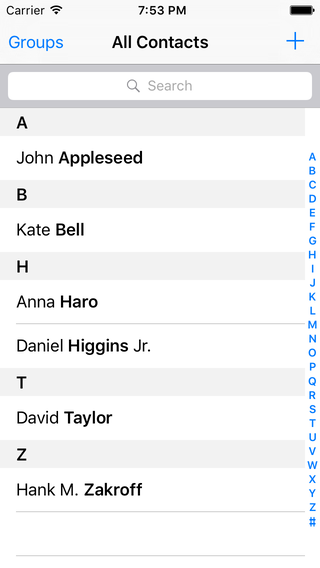
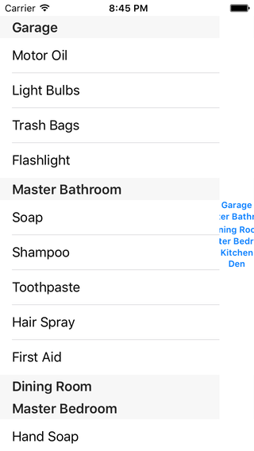
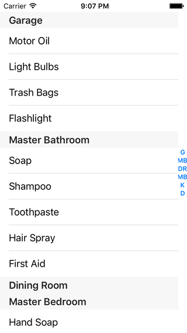

< [Data Processing](../19.SectionsDataProcessing/SectionsDataProcessing.md) | >

# Multiple Sections: Section Index Titles

Section index titles are found on the right side of some table views, most notably in the Contacts app:



It provides a handy way to jump around in a very lengthy list of data. On an average iPhone screen, you might be looking at just over a half-dozen items at any given time, but your full list could easily contain hundreds, if not thousands, of items. If all the user could do was scroll-scroll-scroll to get around, that would be rather irritating. Thus, Apple provides this section index as a way to quick jump to different sections of the list.

I used the word "sections" in the previous sentence deliberately; you cannot jump to specific rows using this mechanism. So if your data was one continuous list of 500 items, you could not use the section index titles to jump to, say, row 76. You must break your data up into sections, which is why this chapter is placed after the ones talking about how to do so. Tapping on an item in the index will then scroll the table view to the corresponding section.

Our sample project will demonstrate an approach to making a simple checklist app. The approach will be similar to what we did with our food list previously, but I deliberately want something that doesn't depend on alphabetical sections. Instead we will keep track of items in different rooms in our house.

## Setup

Create a new iOS project, using the Single View Application template. Name it anything you want, like SectionIndexTitles. Choose your preferred language, device doesn't really matter but let's go with iPhone, and you can turn off any of the other checkboxes like Core Data as they will not be used in this chapter. Using your preferred technique, configure the provided view controller for table view use.

We will use the dictionary-of-arrays technique that we talked about in the [Another Basic Data Structure](../17.SectionsAnotherBasicDataStructure/SectionsAnotherBasicDataStructure.md) chapter. We'll just adapt our source data to reflect some household items, so make your view controller look like this:

```objc
// Objective-C

#import "ViewController.h"

@interface ViewController () <UITableViewDataSource, UITableViewDelegate>

@property (nonatomic, strong) IBOutlet UITableView *tableView;
@property (nonatomic, strong) NSMutableDictionary *contents;
@property (nonatomic, strong) NSMutableArray *headers;

@end

@implementation ViewController

- (void)viewDidLoad
{
    [super viewDidLoad];
    
    NSMutableDictionary *items = [NSMutableDictionary dictionary];
    NSMutableArray *keys = [NSMutableArray array];
    
    NSString *garageKey = @"Garage";
    NSString *masterBathroomKey = @"Master Bathroom";
    NSString *diningRoomKey = @"Dining Room";
    NSString *guestBathroomKey = @"Master Bedroom";
    NSString *kitchenKey = @"Kitchen";
    NSString *denKey = @"Den";
    
    NSArray *garage = @[ @"Motor Oil", @"Light Bulbs", @"Trash Bags", @"Flashlight" ];
    NSArray *masterBathroom = @[ @"Soap", @"Shampoo", @"Toothpaste", @"Hair Spray", @"First Aid" ];
    NSArray *diningRoom = @[ ];
    NSArray *guestBathroom = @[ @"Hand Soap", @"Tissues", @"Toilet Paper" ];
    NSArray *kitchen = @[ @"Milk", @"Bread", @"Pizza", @"Juice", @"Cheese", @"Coffee" ];
    NSArray *den = @[ @"Pens", @"Pencils", @"Paper", @"Stamps" ];
    
    [items setObject:garage forKey:garageKey];
    [items setObject:masterBathroom forKey:masterBathroomKey];
    [items setObject:diningRoom forKey:diningRoomKey];
    [items setObject:guestBathroom forKey:guestBathroomKey];
    [items setObject:kitchen forKey:kitchenKey];
    [items setObject:den forKey:denKey];
    
    [keys addObject:garageKey];
    [keys addObject:masterBathroomKey];
    [keys addObject:diningRoomKey];
    [keys addObject:guestBathroomKey];
    [keys addObject:kitchenKey];
    [keys addObject:denKey];
    
    [self setContents:items];
    [self setHeaders:keys];
}

- (NSString *)itemAtIndexPath:(NSIndexPath *)indexPath
{
    NSString *key = [[self headers] objectAtIndex:[indexPath section]];
    NSArray *groupArray = [[self contents] objectForKey:key];
    NSString *text = [groupArray objectAtIndex:[indexPath row]];
    
    return text;
}

#pragma mark - UITableViewDataSource Methods

- (NSInteger)numberOfSectionsInTableView:(UITableView *)tableView
{
    return [[self headers] count];
}

- (NSString *)tableView:(UITableView *)tableView
titleForHeaderInSection:(NSInteger)section
{
    return [[self headers] objectAtIndex:section];
}

- (NSInteger)tableView:(UITableView *)tableView
 numberOfRowsInSection:(NSInteger)section
{
    NSString *key = [[self headers] objectAtIndex:section];
    NSArray *groupArray = [[self contents] objectForKey:key];
    
    return [groupArray count];
}

- (UITableViewCell *)tableView:(UITableView *)tableView
         cellForRowAtIndexPath:(NSIndexPath *)indexPath
{
    UITableViewCell *cell = [[UITableViewCell alloc] initWithStyle:UITableViewCellStyleDefault reuseIdentifier:@"Plain"];
    
    NSString *text = [self itemAtIndexPath:indexPath];
    
    [[cell textLabel] setText:text];
    
    return cell;
}

#pragma mark - UITableViewDelegate Methods

- (void)tableView:(UITableView *)tableView
didSelectRowAtIndexPath:(NSIndexPath *)indexPath
{
    NSString *text = [self itemAtIndexPath:indexPath];
    
    NSLog(@"text: %@", text);
}

@end

```
```swift
// Swift

import UIKit

class ViewController: UIViewController, UITableViewDataSource, UITableViewDelegate
{
    @IBOutlet var tableView: UITableView!
    var contents = [String: [String]]()
    var headers = [String]()
    
    override func viewDidLoad()
    {
        super.viewDidLoad()
        
        let garageKey = "Garage";
        let masterBathroomKey = "Master Bathroom";
        let diningRoomKey = "Dining Room";
        let guestBathroomKey = "Master Bedroom";
        let kitchenKey = "Kitchen";
        let denKey = "Den";

        let garage = [ "Motor Oil", "Light Bulbs", "Trash Bags", "Flashlight" ];
        let masterBathroom = [ "Soap", "Shampoo", "Toothpaste", "Hair Spray", "First Aid" ];
        let diningRoom = [String]();
        let guestBathroom = [ "Hand Soap", "Tissues", "Toilet Paper" ];
        let kitchen = [ "Milk", "Bread", "Pizza", "Juice", "Cheese", "Coffee" ];
        let den = [ "Pens", "Pencils", "Paper", "Stamps" ];
        
        contents[garageKey] = garage
        contents[masterBathroomKey] = masterBathroom
        contents[diningRoomKey] = diningRoom
        contents[guestBathroomKey] = guestBathroom
        contents[kitchenKey] = kitchen
        contents[denKey] = den
        
        headers.append(garageKey)
        headers.append(masterBathroomKey)
        headers.append(diningRoomKey)
        headers.append(guestBathroomKey)
        headers.append(kitchenKey)
        headers.append(denKey)
    }
    
    func itemAtIndexPath(indexPath: NSIndexPath) -> String
    {
        let key = headers[indexPath.section]
        if let groupArray = contents[key]
        {
            let text = groupArray[indexPath.row]
            
            return text
        }
        
        return ""
    }
    
    // MARK: - UITableViewDataSource Methods
    
    func numberOfSectionsInTableView(tableView: UITableView) -> Int
    {
        return headers.count
    }
    
    func tableView(tableView: UITableView, titleForHeaderInSection section: Int) -> String?
    {
        return headers[section]
    }
    
    func tableView(tableView: UITableView, numberOfRowsInSection section: Int) -> Int
    {
        let key = headers[section]
        if let groupArray = contents[key]
        {
            return groupArray.count
        }
        
        return 0
    }
    
    func tableView(tableView: UITableView, cellForRowAtIndexPath indexPath: NSIndexPath) -> UITableViewCell
    {
        let cell = UITableViewCell.init(style: .Default, reuseIdentifier: "Plain")
        
        let text = itemAtIndexPath(indexPath)
        
        cell.textLabel?.text = text
        
        return cell;
    }
    
    // MARK: - UITableViewDelegate Methods
    
    func tableView(tableView: UITableView, didSelectRowAtIndexPath indexPath: NSIndexPath)
    {
        let text = itemAtIndexPath(indexPath)
        
        print(text)
    }
}
```
Run the app to verify that you have a list of items. Notice that we do have section headers, but they are not currently in any particular order.

## Data Source Methods

The way to enable section index titles is by implementing a delegate method. This one comes from UITableViewDataSource:

```objc
// Objective-C

- (nullable NSArray<NSString *> *)sectionIndexTitlesForTableView:(UITableView *)tableView
```
```swift
// Swift

optional func sectionIndexTitlesForTableView(_ tableView: UITableView) -> [String]?
```
Using this method, you return an array of strings. As it happens, we already have an array of strings - our section headers - so let's just return those and see what happens:

```objc
// Objective-C

- (NSArray<NSString *> *)sectionIndexTitlesForTableView:(UITableView *)tableView
{
    return [self headers];
}
```
```swift
// Swift

func sectionIndexTitlesForTableView(tableView: UITableView) -> [String]?
{
    return headers
}
```
Run the app and take a look:



Several things to notice here:
* All we had to do was provide an array of strings. The table view took care of font, listing the items vertically, center-justifying them horizontally and vertically, and adjusting the spacing of the table to display the section index titles. And if you tap on the various blue items, you'll see the table view jump around so that the item you tapped is listed first. Not bad for a single array.
* Notice that we are seeing entire words here. Up to this point, you may have only ever seen section index titles that are single letters. A, B, C, etc as shown above in the Contacts app. But as we see here, that is a convention more than a technical requirement. All that the table view cares about is that you provide an array of strings; it doesn't really care how long the strings are.
* That said, there is a maximum width that the table view will grant you to display the index titles. We see that the longer titles have been chopped off. They are still fully functional, just with a cropped display. It doesn't look so good this way, so you probably won't want to make a habit of this. But if you have a reason to display more than a single letter, you can. Looks like you can get around a half-dozen characters before the display gets chopped. If 2 or 3 letters would be clearer for your users - and if you're willing to live with the amount of width that is removed from your cells - then you can certainly do so.

Let's do some processing on the titles so that we can reduce the width. We'll pick off the first letter of each word, and use that as our title. For example, Dining Room would become DR.

```objc
// Objective-C

- (NSArray<NSString *> *)sectionIndexTitlesForTableView:(UITableView *)tableView
{
    NSMutableArray *titles = [NSMutableArray array];
    
    for (NSString *header in [self headers])
    {
        NSString *title = @"";
        NSArray *words = [header componentsSeparatedByString:@" "];
        for (NSString *word in words)
        {
            NSString *firstLetter = [[word substringToIndex:1] uppercaseString];
            title = [title stringByAppendingString:firstLetter];
        }
        [titles addObject:title];
    }
    
    return titles;
}
```
```swift
// Swift

func sectionIndexTitlesForTableView(tableView: UITableView) -> [String]?
{
    var titles = [String]()
    
    for header in headers
    {
        var title = ""
        let words = header.componentsSeparatedByString(" ")
        for word in words
        {
            let firstLetterRange = word.startIndex..<word.startIndex.advancedBy(1)
            let firstLetter = word[firstLetterRange].uppercaseString
            title = title + firstLetter
        }
        titles.append(title)
    }
    
    return titles
}
```
Run the app and you should see narrower titles:



## Quantity Mismatch Handling

One thing to notice about both the Contacts app and our sample here is the handling of empty sections. Notice that the Contacts app lists the full A-Z in the index, yet only a handful of sections are actually shown. There is no D section, for example, yet there is still a D in the index. In our sample, the Dining Room is empty, yet we are still showing the header.

The bottom line is that you have to make a decision when there will be an empty section. One option is to simply omit any reference to that section. In our case, after building our list of contents, we could loop over our arrays, and then remove the header for any that are empty. This would remove 1) The section header "Dining Room", _and_ 2) the index title "DR". The user would be none the wiser. Apple could do the same thing by removing the D from the index. They elected not to, and in this case, I don't consider that to be an unreasonable decision. The index is going to zap a certain amount of width anyway, might as well fill it with the full alphabet.

## Summary

< [Data Processing](../19.SectionsDataProcessing/SectionsDataProcessing.md) | >

---
From:
[A Reasonably Complete Guide to UITableView](https://github.com/BriTerIdeas/Book-UITableViewGuide), by Brian Slick
If you found this guide to be helpful, a [tip](http://bit.ly/AW4Cc) would be appreciated.